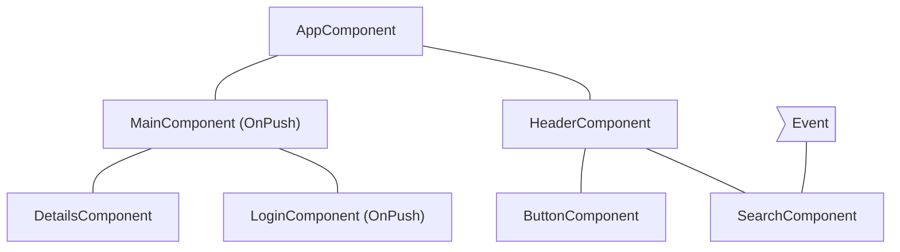
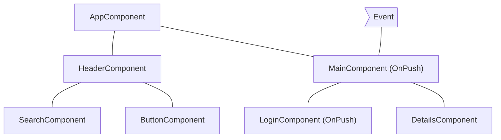
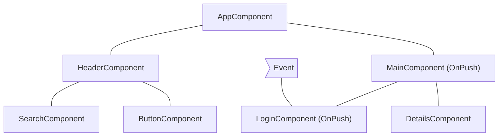
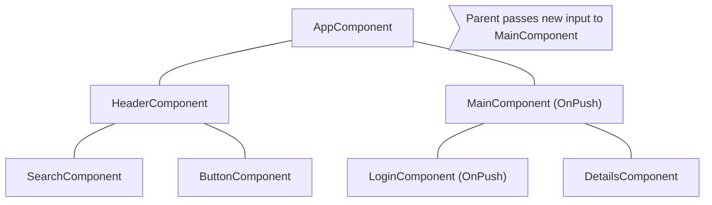

# Skipping component subtrees

JavaScript, varsayilan olarak birden fazla farkli bilesenden referans verebileceginiz degistirilebilir veri yapilari kullanir. Angular, veri yapilarinizin en guncel durumunun DOM'a yansitildigından emin olmak icin tum bilesen agaci uzerinde degisiklik algilamasi calistirir.

Degisiklik algilama cogu uygulama icin yeterince hizlidir. Ancak, bir uygulama ozellikle buyuk bir bilesen agacina sahip oldugunda, tum uygulama genelinde degisiklik algilamasi calistirmak performans sorunlarina neden olabilir. Bunu, degisiklik algilamasini bilesen agacinin yalnizca bir alt kumesinde calisacak sekilde yapilandirarak cozebilirsiniz.

Bir uygulamanin bir bolumunun bir durum degisikliginden etkilenmediginden eminseniz, tum bir bilesen alt agacinda degisiklik algilamasini atlamak icin [OnPush](/api/core/ChangeDetectionStrategy) kullanabilirsiniz.

## Using `OnPush`

OnPush degisiklik algilama, Angular'a bir bilesen alt agaci icin degisiklik algilamasini **yalnizca** su durumlarda calistirmasi talimatini verir:

- Alt agacin kok bileseni, bir sablon baglamasi sonucunda yeni girisler aldiginda. Angular, girisin mevcut ve onceki degerini `==` ile karsilastirir.
- Angular, OnPush degisiklik algilama kullansalar da kullanmasalar da, alt agacin kok bileseninde veya herhangi bir cocugunda bir olayı islediginde _(ornegin olay baglama, cikis baglama veya `@HostListener` kullanarak)_.

Bir bilesenin degisiklik algilama stratejisini `@Component` dekoratorunde `OnPush` olarak ayarlayabilirsiniz:

```ts
import {ChangeDetectionStrategy, Component} from '@angular/core';

@Component({
  changeDetection: ChangeDetectionStrategy.OnPush,
})
export class MyComponent {}
```

## Common change detection scenarios

Bu bolum, Angular'in davranisini gostermek icin birkaç yaygin degisiklik algilama senaryosunu incelemektedir.

### An event is handled by a component with default change detection

Angular, `OnPush` stratejisi olmayan bir bilesen icinde bir olayı islediginde, framework tum bilesen agacinda degisiklik algilamasi calistirir. Angular, yeni giris almamis OnPush kullanan koklere sahip torun bilesen alt agaclarini atlayacaktir.

Ornek olarak, `MainComponent`'in degisiklik algilama stratejisini `OnPush` olarak ayarlar ve kullanici `MainComponent` kokune sahip alt agacin disindaki bir bilesenle etkilesime gecerse, `MainComponent` yeni girisler almadikca Angular asagidaki diyagramdaki tum pembe bilesenleri (`AppComponent`, `HeaderComponent`, `SearchComponent`, `ButtonComponent`) kontrol edecektir:



## An event is handled by a component with OnPush

Angular, OnPush stratejisine sahip bir bilesen icinde bir olayı islediginde, framework tum bilesen agacinda degisiklik algilamasini calistiracaktir. Angular, yeni giris almamis ve olayı isleyen bilesenin disinda kalan OnPush kullanan koklere sahip bilesen alt agaclarini gormezden gelecektir.

Ornek olarak, Angular `MainComponent` icinde bir olayı islediginde, framework tum bilesen agacinda degisiklik algilamasi calistiracaktir. Angular, `LoginComponent` kokune sahip alt agaci gormezden gelecektir cunku `OnPush`'a sahiptir ve olay kapsaminin disinda gerceklesmistir.



## An event is handled by a descendant of a component with OnPush

Angular, OnPush'a sahip bir bilesenin icinde bir olayı islediginde, framework tum bilesen agacinda degisiklik algilamasi calistiracak ve bilesenin atalarini da dahil edecektir.

Ornek olarak, asagidaki diyagramda Angular, OnPush kullanan `LoginComponent` icinde bir olayı isler. Angular, `MainComponent` (`LoginComponent`'in ebeveyni) de dahil olmak uzere tum bilesen alt agacinda degisiklik algilamasi cagrilacaktir, `MainComponent`'in de `OnPush`'a sahip olmasina ragmen. Angular `MainComponent`'i de kontrol eder cunku `LoginComponent` onun gorunumunun bir parcasidir.



## New inputs to component with OnPush

Angular, bir sablon baglamasi sonucunda bir giris ozelligini ayarlarken `OnPush`'a sahip bir alt bilesende degisiklik algilamasi calistiracaktir.

Ornegin, asagidaki diyagramda `AppComponent`, `OnPush`'a sahip `MainComponent`'e yeni bir giris iletir. Angular, `MainComponent`'te degisiklik algilamasi calistiracak ancak kendisi de yeni girisler almadikca, ayrica `OnPush`'a sahip olan `LoginComponent`'te degisiklik algilamasi calistirmayacaktir.



## Edge cases

- **TypeScript kodunda giris ozelliklerini degistirme**. TypeScript'te bir bilesene referans almak icin `@ViewChild` veya `@ContentChild` gibi bir API kullandiginiizda ve bir `@Input` ozelligini manuel olarak degistirdiginizde, Angular OnPush bilesenleri icin degisiklik algilamasi otomatik olarak calistirmayacaktir. Angular'in degisiklik algilamasi calistirmasina ihtiyaciniz varsa, bileseninize `ChangeDetectorRef` enjekte edebilir ve Angular'a bir degisiklik algilama planlamasi soyleyen `changeDetectorRef.markForCheck()` cagrisini yapabilirsiniz.
- **Nesne referanslarini degistirme**. Bir girisin deger olarak degistirilebilir bir nesne aldigi ve nesneyi degistirip referansi korudugunuz durumda, Angular degisiklik algilamasi cagirmayacaktir. Bu beklenen davranistir cunku girisin onceki ve mevcut degeri ayni referansi gosterir.
