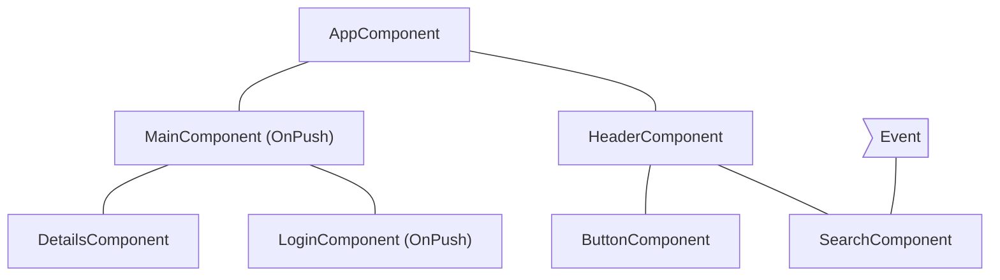
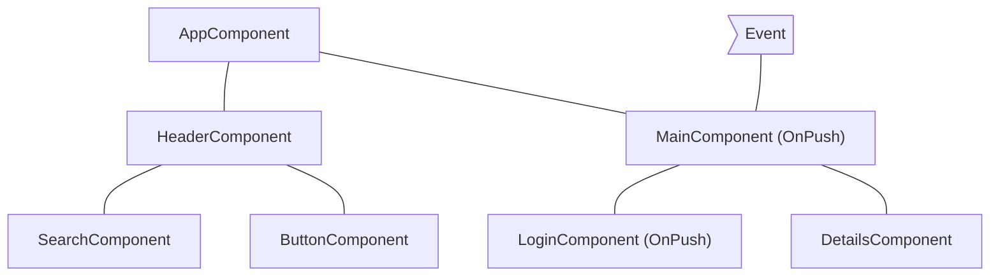
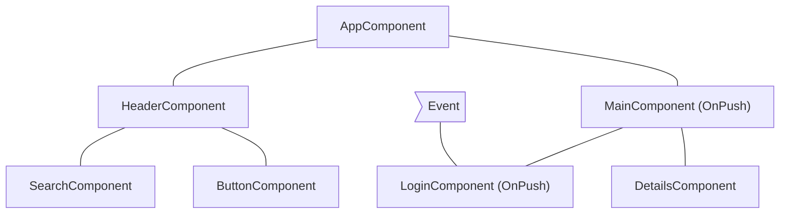
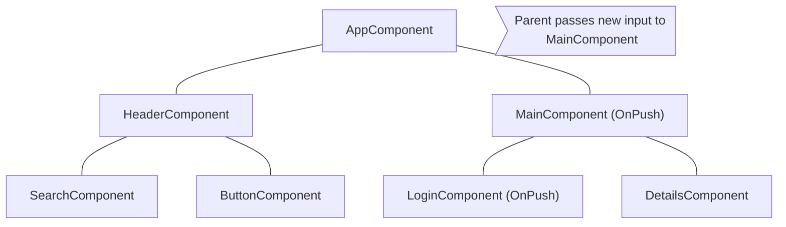

# Bileşen alt ağaçlarını atlama

JavaScript, varsayılan olarak birden fazla farklı bileşenden referans verebileceğiniz değiştirilebilir veri yapıları kullanır. Angular, veri yapılarınızın en güncel durumunun DOM'a yansıtıldığından emin olmak için tüm bileşen ağacı üzerinde değişiklik algılaması çalıştırır.

Değişiklik algılama çoğu uygulama için yeterince hızlıdır. Ancak, bir uygulama özellikle büyük bir bileşen ağacına sahip olduğunda, tüm uygulama genelinde değişiklik algılaması çalıştırmak performans sorunlarına neden olabilir. Bunu, değişiklik algılamasını bileşen ağacının yalnızca bir alt kümesinde çalışacak şekilde yapılandırarak çözebilirsiniz.

## `OnPush` kullanımı

OnPush, Angular'daki varsayılan değişiklik algılama stratejisidir (v22'den beri). Angular'a bir bileşen alt ağacı için değişiklik algılamasını **yalnızca** şu durumlarda çalıştırması talimatını verir:

- Alt ağacın kök bileşeni, bir şablon bağlaması sonucunda yeni girişler aldığında. Angular, girişin mevcut ve önceki değerini `Object.is` ile karşılaştırır.
- Angular, OnPush değişiklik algılama kullansalar da kullanmasalar da, alt ağacın kök bileşeninde veya herhangi bir çocuğunda bir olayı işlediğinde _(örneğin olay bağlama, çıkış bağlama veya `@HostListener` kullanarak)_.

## Yaygın değişiklik algılama senaryoları

Bu bölüm, Angular'ın davranışını göstermek için birkaç yaygın değişiklik algılama senaryosunu incelemektedir.

### Bir olay, `Eager` değişiklik algılamaya sahip bir bileşen tarafından işlenir

Angular, `Eager` stratejisine sahip bir bileşen içinde bir olayı işlediğinde, framework tüm bileşen ağacında değişiklik algılaması çalıştırır. Angular, yeni giriş almamış OnPush kullanan köklere sahip torun bileşen alt ağaçlarını atlayacaktır.

Örnek olarak, `MainComponent`'in değişiklik algılama stratejisini `OnPush` olarak ayarlar ve kullanıcı `MainComponent` köküne sahip alt ağacın dışındaki bir bileşenle etkileşime geçerse, `MainComponent` yeni girişler almadıkça Angular aşağıdaki diyagramdaki tüm pembe bileşenleri (`AppComponent`, `HeaderComponent`, `SearchComponent`, `ButtonComponent`) kontrol edecektir:

```mermaid
graph TD;
    app[AppComponent] --- header[HeaderComponent];
    app --- main["MainComponent (OnPush)"];
    header --- search[SearchComponent];
    header --- button[ButtonComponent];
    main --- login["LoginComponent (OnPush)"];
    main --- details[DetailsComponent];
    event>Event] --- search

class app checkedNode
class header checkedNode
class button checkedNode
class search checkedNode
class event eventNode
```

## Bir olay, OnPush'a sahip bir bileşen tarafından işlenir

Angular, OnPush stratejisine sahip bir bileşen içinde bir olayı işlediğinde, framework tüm bileşen ağacında değişiklik algılamasını çalıştıracaktır. Angular, yeni giriş almamış ve olayı işleyen bileşenin dışında kalan OnPush kullanan köklere sahip bileşen alt ağaçlarını görmezden gelecektir.

Örnek olarak, Angular `MainComponent` içinde bir olayı işlediğinde, framework tüm bileşen ağacında değişiklik algılaması çalıştıracaktır. Angular, `LoginComponent` köküne sahip alt ağacı görmezden gelecektir çünkü `OnPush`'a sahiptir ve olay kapsamının dışında gerçekleşmiştir.

```mermaid
graph TD;
    app[AppComponent] --- header[HeaderComponent];
    app --- main["MainComponent (OnPush)"];
    header --- search[SearchComponent];
    header --- button[ButtonComponent];
    main --- login["LoginComponent (OnPush)"];
    main --- details[DetailsComponent];
    event>Event] --- main

class app checkedNode
class header checkedNode
class button checkedNode
class search checkedNode
class main checkedNode
class details checkedNode
class event eventNode
```

## Bir olay, OnPush'a sahip bir bileşenin alt öğesi tarafından işlenir

Angular, OnPush'a sahip bir bileşenin içinde bir olayı işlediğinde, framework tüm bileşen ağacında değişiklik algılaması çalıştıracak ve bileşenin atalarını da dahil edecektir.

Örnek olarak, aşağıdaki diyagramda Angular, OnPush kullanan `LoginComponent` içinde bir olayı işler. Angular, `MainComponent` (`LoginComponent`'in ebeveyni) de dahil olmak üzere tüm bileşen alt ağacında değişiklik algılaması çağrılacaktır, `MainComponent`'in de `OnPush`'a sahip olmasına rağmen. Angular `MainComponent`'i de kontrol eder çünkü `LoginComponent` onun görünümünün bir parçasıdır.

```mermaid
graph TD;
    app[AppComponent] --- header[HeaderComponent];
    app --- main["MainComponent (OnPush)"];
    header --- search[SearchComponent];
    header --- button[ButtonComponent];
    main --- login["LoginComponent (OnPush)"];
    main --- details[DetailsComponent];
    event>Event] --- login

class app checkedNode
class header checkedNode
class button checkedNode
class search checkedNode
class login checkedNode
class main checkedNode
class details checkedNode
class event eventNode
```

## OnPush'a sahip bileşene yeni girişler

Angular, bir şablon bağlaması sonucunda bir giriş özelliğini ayarlarken `OnPush`'a sahip bir alt bileşende değişiklik algılaması çalıştıracaktır.

Örneğin, aşağıdaki diyagramda `AppComponent`, `OnPush`'a sahip `MainComponent`'e yeni bir giriş iletir. Angular, `MainComponent`'te değişiklik algılaması çalıştıracak ancak kendisi de yeni girişler almadıkça, ayrıca `OnPush`'a sahip olan `LoginComponent`'te değişiklik algılaması çalıştırmayacaktır.

```mermaid
graph TD;
    app[AppComponent] --- header[HeaderComponent];
    app --- main["MainComponent (OnPush)"];
    header --- search[SearchComponent];
    header --- button[ButtonComponent];
    main --- login["LoginComponent (OnPush)"];
    main --- details[DetailsComponent];
    event>Parent passes new input to MainComponent]

class app checkedNode
class header checkedNode
class button checkedNode
class search checkedNode
class main checkedNode
class details checkedNode
class event eventNode
```

## Uç durumlar

- **TypeScript kodunda giriş özelliklerini değiştirme**. TypeScript'te bir bileşene referans almak için `@ViewChild` veya `@ContentChild` gibi bir API kullandığınızda ve bir `@Input` özelliğini manuel olarak değiştirdiğinizde, Angular OnPush bileşenleri için değişiklik algılaması otomatik olarak çalıştırmayacaktır. Angular'ın değişiklik algılaması çalıştırmasına ihtiyacınız varsa, bileşeninize `ChangeDetectorRef` enjekte edebilir ve Angular'a bir değişiklik algılama planlaması söyleyen `changeDetectorRef.markForCheck()` çağrısını yapabilirsiniz.
- **Nesne referanslarını değiştirme**. Bir girişin değer olarak değiştirilebilir bir nesne aldığı ve nesneyi değiştirip referansı koruduğunuz durumda, Angular değişiklik algılaması çağırmayacaktır. Bu beklenen davranıştır çünkü girişin önceki ve mevcut değeri aynı referansı gösterir.
