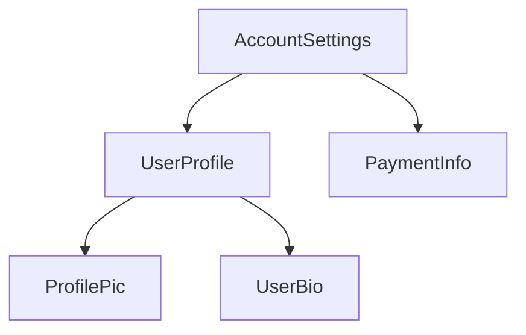

<docs-decorative-header title="Bir bileşenin anatomisi" imgSrc="adev/src/assets/images/components.svg"> <!-- markdownlint-disable-line -->
</docs-decorative-header>

TIP: Bu rehber, [Temel Bilgiler Rehberi](essentials)'ni zaten okuduğunuzu varsayar. Angular'da yeniyseniz önce onu okuyun.

Her bileşen şunlara sahip olmalıdır:

- Kullanıcı girdisini işleme ve sunucudan veri getirme gibi _davranışlara_ sahip bir TypeScript sınıfı
- DOM'a neyin render edileceğini kontrol eden bir HTML şablonu
- Bileşenin HTML'de nasıl kullanılacağını tanımlayan bir [CSS seçici](https://developer.mozilla.org/docs/Learn/CSS/Building_blocks/Selectors)

TypeScript sınıfının üzerine bir `@Component` [dekoratörü](https://www.typescriptlang.org/docs/handbook/decorators.html) ekleyerek Angular'a özgü bilgileri sağlarsınız:

```angular-ts {highlight: [1, 2, 3, 4]}
@Component({
  selector: 'profile-photo',
  template: ``,
})
export class ProfilePhoto {}
```

Veri bağlama, olay işleme ve kontrol akışı dahil olmak üzere Angular şablonları yazma hakkında tüm ayrıntılar için [Şablonlar rehberi](guide/templates)'ne bakın.

`@Component` dekoratörüne iletilen nesne, bileşenin **meta verisi** olarak adlandırılır. Bu, `selector`, `template` ve bu rehber boyunca açıklanan diğer özellikleri içerir.

Bileşenlerin isteğe bağlı olarak o bileşenin DOM'una uygulanan CSS stilleri listesi içerebilir:

```angular-ts {highlight: [4]}
@Component({
  selector: 'profile-photo',
  template: ``,
  styles: `
    img {
      border-radius: 50%;
    }
  `,
})
export class ProfilePhoto {}
```

Varsayılan olarak, bir bileşenin stilleri yalnızca o bileşenin şablonunda tanımlanan elemanları etkiler. Angular'ın stillendirme yaklaşımı hakkında ayrıntılar için [Bileşen Stillendirme](guide/components/styling) belgesine bakın.

Alternatif olarak şablon ve stillerinizi ayrı dosyalarda yazmayı seçebilirsiniz:

```ts {highlight: [3,4]}
@Component({
  selector: 'profile-photo',
  templateUrl: 'profile-photo.html',
  styleUrl: 'profile-photo.css',
})
export class ProfilePhoto {}
```

Bu, projenizdeki _sunum_ ve _davranış_ kaygılarını ayırmaya yardımcı olabilir. Tüm projeniz için tek bir yaklaşım seçebilir veya her bileşen için hangisini kullanacağınıza karar verebilirsiniz.

Hem `templateUrl` hem de `styleUrl`, bileşenin bulunduğu dizine göredir.

## Bileşenleri kullanma

### `@Component` dekoratöründe import'lar

Bir bileşen, [direktif](guide/directives) veya [pipe](guide/templates/pipes) kullanmak için, onu `@Component` dekoratöründeki `imports` dizisine eklemeniz gerekir:

```ts
import {ProfilePhoto} from './profile-photo';

@Component({
  // Bu bileşenin şablonunda kullanmak için
  // `ProfilePhoto` bileşenini import edin.
  imports: [ProfilePhoto],
  /* ... */
})
export class UserProfile {}
```

Varsayılan olarak, Angular bileşenleri _bağımsızdır_ (standalone), yani onları doğrudan diğer bileşenlerin `imports` dizisine ekleyebilirsiniz. Angular'ın daha eski bir sürümü ile oluşturulan bileşenlerde bunun yerine `@Component` dekoratöründe `standalone: false` belirtilebilir. Bu bileşenlerde, bileşenin tanımlandığı `NgModule`'u içerir (import edersiniz). Ayrıntılar için tam [`NgModule` rehberi](guide/ngmodules/overview)'ne bakın.

Important: 19.0.0 öncesi Angular sürümlerinde `standalone` seçeneği varsayılan olarak `false` değerindedir.

### Bir şablonda bileşenleri gösterme

Her bileşen bir [CSS seçici](https://developer.mozilla.org/docs/Learn/CSS/Building_blocks/Selectors) tanımlar:

```angular-ts {highlight: [2]}
@Component({
  selector: 'profile-photo',
  ...
})
export class ProfilePhoto { }
```

Angular'ın hangi seçici türlerini desteklediği ve seçici seçme rehberliği hakkında ayrıntılar için [Bileşen Seçicileri](guide/components/selectors) belgesine bakın.

_Diğer_ bileşenlerin şablonunda eşleşen bir HTML elemanı oluşturarak bir bileşeni gösterirsiniz:

```angular-ts {highlight: [8]}
@Component({
  selector: 'profile-photo',
})
export class ProfilePhoto {}

@Component({
  imports: [ProfilePhoto],
  template: `<profile-photo />`,
})
export class UserProfile {}
```

Angular, karşılaştığı her eşleşen HTML elemanı için bileşenin bir örneğini oluşturur. Bir bileşenin seçicisiyle eşleşen DOM elemanı, o bileşenin **host elemanı** olarak adlandırılır. Bir bileşenin şablonunun içeriği, host elemanı içerisinde render edilir.

Bir bileşen tarafından render edilen, o bileşenin şablonuna karşılık gelen DOM, o bileşenin **görünümü** (view) olarak adlandırılır.

Bileşenleri bu şekilde birleştirirken, **Angular uygulamanızı bir bileşen ağacı olarak düşünebilirsiniz**.



Bu ağaç yapısı, [bağımlılık enjeksiyonu](guide/di) ve [alt sorgular](guide/components/queries) dahil olmak üzere birçok Angular kavramını anlamak için önemlidir.
