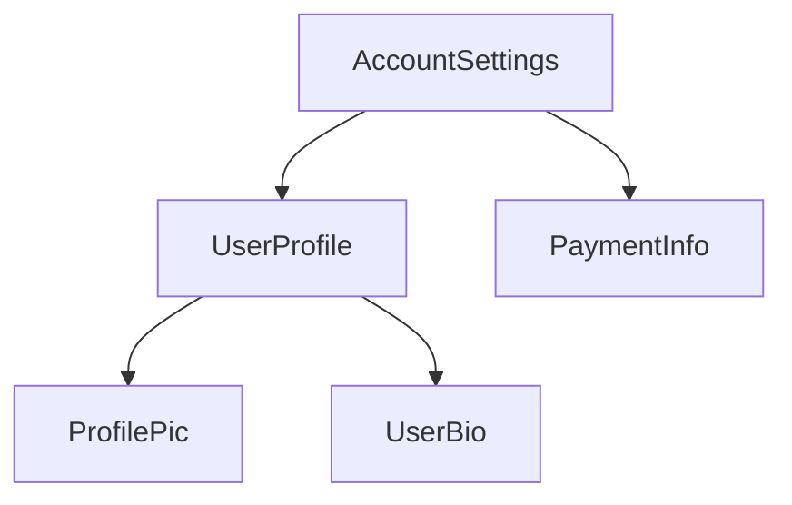

<docs-decorative-header title="Anatomy of a component" imgSrc="adev/src/assets/images/components.svg"> <!-- markdownlint-disable-line -->
</docs-decorative-header>

TIP: Bu rehber, [Temel Bilgiler Rehberi](essentials)'ni zaten okudugunuzu varsayar. Angular'da yeniyseniz once onu okuyun.

Her bilesen sunlara sahip olmalidir:

- Kullanici girdisini isleme ve sunucudan veri getirme gibi _davranislara_ sahip bir TypeScript sinifi
- DOM'a neyin render edilecegini kontrol eden bir HTML sablonu
- Bilesnenin HTML'de nasil kullanilacagini tanimlayan bir [CSS secici](https://developer.mozilla.org/docs/Learn/CSS/Building_blocks/Selectors)

TypeScript sinifinin uzerine bir `@Component` [dekoratoru](https://www.typescriptlang.org/docs/handbook/decorators.html) ekleyerek Angular'a ozgu bilgileri saglarsiniz:

```angular-ts {highlight: [1, 2, 3, 4]}
@Component({
  selector: 'profile-photo',
  template: ``,
})
export class ProfilePhoto {}
```

Veri baglama, olay isleme ve kontrol akisi dahil olmak uzere Angular sablonlari yazma hakkinda tum ayrintilar icin [Sablonlar rehberi](guide/templates)'ne bakin.

`@Component` dekoratorune iletilen nesne, bilesnenin **meta verisi** olarak adlandirilir. Bu, `selector`, `template` ve bu rehber boyunca aciklanan diger ozellikleri icerir.

Bilesenlerin istege bagli olarak o bilesnenin DOM'una uygulanan CSS stilleri listesi icerebilir:

```angular-ts {highlight: [4]}
@Component({
  selector: 'profile-photo',
  template: ``,
  styles: `
    img {
      border-radius: 50%;
    }
  `,
})
export class ProfilePhoto {}
```

Varsayilan olarak, bir bilesnenin stilleri yalnizca o bilesnenin sablonunda tanimlanan elemanlari etkiler. Angular'in stillendirme yaklasimi hakkinda ayrintilar icin [Bilesen Stillendirme](guide/components/styling) belgesine bakin.

Alternatif olarak sablon ve stillerinizi ayri dosyalarda yazmayi secebilirsiniz:

```ts {highlight: [3,4]}
@Component({
  selector: 'profile-photo',
  templateUrl: 'profile-photo.html',
  styleUrl: 'profile-photo.css',
})
export class ProfilePhoto {}
```

Bu, projenizdeki _sunum_ ve _davranis_ kaygilerini ayirmaya yardimci olabilir. Tum projeniz icin tek bir yaklasim secebilir veya her bilesen icin hangisini kullanacaginiza karar verebilirsiniz.

Hem `templateUrl` hem de `styleUrl`, bilesnenin bulundugu dizine goredir.

## Using components

### Imports in the `@Component` decorator

Bir bilesen, [direktif](guide/directives) veya [pipe](guide/templates/pipes) kullanmak icin, onu `@Component` dekoratorundeki `imports` dizisine eklemeniz gerekir:

```ts
import {ProfilePhoto} from './profile-photo';

@Component({
  // Import the `ProfilePhoto` component in
  // order to use it in this component's template.
  imports: [ProfilePhoto],
  /* ... */
})
export class UserProfile {}
```

Varsayilan olarak, Angular bilesenleri _bagimsizdir_ (standalone), yani onlari dogrudan diger bilesenlerin `imports` dizisine ekleyebilirsiniz. Angular'in daha eski bir surumu ile olusturulan bilesenlerde bunun yerine `@Component` dekoratorunde `standalone: false` belirtilebilir. Bu bilesenlerde, bilesnenin tanimlandigi `NgModule`'u icerir (import edersiniz). Ayrintilar icin tam [`NgModule` rehberi](guide/ngmodules/overview)'ne bakin.

Important: 19.0.0 oncesi Angular surumlerinde `standalone` secenegi varsayilan olarak `false` degerindedir.

### Showing components in a template

Her bilesen bir [CSS secici](https://developer.mozilla.org/docs/Learn/CSS/Building_blocks/Selectors) tanimlar:

```angular-ts {highlight: [2]}
@Component({
  selector: 'profile-photo',
  ...
})
export class ProfilePhoto { }
```

Angular'in hangi secici turlerini destekledigi ve secici secme rehberligi hakkinda ayrintilar icin [Bilesen Secicileri](guide/components/selectors) belgesine bakin.

_Diger_ bilesenlerin sablonunda eslesen bir HTML elemani olusturarak bir bileseni gosterirsiniz:

```angular-ts {highlight: [8]}
@Component({
  selector: 'profile-photo',
})
export class ProfilePhoto {}

@Component({
  imports: [ProfilePhoto],
  template: `<profile-photo />`,
})
export class UserProfile {}
```

Angular, karsilastigi her eslesen HTML elemani icin bilesnenin bir ornegini olusturur. Bir bilesnenin secicisiyle eslesen DOM elemani, o bilesnenin **host elemani** olarak adlandirilir. Bir bilesnenin sablonunun icerigi, host elemani icerisinde render edilir.

Bir bilesen tarafindan render edilen, o bilesnenin sablonuna karsilik gelen DOM, o bilesnenin **gorunumu** (view) olarak adlandirilir.

Bilesenleri bu sekilde birlestirirken, **Angular uygulamanizi bir bilesen agaci olarak dusunebilirsiniz**.



Bu agac yapisi, [bagimlilik enjeksiyonu](guide/di) ve [alt sorgular](guide/components/queries) dahil olmak uzere bircok Angular kavramini anlamak icin onemlidir.
