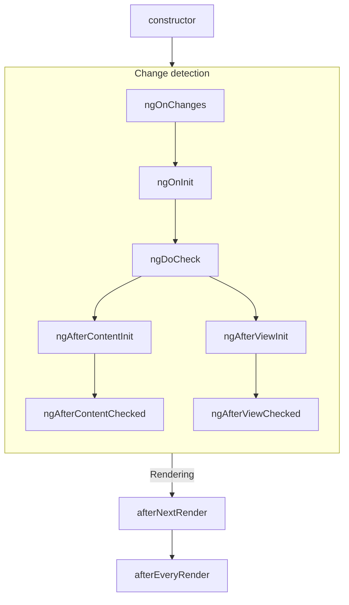
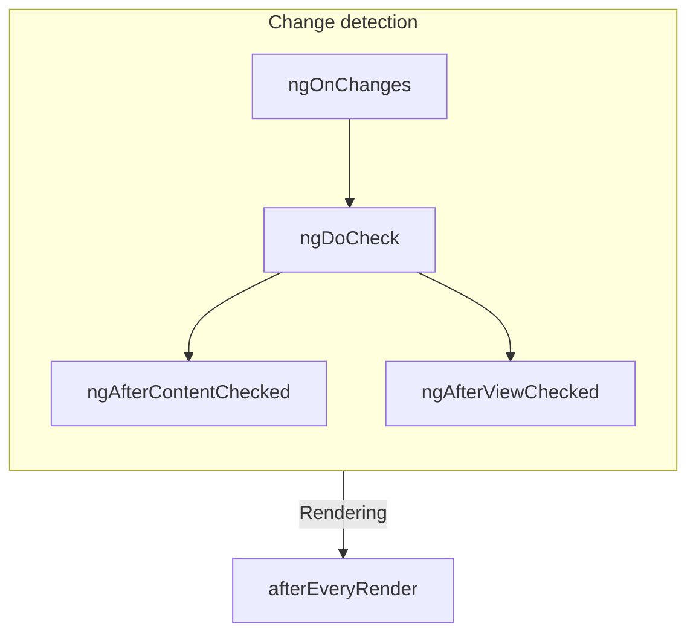

# Bileşen yaşam döngüsü

TIP: Bu rehber, [Temel Bilgiler Rehberi](essentials)'ni zaten okuduğunuzu varsayar. Angular'da yeniyseniz önce onu okuyun.

Bir bileşenin **yaşam döngüsü**, bileşenin oluşturulması ile yok edilmesi arasında gerçekleşen adımlar dizisidir. Her adım, Angular'ın bileşenleri render etme ve zaman içinde güncellemeleri kontrol etme sürecinin farklı bir bölümünü temsil eder.

Bileşenlerinizde, bu adımlar sırasında kod çalıştırmak için **yaşam döngüsü kancaları** uygulayabilirsiniz. Belirli bir bileşen örneği ile ilişkili yaşam döngüsü kancaları, bileşen sınıfınızdaki yöntemler olarak uygulanır. Genel Angular uygulamasıyla ilişkili yaşam döngüsü kancaları, bir geri çağrıma kabul eden fonksiyonlar olarak uygulanır.

Bir bileşenin yaşam döngüsü, Angular'ın bileşenlerinizi zaman içinde değişiklikler açısından nasıl kontrol ettiğiyle yakından bağlantılıdır. Bu yaşam döngüsünü anlamak için, Angular'ın uygulama ağacınızda yukarıdan aşağıya doğru yürüyerek şablon bağlamalarındaki değişiklikleri kontrol ettiğini bilmeniz yeterlidir. Aşağıda açıklanan yaşam döngüsü kancaları, Angular bu geçişi yaparken çalışır. Bu geçiş her bileşeni tam olarak bir kez ziyaret eder, bu nedenle işlemin ortasında daha fazla durum değişiklikleri yapmaktan her zaman kaçınmalısınız.

## Özet

<div class="docs-table docs-scroll-track-transparent">
  <table>
    <tr>
      <td><strong>Aşama</strong></td>
      <td><strong>Yöntem</strong></td>
      <td><strong>Özet</strong></td>
    </tr>
    <tr>
      <td>Oluşturma</td>
      <td><code>constructor</code></td>
      <td>
        <a href="https://developer.mozilla.org/docs/Web/JavaScript/Reference/Classes/constructor" target="_blank">
          Standart JavaScript sınıf constructor'ı
        </a>. Angular bileşeni örneklediğinde çalışır.
      </td>
    </tr>
    <tr>
      <td rowspan="7">Değişiklik<p>Algılama</td>
      <td><code>ngOnInit</code>
      </td>
      <td>Bileşenin tüm girdileri başlatıldıktan sonra bir kez çalışır.</td>
    </tr>
    <tr>
      <td><code>ngOnChanges</code></td>
      <td>Bileşenin girdileri her değiştiğinde çalışır.</td>
    </tr>
    <tr>
      <td><code>ngDoCheck</code></td>
      <td>Bu bileşen değişiklikler için her kontrol edildiğinde çalışır.</td>
    </tr>
    <tr>
      <td><code>ngAfterContentInit</code></td>
      <td>Bileşenin <em>içeriği</em> başlatıldıktan sonra bir kez çalışır.</td>
    </tr>
    <tr>
      <td><code>ngAfterContentChecked</code></td>
      <td>Bu bileşen içeriği değişiklikler için her kontrol edildiğinde çalışır.</td>
    </tr>
    <tr>
      <td><code>ngAfterViewInit</code></td>
      <td>Bileşenin <em>görünümü</em> başlatıldıktan sonra bir kez çalışır.</td>
    </tr>
    <tr>
      <td><code>ngAfterViewChecked</code></td>
      <td>Bileşenin görünümü değişiklikler için her kontrol edildiğinde çalışır.</td>
    </tr>
    <tr>
      <td rowspan="2">Render Etme</td>
      <td><code>afterNextRender</code></td>
      <td><strong>Tüm</strong> bileşenler bir sonraki sefer DOM'a render edildikten sonra bir kez çalışır.</td>
    </tr>
    <tr>
      <td><code>afterEveryRender</code></td>
      <td><strong>Tüm</strong> bileşenler DOM'a her render edildikten sonra çalışır.</td>
    </tr>
    <tr>
      <td>Yok Etme</td>
      <td><code>ngOnDestroy</code></td>
      <td>Bileşen yok edilmeden önce bir kez çalışır.</td>
    </tr>
  </table>
</div>

### ngOnInit

`ngOnInit` yöntemi, Angular bileşenin tüm girdilerini başlangıç değerleriyle başlattıktan sonra çalışır. Bir bileşenin `ngOnInit`'i tam olarak bir kez çalışır.

Bu adım, bileşenin kendi şablonunun başlatılmasından _önce_ gerçekleşir. Bu, bileşenin durumunu başlangıç girdi değerlerine göre güncelleyebileceğiniz anlamına gelir.

### ngOnChanges

`ngOnChanges` yöntemi, herhangi bir bileşen girdisi değiştikten sonra çalışır.

Bu adım, bileşenin kendi şablonunun kontrol edilmesinden _önce_ gerçekleşir. Bu, bileşenin durumunu başlangıç girdi değerlerine göre güncelleyebileceğiniz anlamına gelir.

Başlatma sırasında, ilk `ngOnChanges` `ngOnInit`'ten önce çalışır.

#### Değişiklikleri inceleme

`ngOnChanges` yöntemi tek bir `SimpleChanges` argümanı kabul eder. Bu nesne, her bileşen girdi adını bir `SimpleChange` nesnesine eşleştiren bir [`Record`](https://www.typescriptlang.org/docs/handbook/utility-types.html#recordkeys-type)'dur. Her `SimpleChange`, girdinin önceki değerini, mevcut değerini ve girdinin ilk kez değişip değişmediğini gösteren bir işaret içerir.

Daha güçlü tür denetimi için ilk generic argüman olarak isteğe bağlı olarak mevcut sınıfı veya this'i iletebilirsiniz.

```ts
@Component({
  /* ... */
})
export class UserProfile {
  name = input('');

  ngOnChanges(changes: SimpleChanges<UserProfile>) {
    if (changes.name) {
      console.log(`Previous: ${changes.name.previousValue}`);
      console.log(`Current: ${changes.name.currentValue}`);
      console.log(`Is first ${changes.name.firstChange}`);
    }
  }
}
```

Herhangi bir girdi özelliği için bir `alias` sağlarsanız, `SimpleChanges` Record'u hala anahtar olarak takma ad yerine TypeScript özellik adını kullanır.

### ngOnDestroy

`ngOnDestroy` yöntemi, bir bileşen yok edilmeden hemen önce bir kez çalışır. Angular, bir bileşeni sayfada artık gösterilmediğinde yok eder, örneğin `@if` ile gizlenme veya başka bir sayfaya navigasyon.

#### DestroyRef

`ngOnDestroy` yöntemine alternatif olarak, bir `DestroyRef` örneği enjekte edebilirsiniz. `DestroyRef`'in `onDestroy` yöntemini çağırarak bileşenin yok edilmesi üzerine çağırılacak bir geri çağrıma kaydedebilirsiniz.

```ts
@Component({
  /* ... */
})
export class UserProfile {
  constructor() {
    inject(DestroyRef).onDestroy(() => {
      console.log('UserProfile destruction');
    });
  }
}
```

`DestroyRef` örneğini bileşen dışındaki fonksiyonlara veya sınıflara iletebilirsiniz. Bileşen yok edildiğinde bazı temizlik davranışı çalıştırması gereken başka kodlarınız varsa bu kalıbı kullanın.

Tüm temizlik kodunu `ngOnDestroy` yöntemine koymak yerine, kurulum kodunu temizlik koduna yakın tutmak için de `DestroyRef` kullanabilirsiniz.

##### Örnek yok edilmesini algılama

`DestroyRef`, belirli bir örneğin zaten yok edilip edilmediğini kontrol etmeye olanak tanıyan bir `destroyed` özelliği sağlar. Bu, özellikle gecikmeli veya asenkron mantıkla uğraşılırken yok edilmiş bileşenler üzerinde işlem yapmayı önlemek için kullanışlıdır.

`destroyRef.destroyed` değerini kontrol ederek, örnek temizlendikten sonra kod çalıştırmayı önleyerek `NG0911: View has already been destroyed.` gibi olası hataları önleyebilirsiniz.

### ngDoCheck

`ngDoCheck` yöntemi, Angular bir bileşenin şablonunu değişiklikler için her kontrol etmeden önce çalışır.

Bu yaşam döngüsü kancasını, Angular'ın normal değişiklik algılamasının dışındaki durum değişikliklerini manuel olarak kontrol ederek bileşenin durumunu manuel olarak güncellemek için kullanabilirsiniz.

Bu yöntem çok sık çalışır ve sayfa performansınızı önemli ölçüde etkileyebilir. Bu kancayı mümkün olduğunda tanımlamaktan kaçının ve yalnızca başka bir alternatifiniz olmadığında kullanın.

Başlatma sırasında, ilk `ngDoCheck` `ngOnInit`'ten sonra çalışır.

### ngAfterContentInit

`ngAfterContentInit` yöntemi, bileşenin içerisine yuvalanan tüm alt elemanlar (_içeriği_) başlatıldıktan sonra bir kez çalışır.

Bu yaşam döngüsü kancasını [içerik sorguları](guide/components/queries#içerik-sorguları)'nın sonuçlarını okumak için kullanabilirsiniz. Bu sorguların başlatılmış durumuna erişebilirsiniz, ancak bu yöntemde herhangi bir durumu değiştirmeye çalışmak [ExpressionChangedAfterItHasBeenCheckedError](errors/NG0100) hatasına neden olur.

### ngAfterContentChecked

`ngAfterContentChecked` yöntemi, bileşenin içerisine yuvalanan alt elemanlar (_içeriği_) değişiklikler için her kontrol edildiğinde çalışır.

Bu yöntem çok sık çalışır ve sayfa performansınızı önemli ölçüde etkileyebilir. Bu kancayı mümkün olduğunda tanımlamaktan kaçının ve yalnızca başka bir alternatifiniz olmadığında kullanın.

[İçerik sorguları](guide/components/queries#içerik-sorguları)'nın güncellenmiş durumuna burada erişebilirsiniz, ancak bu yöntemde herhangi bir durumu değiştirmeye çalışmak [ExpressionChangedAfterItHasBeenCheckedError](errors/NG0100) hatasına neden olur.

### ngAfterViewInit

`ngAfterViewInit` yöntemi, bileşenin şablonundaki tüm alt elemanlar (_görünümü_) başlatıldıktan sonra bir kez çalışır.

Bu yaşam döngüsü kancasını [görünüm sorguları](guide/components/queries#görünüm-sorguları)'nın sonuçlarını okumak için kullanabilirsiniz. Bu sorguların başlatılmış durumuna erişebilirsiniz, ancak bu yöntemde herhangi bir durumu değiştirmeye çalışmak [ExpressionChangedAfterItHasBeenCheckedError](errors/NG0100) hatasına neden olur.

### ngAfterViewChecked

`ngAfterViewChecked` yöntemi, bileşenin şablonundaki alt elemanlar (_görünümü_) değişiklikler için her kontrol edildiğinde çalışır.

Bu yöntem çok sık çalışır ve sayfa performansınızı önemli ölçüde etkileyebilir. Bu kancayı mümkün olduğunda tanımlamaktan kaçının ve yalnızca başka bir alternatifiniz olmadığında kullanın.

[Görünüm sorguları](guide/components/queries#görünüm-sorguları)'nın güncellenmiş durumuna burada erişebilirsiniz, ancak bu yöntemde herhangi bir durumu değiştirmeye çalışmak [ExpressionChangedAfterItHasBeenCheckedError](errors/NG0100) hatasına neden olur.

### afterEveryRender ve afterNextRender

`afterEveryRender` ve `afterNextRender` fonksiyonları, Angular sayfadaki _tüm bileşenleri_ DOM'a render etmeyi bitirdikten sonra çağırılacak bir **render geri çağrısı** kaydetmenize olanak tanır.

Bu fonksiyonlar, bu rehberde açıklanan diğer yaşam döngüsü kancalarından farklıdır. Bir sınıf yöntemi olmak yerine, bir geri çağrıma kabul eden bağımsız fonksiyonlardır. Render geri çağrımalarının çalıştırılması belirli bir bileşen örneğine bağlı değildir, bunun yerine uygulama genelinde bir kancadır.

`afterEveryRender` ve `afterNextRender` bir [enjeksiyon bağlamında](guide/di/dependency-injection-context) çağırılmalıdır, tipik olarak bileşenin constructor'ında.

Manuel DOM işlemleri gerçekleştirmek için render geri çağrımalarını kullanabilirsiniz.
Angular'da DOM ile çalışma rehberliği için [DOM API'lerini Kullanma](guide/components/dom-apis) belgesine bakın.

Render geri çağrıları, sunucu tarafı render etme veya derleme zamanı ön-render etme sırasında çalışmaz.

#### after\*Render aşamaları

`afterEveryRender` veya `afterNextRender` kullanırken, işi isteğe bağlı olarak aşamalara bölebilirsiniz. Aşama, DOM işlemlerinin sıralamasını kontrol etmenizi sağlar ve [düzeni bozmayı](https://web.dev/avoid-large-complex-layouts-and-layout-thrashing) en aza indirmek için _yazma_ işlemlerini _okuma_ işlemlerinden önce sıralamanıza olanak tanır. Aşamalar arası iletişim için, bir aşama fonksiyonu sonraki aşamada erişilebilecek bir sonuç değeri döndürebilir.

```ts
import {Component, ElementRef, afterNextRender} from '@angular/core';

@Component({
  /*...*/
})
export class UserProfile {
  private prevPadding = 0;
  private elementHeight = 0;

  constructor() {
    const elementRef = inject(ElementRef);
    const nativeElement = elementRef.nativeElement;

    afterNextRender({
      // Geometrik bir özelliğe yazmak için `Write` aşamasını kullanın.
      write: () => {
        const padding = computePadding();
        const changed = padding !== this.prevPadding;
        if (changed) {
          nativeElement.style.padding = padding;
        }
        return changed; // Okuma aşamasına bir şeyin değişip değişmediğini bildirin.
      },

      // Tüm yazmalar gerçekleştikten sonra geometrik özellikleri okumak için `Read` aşamasını kullanın.
      read: (didWrite) => {
        if (didWrite) {
          this.elementHeight = nativeElement.getBoundingClientRect().height;
        }
      },
    });
  }
}
```

Aşağıdaki sırada çalıştırılan dört aşama vardır:

| Aşama            | Açıklama                                                                                                                                                                                                  |
| ---------------- | --------------------------------------------------------------------------------------------------------------------------------------------------------------------------------------------------------- |
| `earlyRead`      | Sonraki hesaplama için kesinlikle gerekli olan düzeni etkileyen DOM özelliklerini ve stillerini okumak için bu aşamayı kullanın. Mümkünse bu aşamadan kaçının, `write` ve `read` aşamalarını tercih edin. |
| `write`          | Düzeni etkileyen DOM özelliklerini ve stillerini yazmak için bu aşamayı kullanın.                                                                                                                         |
| `mixedReadWrite` | Varsayılan aşama. Hem düzeni etkileyen özellikleri hem de stilleri okuması ve yazması gereken işlemler için kullanın. Mümkünse bu aşamadan kaçının, açık `write` ve `read` aşamalarını tercih edin.       |
| `read`           | Düzeni etkileyen DOM özelliklerini okumak için bu aşamayı kullanın.                                                                                                                                       |

## Yaşam döngüsü arayüzleri

Angular, her yaşam döngüsü yöntemi için bir TypeScript arayüzü sağlar. Uygulamanızda yazım hatası veya imla hatası olmadığını sağlamak için isteğe bağlı olarak bu arayüzleri içerebilir (import) ve `implement` edebilirsiniz.

Her arayüz, karşılık gelen yöntemle aynı ada sahiptir, ancak `ng` öneki olmadan. Örneğin, `ngOnInit` arayüzü `OnInit`'tir.

```ts
@Component({
  /* ... */
})
export class UserProfile implements OnInit {
  ngOnInit() {
    /* ... */
  }
}
```

## Çalışma sırası

Aşağıdaki diyagramlar Angular'ın yaşam döngüsü kancalarının çalışma sırasını göstermektedir.

### Başlatma sırasında



### Sonraki güncellemeler



### Direktiflerle sıralama

Bir şablonda veya `hostDirectives` özelliği ile aynı elemana bir veya daha fazla direktif ile birlikte bir bileşen yerleştirdiğinizde, framework tek bir eleman üzerindeki bileşen ve direktifler arasında belirli bir yaşam döngüsü kancası için herhangi bir sıralama garantisi vermez. Gözlemlenen bir sıralamaya asla güvenmeyin, çünkü bu Angular'ın sonraki sürümlerinde değişebilir.
