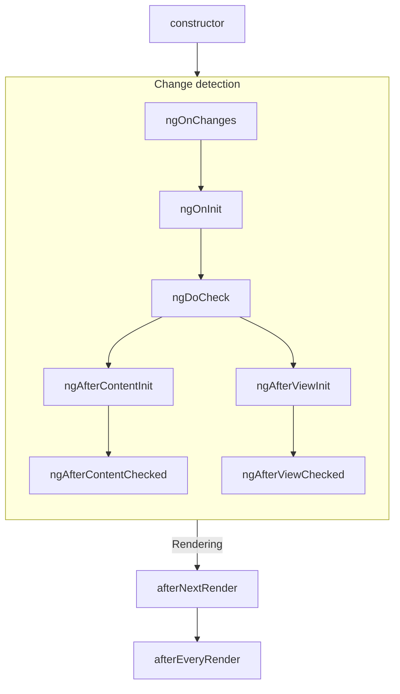
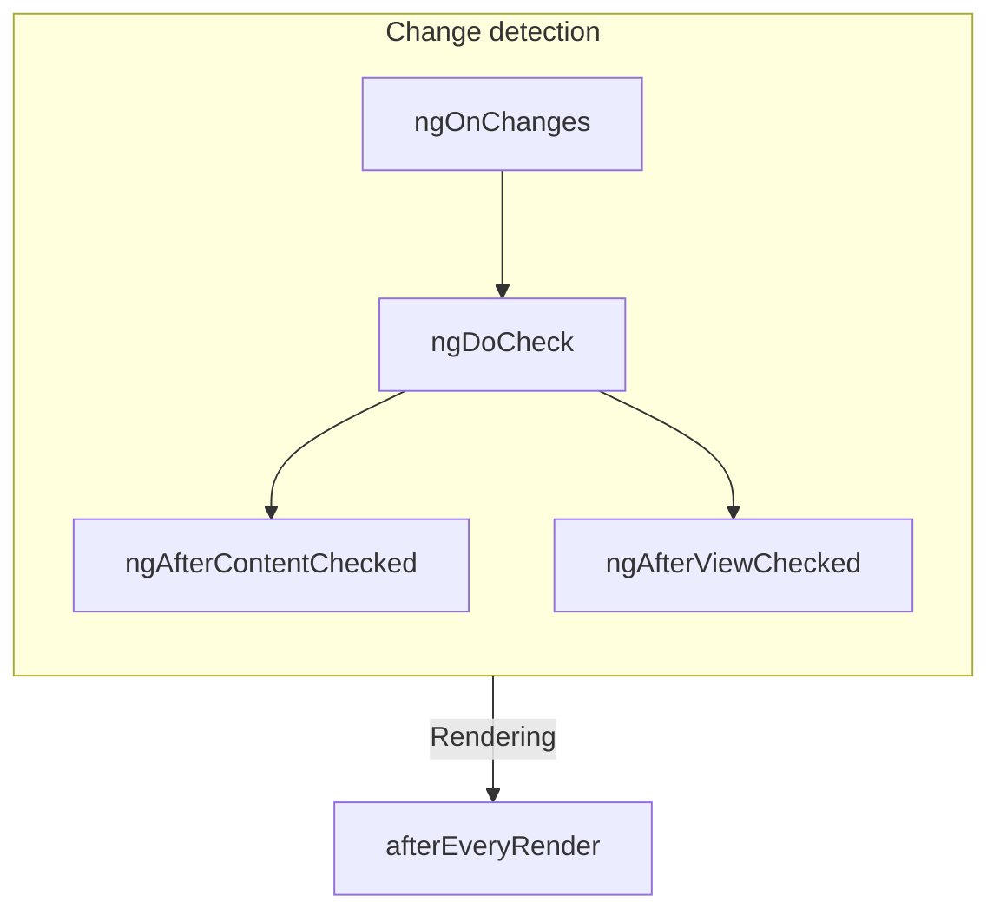

# Component Lifecycle

TIP: Bu rehber, [Temel Bilgiler Rehberi](essentials)'ni zaten okudugunuzu varsayar. Angular'da yeniyseniz once onu okuyun.

Bir bilesnenin **yasam dongusu**, bilesnenin olusturulmasi ile yok edilmesi arasinda gerceklesen adimlar dizisidir. Her adim, Angular'in bilesenleri render etme ve zaman icinde guncellemeleri kontrol etme surecinin farkli bir bolumunu temsil eder.

Bilesenlerinizde, bu adimlar sirasinda kod calistirmak icin **yasam dongusu kancalari** uygulayabilirsiniz. Belirli bir bilesen ornegi ile iliskili yasam dongusu kancalari, bilesen sinifinizdaki yontemler olarak uygulanir. Genel Angular uygulamasiyla iliskili yasam dongusu kancalari, bir geri cagrima kabul eden fonksiyonlar olarak uygulanir.

Bir bilesnenin yasam dongusu, Angular'in bilesenlerinizi zaman icinde degisiklikler acisindan nasil kontrol ettigiyle yakindan baglantilidir. Bu yasam dongusunu anlamak icin, Angular'in uygulama agacinizda yukaridan asagiya dogru yuruyerek sablon baglamalarindaki degisiklikleri kontrol ettigini bilmeniz yeterlidir. Asagida aciklanan yasam dongusu kancalari, Angular bu gecisi yaparken calisir. Bu gecis her bileseni tam olarak bir kez ziyaret eder, bu nedenle islemin ortasinda daha fazla durum degisikligi yapmaktan her zaman kacinmalisiniz.

## Summary

<div class="docs-table docs-scroll-track-transparent">
  <table>
    <tr>
      <td><strong>Asama</strong></td>
      <td><strong>Yontem</strong></td>
      <td><strong>Ozet</strong></td>
    </tr>
    <tr>
      <td>Olusturma</td>
      <td><code>constructor</code></td>
      <td>
        <a href="https://developer.mozilla.org/docs/Web/JavaScript/Reference/Classes/constructor" target="_blank">
          Standart JavaScript sinif constructor'i
        </a>. Angular bileseni orneklediginde calisir.
      </td>
    </tr>
    <tr>
      <td rowspan="7">Degisiklik<p>Algilama</td>
      <td><code>ngOnInit</code>
      </td>
      <td>Bilesnenin tum girdileri baslatildiktan sonra bir kez calisir.</td>
    </tr>
    <tr>
      <td><code>ngOnChanges</code></td>
      <td>Bilesnenin girdileri her degistiginde calisir.</td>
    </tr>
    <tr>
      <td><code>ngDoCheck</code></td>
      <td>Bu bilesen degisiklikler icin her kontrol edildiginde calisir.</td>
    </tr>
    <tr>
      <td><code>ngAfterContentInit</code></td>
      <td>Bilesnenin <em>icerigi</em> baslatildiktan sonra bir kez calisir.</td>
    </tr>
    <tr>
      <td><code>ngAfterContentChecked</code></td>
      <td>Bu bilesen icerigi degisiklikler icin her kontrol edildiginde calisir.</td>
    </tr>
    <tr>
      <td><code>ngAfterViewInit</code></td>
      <td>Bilesnenin <em>gorunumu</em> baslatildiktan sonra bir kez calisir.</td>
    </tr>
    <tr>
      <td><code>ngAfterViewChecked</code></td>
      <td>Bilesnenin gorunumu degisiklikler icin her kontrol edildiginde calisir.</td>
    </tr>
    <tr>
      <td rowspan="2">Render Etme</td>
      <td><code>afterNextRender</code></td>
      <td><strong>Tum</strong> bilesenler bir sonraki sefer DOM'a render edildikten sonra bir kez calisir.</td>
    </tr>
    <tr>
      <td><code>afterEveryRender</code></td>
      <td><strong>Tum</strong> bilesenler DOM'a her render edildikten sonra calisir.</td>
    </tr>
    <tr>
      <td>Yok Etme</td>
      <td><code>ngOnDestroy</code></td>
      <td>Bilesen yok edilmeden once bir kez calisir.</td>
    </tr>
  </table>
</div>

### ngOnInit

`ngOnInit` yontemi, Angular bilesnenin tum girdilerini baslangic degerleriyle baslattktan sonra calisir. Bir bilesnenin `ngOnInit`'i tam olarak bir kez calisir.

Bu adim, bilesnenin kendi sablonunun baslatilmasindan _once_ gerceklesir. Bu, bilesnenin durumunu baslangic girdi degerlerine gore guncelleyebileceginiz anlamina gelir.

### ngOnChanges

`ngOnChanges` yontemi, herhangi bir bilesen girdisi degistikten sonra calisir.

Bu adim, bilesnenin kendi sablonunun kontrol edilmesinden _once_ gerceklesir. Bu, bilesnenin durumunu baslangic girdi degerlerine gore guncelleyebileceginiz anlamina gelir.

Baslatma sirasinda, ilk `ngOnChanges` `ngOnInit`'ten once calisir.

#### Inspecting changes

`ngOnChanges` yontemi tek bir `SimpleChanges` argumani kabul eder. Bu nesne, her bilesen girdi adini bir `SimpleChange` nesnesine eslestiren bir [`Record`](https://www.typescriptlang.org/docs/handbook/utility-types.html#recordkeys-type)'dur. Her `SimpleChange`, girdinin onceki degerini, mevcut degerini ve girdinin ilk kez degisip degismedigini gosteren bir isaret icerir.

Daha guclu tur denetimi icin ilk generic arguman olarak istege bagli olarak mevcut sinifi veya this'i iletebilirsiniz.

```ts
@Component({
  /* ... */
})
export class UserProfile {
  name = input('');

  ngOnChanges(changes: SimpleChanges<UserProfile>) {
    if (changes.name) {
      console.log(`Previous: ${changes.name.previousValue}`);
      console.log(`Current: ${changes.name.currentValue}`);
      console.log(`Is first ${changes.name.firstChange}`);
    }
  }
}
```

Herhangi bir girdi ozelligi icin bir `alias` saglarsaniz, `SimpleChanges` Record'u hala anahtar olarak takma ad yerine TypeScript ozellik adini kullanir.

### ngOnDestroy

`ngOnDestroy` yontemi, bir bilesen yok edilmeden hemen once bir kez calisir. Angular, bir bileseni sayfada artik gosterilmediginde yok eder, ornegin `@if` ile gizlenme veya baska bir sayfaya navigasyon.

#### DestroyRef

`ngOnDestroy` yontemine alternatif olarak, bir `DestroyRef` ornegi enjekte edebilirsiniz. `DestroyRef`'in `onDestroy` yontemini cagirarak bilesnenin yok edilmesi uzerine cagirilacak bir geri cagrima kaydedebilirsiniz.

```ts
@Component({
  /* ... */
})
export class UserProfile {
  constructor() {
    inject(DestroyRef).onDestroy(() => {
      console.log('UserProfile destruction');
    });
  }
}
```

`DestroyRef` ornegini bilesen disindaki fonksiyonlara veya siniflara iletebilirsiniz. Bilesen yok edildiginde bazi temizlik davranisi calistirmasi gereken baska kodlariniz varsa bu kalabi kullanin.

Tum temizlik kodunu `ngOnDestroy` yontemine koymak yerine, kurulum kodunu temizlik koduna yakin tutmak icin de `DestroyRef` kullanabilirsiniz.

##### Detecting instance destruction

`DestroyRef`, belirli bir ornegin zaten yok edilip edilmedigini kontrol etmeye olanak taniyan bir `destroyed` ozelligi saglar. Bu, ozellikle gecikmeli veya asenkron mantikla ugrasilirken yok edilmis bilesenler uzerinde islem yapmayi onlemek icin kullanisildir.

`destroyRef.destroyed` degerini kontrol ederek, ornek temizlendikten sonra kod calistirmayi onleyerek `NG0911: View has already been destroyed.` gibi olasi hatalari onleyebilirsiniz.

### ngDoCheck

`ngDoCheck` yontemi, Angular bir bilesnenin sablonunu degisiklikler icin her kontrol etmeden once calisir.

Bu yasam dongusu kancasini, Angular'in normal degisiklik alglamasinin disindaki durum degisikliklerini manuel olarak kontrol ederek bilesnenin durumunu manuel olarak guncellemek icin kullanabilirsiniz.

Bu yontem cok sik calisir ve sayfa performansinizi onemli olcude etkileyebilir. Bu kancayi mumkun oldugunda tanimlamaktan kacinin ve yalnizca baska bir alternatifiniz olmadiginda kullanin.

Baslatma sirasinda, ilk `ngDoCheck` `ngOnInit`'ten sonra calisir.

### ngAfterContentInit

`ngAfterContentInit` yontemi, bilesnenin icerisine yuvalanan tum alt elemanlar (_icerigi_) baslatildiktan sonra bir kez calisir.

Bu yasam dongusu kancasini [icerik sorgulari](guide/components/queries#content-queries)'nin sonuclarini okumak icin kullanabilirsiniz. Bu sorgularin baslatilmis durumuna erissebilirsiniz, ancak bu yontemde herhangi bir durumu degistirmeye calismak [ExpressionChangedAfterItHasBeenCheckedError](errors/NG0100) hatasina neden olur.

### ngAfterContentChecked

`ngAfterContentChecked` yontemi, bilesnenin icerisine yuvalanan alt elemanlar (_icerigi_) degisiklikler icin her kontrol edildiginde calisir.

Bu yontem cok sik calisir ve sayfa performansinizi onemli olcude etkileyebilir. Bu kancayi mumkun oldugunda tanimlamaktan kacinin ve yalnizca baska bir alternatifiniz olmadiginda kullanin.

[Icerik sorgulari](guide/components/queries#content-queries)'nin guncellenmis durumuna burada erissebilirsiniz, ancak bu yontemde herhangi bir durumu degistirmeye calismak [ExpressionChangedAfterItHasBeenCheckedError](errors/NG0100) hatasina neden olur.

### ngAfterViewInit

`ngAfterViewInit` yontemi, bilesnenin sablonundaki tum alt elemanlar (_gorunumu_) baslatildiktan sonra bir kez calisir.

Bu yasam dongusu kancasini [gorunum sorgulari](guide/components/queries#view-queries)'nin sonuclarini okumak icin kullanabilirsiniz. Bu sorgularin baslatilmis durumuna erissebilirsiniz, ancak bu yontemde herhangi bir durumu degistirmeye calismak [ExpressionChangedAfterItHasBeenCheckedError](errors/NG0100) hatasina neden olur.

### ngAfterViewChecked

`ngAfterViewChecked` yontemi, bilesnenin sablonundaki alt elemanlar (_gorunumu_) degisiklikler icin her kontrol edildiginde calisir.

Bu yontem cok sik calisir ve sayfa performansinizi onemli olcude etkileyebilir. Bu kancayi mumkun oldugunda tanimlamaktan kacinin ve yalnizca baska bir alternatifiniz olmadiginda kullanin.

[Gorunum sorgulari](guide/components/queries#view-queries)'nin guncellenmis durumuna burada erissebilirsiniz, ancak bu yontemde herhangi bir durumu degistirmeye calismak [ExpressionChangedAfterItHasBeenCheckedError](errors/NG0100) hatasina neden olur.

### afterEveryRender and afterNextRender

`afterEveryRender` ve `afterNextRender` fonksiyonlari, Angular sayfadaki _tum bilesenleri_ DOM'a render etmeyi bitirdikten sonra cagirilacak bir **render geri cagrisi** kaydetmenize olanak tanir.

Bu fonksiyonlar, bu rehberde aciklanan diger yasam dongusu kancalarindan farklidir. Bir sinif yontemi olmak yerine, bir geri cagrima kabul eden bagimsiz fonksiyonlardir. Render geri cagrimalarinin calistirilmasi belirli bir bilesen ornegine bagli degildir, bunun yerine uygulama genelinde bir kancadir.

`afterEveryRender` ve `afterNextRender` bir [enjeksiyon baglaminda](guide/di/dependency-injection-context) cagrilmalidir, tipik olarak bilesnenin constructor'inda.

Manuel DOM islemleri gerceklestirmek icin render geri cagrimalarini kullanabilirsiniz.
Angular'da DOM ile calisma rehberligi icin [DOM API'lerini Kullanma](guide/components/dom-apis) belgesine bakin.

Render geri cagrilari, sunucu tarafi render etme veya derleme zamani on-render etme sirasinda calismaz.

#### after\*Render phases

`afterEveryRender` veya `afterNextRender` kullanirken, isi istege bagli olarak asamalara bollebilirsiniz. Asama, DOM islemlerinin siralamasini kontrol etmenizi saglar ve [duzeni bozmayi](https://web.dev/avoid-large-complex-layouts-and-layout-thrashing) en aza indirmek icin _yazma_ islemlerini _okuma_ islemlerinden once siralamniza olanak tanir. Asamalar arasi iletisim icin, bir asama fonksiyonu sonraki asamada erisilebilecek bir sonuc degeri dondureblir.

```ts
import {Component, ElementRef, afterNextRender} from '@angular/core';

@Component({
  /*...*/
})
export class UserProfile {
  private prevPadding = 0;
  private elementHeight = 0;

  constructor() {
    const elementRef = inject(ElementRef);
    const nativeElement = elementRef.nativeElement;

    afterNextRender({
      // Use the `Write` phase to write to a geometric property.
      write: () => {
        const padding = computePadding();
        const changed = padding !== this.prevPadding;
        if (changed) {
          nativeElement.style.padding = padding;
        }
        return changed; // Communicate whether anything changed to the read phase.
      },

      // Use the `Read` phase to read geometric properties after all writes have occurred.
      read: (didWrite) => {
        if (didWrite) {
          this.elementHeight = nativeElement.getBoundingClientRect().height;
        }
      },
    });
  }
}
```

Asagidaki sirada calistirilan dort asama vardir:

| Asama            | Aciklama                                                                                                                                                                                                 |
| ---------------- | -------------------------------------------------------------------------------------------------------------------------------------------------------------------------------------------------------- |
| `earlyRead`      | Sonraki hesaplama icin kesinlikle gerekli olan duzeni etkileyen DOM ozelliklerini ve stillerini okumak icin bu asmayi kullanin. Mumkunse bu asamadan kacinin, `write` ve `read` asamalarini tercih edin. |
| `write`          | Duzeni etkileyen DOM ozelliklerini ve stillerini yazmak icin bu asmayi kullanin.                                                                                                                         |
| `mixedReadWrite` | Varsayilan asama. Hem duzeni etkileyen ozellikleri hem de stilleri okumasi ve yazmasi gereken islemler icin kullanin. Mumkunse bu asamadan kacinin, acik `write` ve `read` asamalarini tercih edin.      |
| `read`           | Duzeni etkileyen DOM ozelliklerini okumak icin bu asmayi kullanin.                                                                                                                                       |

## Lifecycle interfaces

Angular, her yasam dongusu yontemi icin bir TypeScript arayuzu saglar. Uygulamanizda yazim hatasi veya imla hatasi olmadigni saglamak icin istege bagli olarak bu arayuzleri icerebilir (import) ve `implement` edebilirsiniz.

Her arayuz, karsilik gelen yontemle ayni ada sahiptir, ancak `ng` oneki olmadan. Ornegin, `ngOnInit` arayuzu `OnInit`'tir.

```ts
@Component({
  /* ... */
})
export class UserProfile implements OnInit {
  ngOnInit() {
    /* ... */
  }
}
```

## Execution order

Asagidaki diyagramlar Angular'in yasam dongusu kancalarinin calisma sirasini gostermektedir.

### During initialization



### Subsequent updates



### Ordering with directives

Bir sablonda veya `hostDirectives` ozelligi ile ayni elemana bir veya daha fazla direktif ile birlikte bir bilesen yerlestirdiginizde, framework tek bir eleman uzerindeki bilesen ve direktifler arasinda belirli bir yasam dongusu kancasi icin herhangi bir siralama garantisi vermez. Gozlemlenen bir siralamaya asla guvenmeyin, cunku bu Angular'in sonraki surumlerinde degisebilir.
