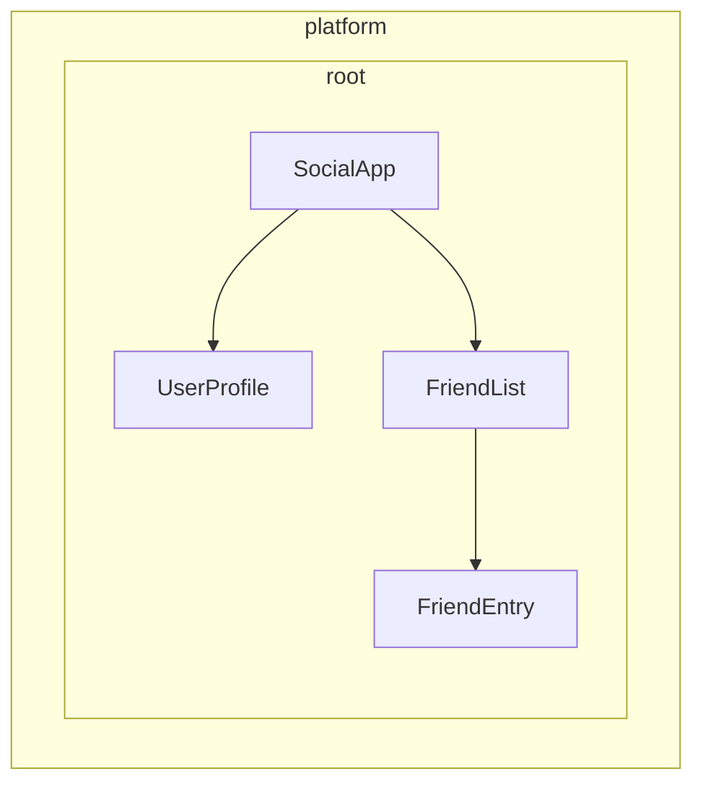

# Bağımlılık provider'larını tanımlama

Angular, servisleri enjeksiyon için kullanılabilir hale getirmenin iki yolunu sunar:

1. **Otomatik sağlama** - `@Injectable` dekoratöründe `providedIn` kullanarak veya `InjectionToken` yapılandırmasında bir fabrika sağlayarak
2. **Manuel sağlama** - Bileşenlerde, direktiflerde, rotalarda veya uygulama yapılandırmasında `providers` dizisini kullanarak

[Önceki kılavuzda](/guide/di/creating-and-using-services), çoğu yaygın kullanım durumunu ele alan `providedIn: 'root'` kullanarak servislerin nasıl oluşturulacağını öğrendiniz. Bu kılavuz, hem otomatik hem de manuel sağlayıcı yapılandırması için ek desenleri inceler.

## Sınıf dışı bağımlılıklar için otomatik sağlama

`@Injectable` dekoratörü ile `providedIn: 'root'` servisler (sınıflar) için harika çalışırken, başka türde değerleri global olarak sağlamanız gerekebilir - yapılandırma nesneleri, fonksiyonlar veya ilkel değerler gibi. Angular bu amaçla `InjectionToken` sağlar.

### InjectionToken nedir?

`InjectionToken`, Angular'ın bağımlılık enjeksiyonu sisteminin enjeksiyon için değerleri benzersiz şekilde tanımlamak için kullandığı bir nesnedir. Bunu, Angular'ın DI sisteminde herhangi bir türde değer depolamanıza ve almanıza olanak tanıyan özel bir anahtar olarak düşünün:

```ts
import {InjectionToken} from '@angular/core';

// Bir string değer için token oluştur
export const API_URL = new InjectionToken<string>('api.url');

// Bir fonksiyon için token oluştur
export const LOGGER = new InjectionToken<(msg: string) => void>('logger.function');

// Karmaşık bir tür için token oluştur
export interface Config {
  apiUrl: string;
  timeout: number;
}
export const CONFIG_TOKEN = new InjectionToken<Config>('app.config');
```

NOTE: String parametresi (örn., `'api.url'`) tamamen hata ayıklama amaçlı bir açıklamadır -- Angular, token'ları bu string ile değil nesne referansları ile tanımlar.

### `providedIn: 'root'` ile InjectionToken

`factory`'ye sahip bir `InjectionToken`, varsayılan olarak `providedIn: 'root'` ile sonuçlanır (ancak `providedIn` özelliği ile geçersiz kılınabilir).

```ts
// 📁 /app/config.token.ts
import {InjectionToken} from '@angular/core';

export interface AppConfig {
  apiUrl: string;
  version: string;
  features: Record<string, boolean>;
}

// providedIn kullanarak global olarak kullanılabilir yapılandırma
export const APP_CONFIG = new InjectionToken<AppConfig>('app.config', {
  providedIn: 'root',
  factory: () => ({
    apiUrl: 'https://api.example.com',
    version: '1.0.0',
    features: {
      darkMode: true,
      analytics: false,
    },
  }),
});

// providers dizisine eklemeye gerek yok - her yerde kullanılabilir!
@Component({
  selector: 'app-header',
  template: `<h1>Version: {{ config.version }}</h1>`,
})
export class Header {
  config = inject(APP_CONFIG); // Otomatik olarak kullanılabilir
}
```

### Fabrika fonksiyonları ile InjectionToken ne zaman kullanılır

Bir sınıf kullanamadığınızda ancak bağımlılıkları global olarak sağlamanız gerektiğinde, fabrika fonksiyonları ile InjectionToken idealdir:

```ts
// 📁 /app/logger.token.ts
import {InjectionToken, inject} from '@angular/core';
import {APP_CONFIG} from './config.token';

// Logger fonksiyon türü
export type LoggerFn = (level: string, message: string) => void;

// Bağımlılıklara sahip global logger fonksiyonu
export const LOGGER_FN = new InjectionToken<LoggerFn>('logger.function', {
  providedIn: 'root',
  factory: () => {
    const config = inject(APP_CONFIG);

    return (level: string, message: string) => {
      if (config.features.logging !== false) {
        console[level](`[${new Date().toISOString()}] ${message}`);
      }
    };
  },
});

// 📁 /app/storage.token.ts
// Tarayıcı API'lerini token olarak sağlama
export const LOCAL_STORAGE = new InjectionToken<Storage>('localStorage', {
  // providedIn: 'root' varsayılan olarak yapılandırılmıştır
  factory: () => window.localStorage,
});

export const SESSION_STORAGE = new InjectionToken<Storage>('sessionStorage', {
  providedIn: 'root',
  factory: () => window.sessionStorage,
});

// 📁 /app/feature-flags.token.ts
// Çalışma zamanı mantığı ile karmaşık yapılandırma
export const FEATURE_FLAGS = new InjectionToken<Map<string, boolean>>('feature.flags', {
  providedIn: 'root',
  factory: () => {
    const flags = new Map<string, boolean>();

    // Ortam veya URL parametrelerinden ayrıştır
    const urlParams = new URLSearchParams(window.location.search);
    const enableBeta = urlParams.get('beta') === 'true';

    flags.set('betaFeatures', enableBeta);
    flags.set('darkMode', true);
    flags.set('newDashboard', false);

    return flags;
  },
});
```

Bu yaklaşım birçok avantaj sunar:

- **Manuel sağlayıcı yapılandırması gerekmez** - Servisler için `providedIn: 'root'` gibi çalışır
- **Tree-shakeable** - Yalnızca gerçekten kullanılıyorsa dahil edilir
- **Tür güvenli** - Sınıf dışı değerler için tam TypeScript desteği
- **Diğer bağımlılıkları enjekte edebilir** - Fabrika fonksiyonları diğer servislere erişmek için `inject()` kullanabilir

## Manuel provider yapılandırmasını anlama

`providedIn: 'root'`'un sunduğundan daha fazla kontrol gerektiğinde, sağlayıcıları manuel olarak yapılandırabilirsiniz. `providers` dizisi aracılığıyla manuel yapılandırma şu durumlarda faydalıdır:

1. **Servisin `providedIn`'i yoksa** - Otomatik sağlama olmayan servisler manuel olarak sağlanmalıdır
2. **Yeni bir örnek istiyorsanız** - Paylaşılan örneği kullanmak yerine bileşen/direktif seviyesinde ayrı bir örnek oluşturmak için
3. **Çalışma zamanı yapılandırması gerekiyorsa** - Servis davranışı çalışma zamanı değerlerine bağlı olduğunda
4. **Sınıf dışı değerler sağlıyorsanız** - Yapılandırma nesneleri, fonksiyonlar veya ilkel değerler

### Örnek: `providedIn` olmadan service

```ts
import {Injectable, Component, inject} from '@angular/core';

// providedIn olmayan service
@Injectable()
export class LocalDataStore {
  private data: string[] = [];

  addData(item: string) {
    this.data.push(item);
  }
}

// Bileşen bunu sağlamalıdır
@Component({
  selector: 'app-example',
  // `LocalDataStore` service'inin providedIn'i olmadığı için burada bir provider gereklidir.
  providers: [LocalDataStore],
  template: `...`,
})
export class Example {
  dataStore = inject(LocalDataStore);
}
```

### Örnek: Bileşene özgü örnekler oluşturma

`providedIn: 'root'` ile sağlanan servisler bileşen seviyesinde geçersiz kılınabilir. Bu, servisin örneğini bir bileşenin yaşam döngüsüne bağlar. Sonuç olarak, bileşen yok edildiğinde, sağlanan servis de yok edilir.

```ts
import {Injectable, Component, inject} from '@angular/core';

@Injectable({providedIn: 'root'})
export class DataStore {
  private data: ListItem[] = [];
}

// Bu bileşen kendi örneğini alır
@Component({
  selector: 'app-isolated',
  // Root seviyesinde sağlanan örneği kullanmak yerine `DataStore`'un yeni bir örneğini oluşturur.
  providers: [DataStore],
  template: `...`,
})
export class Isolated {
  dataStore = inject(DataStore); // Bileşene özgü örnek
}
```

## Angular'da injector hiyerarşisi

Angular'ın bağımlılık enjeksiyonu sistemi hiyerarşiktir. Bir bileşen bir bağımlılık istediğinde, Angular o bileşenin enjektöründen başlar ve bu bağımlılık için bir sağlayıcı bulana kadar ağaçta yukarı doğru ilerler. Uygulama ağacınızdaki her bileşenin kendi enjektörü olabilir ve bu enjektörler bileşen ağacınızı yansıtan bir hiyerarşi oluşturur.

Bu hiyerarşi şunları sağlar:

- **Kapsamlı örnekler**: Uygulamanızın farklı bölümleri aynı servisin farklı örneklerine sahip olabilir
- **Geçersiz kılma davranışı**: Alt bileşenler üst bileşenlerden gelen sağlayıcıları geçersiz kılabilir
- **Bellek verimliliği**: Servisler yalnızca gerekli olduğu yerde örneklendirilir

Angular'da, bir bileşen veya direktife sahip herhangi bir eleman tüm alt öğelerine değerler sağlayabilir.



Yukarıdaki örnekte:

1. `SocialApp`, `UserProfile` ve `FriendList` için değerler sağlayabilir
2. `FriendList`, `FriendEntry`'ye enjeksiyon için değerler sağlayabilir, ancak ağacın parçası olmadığı için `UserProfile`'a enjeksiyon için değer sağlayamaz

## Bir provider bildirme

Angular'ın bağımlılık enjeksiyonu sistemini bir hash map veya sözlük olarak düşünün. Her sağlayıcı yapılandırma nesnesi bir anahtar-değer çifti tanımlar:

- **Anahtar (Sağlayıcı tanımlayıcı)**: Bir bağımlılığı istemek için kullandığınız benzersiz tanımlayıcı
- **Değer**: Bu token istendiğinde Angular'ın döndürmesi gereken şey

Bağımlılıkları manuel olarak sağlarken, genellikle şu kısaltılmış sözdizimini görürsünüz:

```angular-ts
import {Component} from '@angular/core';
import {LocalService} from './local-service';

@Component({
  selector: 'app-example',
  providers: [LocalService], // providedIn olmayan service
})
export class Example {}
```

Bu aslında daha ayrıntılı bir sağlayıcı yapılandırmasının kısaltmasıdır:

```ts
{
  // Bu kısaltılmış versiyondur
  providers: [LocalService],

  // Bu tam versiyondur
  providers: [
    { provide: LocalService, useClass: LocalService }
  ]
}
```

### Provider yapılandırma nesnesi

Her sağlayıcı yapılandırma nesnesinin iki temel parçası vardır:

1. **Sağlayıcı tanımlayıcı**: Angular'ın bağımlılığı almak için kullandığı benzersiz anahtar (`provide` özelliği aracılığıyla ayarlanır)
2. **Değer**: Angular'ın getirmesini istediğiniz gerçek bağımlılık, istenen türe göre farklı anahtarlarla yapılandırılır:
   - `useClass` - Bir JavaScript sınıfı sağlar
   - `useValue` - Statik bir değer sağlar
   - `useFactory` - Değeri döndüren bir fabrika fonksiyonu sağlar
   - `useExisting` - Mevcut bir sağlayıcıya takma ad sağlar

### Provider tanımlayıcıları

Sağlayıcı tanımlayıcıları, Angular'ın bağımlılık enjeksiyonu (DI) sisteminin benzersiz bir kimlik aracılığıyla bir bağımlılığı almasına olanak tanır. Sağlayıcı tanımlayıcılarını iki şekilde oluşturabilirsiniz:

1. [Sınıf adları](#sınıf-adları)
2. [Enjeksiyon token'ları](#injection-tokenlar)

#### Sınıf adları

Sınıf adı, içe aktarılan sınıfı doğrudan tanımlayıcı olarak kullanır:

```angular-ts
import {Component} from '@angular/core';
import {LocalService} from './local-service';

@Component({
  selector: 'app-example',
  providers: [{provide: LocalService, useClass: LocalService}],
})
export class Example {
  /* ... */
}
```

Sınıf hem tanımlayıcı hem de uygulama olarak hizmet eder, bu nedenle Angular `providers: [LocalService]` kısaltmasını sağlar.

#### Injection token'lar

Angular, enjekte edilebilir değerler için veya aynı arayüzün birden fazla uygulamasını sağlamak istediğinizde benzersiz bir nesne referansı oluşturan yerleşik [`InjectionToken`](api/core/InjectionToken) sınıfını sağlar.

```ts
// 📁 /app/tokens.ts
import {InjectionToken} from '@angular/core';
import {DataService} from './data-service.interface';

export const DATA_SERVICE_TOKEN = new InjectionToken<DataService>('DataService');
```

NOTE: `'DataService'` string'i tamamen hata ayıklama amacıyla kullanılan bir açıklamadır. Angular, token'ı bu string ile değil nesne referansı ile tanımlar.

Token'ı sağlayıcı yapılandırmanızda kullanın:

```angular-ts
import {Component, inject} from '@angular/core';
import {LocalDataService} from './local-data-service';
import {DATA_SERVICE_TOKEN} from './tokens';

@Component({
  selector: 'app-example',
  providers: [{provide: DATA_SERVICE_TOKEN, useClass: LocalDataService}],
})
export class Example {
  private dataService = inject(DATA_SERVICE_TOKEN);
}
```

#### TypeScript arayüzleri enjeksiyon için tanımlayıcı olarak kullanılabilir mi?

TypeScript arayüzleri çalışma zamanında var olmadıkları için enjeksiyon amacıyla kullanılamaz:

```ts
// ❌ Bu çalışmaz!
interface DataService {
  getData(): string[];
}

// Arayüzler TypeScript derlemesinden sonra kaybolur
@Component({
  providers: [
    {provide: DataService, useClass: LocalDataService}, // Hata!
  ],
})
export class Example {
  private dataService = inject(DataService); // Hata!
}

// ✅ Bunun yerine InjectionToken kullanın
export const DATA_SERVICE_TOKEN = new InjectionToken<DataService>('DataService');

@Component({
  providers: [{provide: DATA_SERVICE_TOKEN, useClass: LocalDataService}],
})
export class Example {
  private dataService = inject(DATA_SERVICE_TOKEN); // Çalışır!
}
```

`InjectionToken`, Angular'ın DI sisteminin kullanabileceği bir çalışma zamanı değeri sağlarken, TypeScript'in generic tür parametresi aracılığıyla tür güvenliğini korur.

### Provider değer türleri

#### useClass

`useClass`, bir bağımlılık olarak bir JavaScript sınıfı sağlar. Kısaltılmış sözdizimi kullanıldığında varsayılandır:

```ts
// Kısaltma
providers: [DataService];

// Tam sözdizimi
providers: [{provide: DataService, useClass: DataService}];

// Farklı uygulama
providers: [{provide: DataService, useClass: MockDataService}];

// Koşullu uygulama
providers: [
  {
    provide: StorageService,
    useClass: environment.production ? CloudStorageService : LocalStorageService,
  },
];
```

#### Pratik örnek: Logger değiştirme

İşlevselliği genişletmek için uygulamaları ikame edebilirsiniz:

```ts
import {Injectable, Component, inject} from '@angular/core';

// Temel logger
@Injectable()
export class Logger {
  log(message: string) {
    console.log(message);
  }
}

// Zaman damgası ile geliştirilmiş logger
@Injectable()
export class BetterLogger extends Logger {
  override log(message: string) {
    super.log(`[${new Date().toISOString()}] ${message}`);
  }
}

// Kullanıcı bağlamını içeren logger
@Injectable()
export class EvenBetterLogger extends Logger {
  private userService = inject(UserService);

  override log(message: string) {
    const name = this.userService.user.name;
    super.log(`Message to ${name}: ${message}`);
  }
}

// Bileşeninizde
@Component({
  selector: 'app-example',
  providers: [
    UserService, // EvenBetterLogger buna ihtiyaç duyar
    {provide: Logger, useClass: EvenBetterLogger},
  ],
})
export class Example {
  private logger = inject(Logger); // EvenBetterLogger örneğini alır
}
```

#### useValue

`useValue`, statik bir değer olarak herhangi bir JavaScript veri türünü sağlar:

```ts
providers: [
  {provide: API_URL_TOKEN, useValue: 'https://api.example.com'},
  {provide: MAX_RETRIES_TOKEN, useValue: 3},
  {provide: FEATURE_FLAGS_TOKEN, useValue: {darkMode: true, beta: false}},
];
```

IMPORTANT: TypeScript türleri ve arayüzleri bağımlılık değerleri olarak hizmet edemez. Yalnızca derleme zamanında var olurlar.

#### Pratik örnek: Uygulama yapılandırması

`useValue` için yaygın bir kullanım durumu, uygulama yapılandırması sağlamaktır:

```ts
// Yapılandırma arayüzünü tanımla
export interface AppConfig {
  apiUrl: string;
  appTitle: string;
  features: {
    darkMode: boolean;
    analytics: boolean;
  };
}

// Injection token oluştur
export const APP_CONFIG = new InjectionToken<AppConfig>('app.config');

// Yapılandırmayı tanımla
const appConfig: AppConfig = {
  apiUrl: 'https://api.example.com',
  appTitle: 'My Application',
  features: {
    darkMode: true,
    analytics: false,
  },
};

// Bootstrap'te sağla
bootstrapApplication(AppComponent, {
  providers: [{provide: APP_CONFIG, useValue: appConfig}],
});

// Bileşende kullan
@Component({
  selector: 'app-header',
  template: `<h1>{{ title }}</h1>`,
})
export class Header {
  private config = inject(APP_CONFIG);
  title = this.config.appTitle;
}
```

#### useFactory

`useFactory`, enjeksiyon için yeni bir değer üreten bir fonksiyon sağlar:

```ts
export const loggerFactory = (config: AppConfig) => {
  return new LoggerService(config.logLevel, config.endpoint);
};

providers: [
  {
    provide: LoggerService,
    useFactory: loggerFactory,
    deps: [APP_CONFIG], // Fabrika fonksiyonunun bağımlılıkları
  },
];
```

Fabrika bağımlılıklarını isteğe bağlı olarak işaretleyebilirsiniz:

```ts
import {Optional} from '@angular/core';

providers: [
  {
    provide: MyService,
    useFactory: (required: RequiredService, optional?: OptionalService) => {
      return new MyService(required, optional || new DefaultService());
    },
    deps: [RequiredService, [new Optional(), OptionalService]],
  },
];
```

#### Pratik örnek: Yapılandırma tabanlı API istemcisi

İşte çalışma zamanı yapılandırmasıyla bir servis oluşturmak için fabrika kullanımını gösteren eksiksiz bir örnek:

```ts
// Çalışma zamanı yapılandırması gerektiren service
class ApiClient {
  constructor(
    private http: HttpClient,
    private baseUrl: string,
    private rateLimitMs: number,
  ) {}

  async fetchData(endpoint: string) {
    // Kullanıcı seviyesine göre hız sınırlaması uygula
    await this.applyRateLimit();
    return this.http.get(`${this.baseUrl}/${endpoint}`);
  }

  private async applyRateLimit() {
    // Basitleştirilmiş örnek - gerçek uygulama istek zamanlamasını takip eder
    return new Promise((resolve) => setTimeout(resolve, this.rateLimitMs));
  }
}

// Kullanıcı seviyesine göre yapılandıran fabrika fonksiyonu
import {inject} from '@angular/core';
import {HttpClient} from '@angular/common/http';
const apiClientFactory = () => {
  const http = inject(HttpClient);
  const userService = inject(UserService);

  // userService'in bu değerleri sağladığını varsayarak
  const baseUrl = userService.getApiBaseUrl();
  const rateLimitMs = userService.getRateLimit();

  return new ApiClient(http, baseUrl, rateLimitMs);
};

// Provider yapılandırması
export const apiClientProvider = {
  provide: ApiClient,
  useFactory: apiClientFactory,
};

// Bileşende kullanım
@Component({
  selector: 'app-dashboard',
  providers: [apiClientProvider],
})
export class Dashboard {
  private apiClient = inject(ApiClient);
}
```

#### useExisting

`useExisting`, zaten tanımlanmış bir sağlayıcı için bir takma ad oluşturur. Her iki token da aynı örneği döndürür:

```ts
providers: [
  NewLogger, // Gerçek service
  {provide: OldLogger, useExisting: NewLogger}, // Takma ad
];
```

IMPORTANT: `useExisting`'i `useClass` ile karıştırmayın. `useClass` ayrı örnekler oluşturur, `useExisting` ise aynı tekil örneği almanızı sağlar.

### Birden fazla provider

Birden fazla sağlayıcı aynı token'a değer katkıda bulunduğunda `multi: true` bayrağını kullanın:

```ts
export const INTERCEPTOR_TOKEN = new InjectionToken<Interceptor[]>('interceptors');

providers: [
  {provide: INTERCEPTOR_TOKEN, useClass: AuthInterceptor, multi: true},
  {provide: INTERCEPTOR_TOKEN, useClass: LoggingInterceptor, multi: true},
  {provide: INTERCEPTOR_TOKEN, useClass: RetryInterceptor, multi: true},
];
```

`INTERCEPTOR_TOKEN`'ı enjekte ettiğinizde, üç interceptor'ın örneklerini içeren bir dizi alırsınız.

## Provider'ları nerede belirtebilirsiniz?

Angular, sağlayıcıları kaydedebileceğiniz birkaç seviye sunar ve her birinin kapsam, yaşam döngüsü ve performans için farklı etkileri vardır:

- [**Uygulama başlatma**](#uygulama-başlatma) - Her yerde kullanılabilir global tekil örnekler
- [**Bir eleman üzerinde (bileşen veya direktif)**](#bileşen-veya-direktif-providerları) - Belirli bileşen ağaçları için izole örnekler
- [**Rota**](#rota-providerları) - Tembel yüklenen modüller için özelliğe özgü servisler

### Uygulama başlatma

Şu durumlarda `bootstrapApplication`'da uygulama seviyesi sağlayıcıları kullanın:

- **Servis birden fazla özellik alanında kullanılıyorsa** - Uygulamanızın birçok bölümünün ihtiyaç duyduğu HTTP istemcileri, günlükleme veya kimlik doğrulama gibi servisler
- **Gerçek bir tekil istiyorsanız** - Tüm uygulama tarafından paylaşılan tek bir örnek
- **Servisin bileşene özgü yapılandırması yoksa** - Her yerde aynı şekilde çalışan genel amaçlı yardımcı araçlar
- **Global yapılandırma sağlıyorsanız** - API uç noktaları, özellik bayrakları veya ortam ayarları

```ts
// main.ts
bootstrapApplication(App, {
  providers: [
    {provide: API_BASE_URL, useValue: 'https://api.example.com'},
    {provide: INTERCEPTOR_TOKEN, useClass: AuthInterceptor, multi: true},
    LoggingService, // Uygulama genelinde kullanılır
    {provide: ErrorHandler, useClass: GlobalErrorHandler},
  ],
});
```

**Avantajlar:**

- Tek örnek bellek kullanımını azaltır
- Ek kurulum olmadan her yerde kullanılabilir
- Global durumu yönetmek daha kolaydır

**Dezavantajlar:**

- Değer hiç enjekte edilmese bile her zaman JavaScript paketinize dahil edilir
- Özellik başına kolayca özelleştirilemez
- Bireysel bileşenleri izole olarak test etmek daha zordur

#### Neden `providedIn: 'root'` yerine bootstrap sırasında sağlanır?

Şu durumlarda başlatma sırasında bir sağlayıcı isteyebilirsiniz:

- Sağlayıcının yan etkileri varsa (örn., istemci tarafı yönlendiriciyi yükleme)
- Sağlayıcı yapılandırma gerektiriyorsa (örn., rotalar)
- Angular'ın `provideSomething` desenini kullanıyorsanız (örn., `provideRouter`, `provideHttpClient`)

### Bileşen veya direktif provider'ları

Şu durumlarda bileşen veya direktif sağlayıcıları kullanın:

- **Servisin bileşene özgü durumu varsa** - Form doğrulayıcılar, bileşene özgü önbellekler veya UI durum yöneticileri
- **İzole örneklere ihtiyacınız varsa** - Her bileşenin servisin kendi kopyasına ihtiyaç duyması
- **Servis yalnızca bir bileşen ağacı tarafından kullanılıyorsa** - Global erişim gerektirmeyen özel servisler
- **Yeniden kullanılabilir bileşenler oluşturuyorsanız** - Kendi servisleriyle bağımsız çalışması gereken bileşenler

```angular-ts
// Kendi doğrulama service'ine sahip özelleştirilmiş form bileşeni
@Component({
  selector: 'app-advanced-form',
  providers: [
    FormValidationService, // Her form kendi doğrulayıcısını alır
    {provide: FORM_CONFIG, useValue: {strictMode: true}},
  ],
})
export class AdvancedForm {}

// İzole durum yönetimine sahip modal bileşeni
@Component({
  selector: 'app-modal',
  providers: [
    ModalStateService, // Her modal kendi durumunu yönetir
  ],
})
export class Modal {}
```

**Avantajlar:**

- Daha iyi kapsülleme ve izolasyon
- Bileşenleri bireysel olarak test etmek daha kolay
- Birden fazla örnek farklı yapılandırmalarla bir arada bulunabilir

**Dezavantajlar:**

- Her bileşen için yeni örnek oluşturulur (daha yüksek bellek kullanımı)
- Bileşenler arasında paylaşılan durum yok
- İhtiyaç duyulan her yerde sağlanmalıdır
- Değer hiç enjekte edilmese bile her zaman bileşen veya direktif ile aynı JavaScript paketine dahil edilir

NOTE: Aynı eleman üzerinde birden fazla direktif aynı token'ı sağlıyorsa, biri kazanır, ancak hangisi tanımsızdır.

### Rota provider'ları

Rota seviyesi sağlayıcılarını şunlar için kullanın:

- **Özelliğe özgü servisler** - Yalnızca belirli rotalar veya özellik modülleri için gereken servisler
- **Tembel yüklenen modül bağımlılıkları** - Yalnızca belirli özelliklerle yüklenmesi gereken servisler
- **Rotaya özgü yapılandırma** - Uygulama alanına göre değişen ayarlar

```ts
// routes.ts
export const routes: Routes = [
  {
    path: 'admin',
    providers: [
      AdminService, // Yalnızca admin rotalarıyla yüklenir
      {provide: FEATURE_FLAGS, useValue: {adminMode: true}},
    ],
    loadChildren: () => import('./admin/admin.routes'),
  },
  {
    path: 'shop',
    providers: [
      ShoppingCartService, // İzole alışveriş durumu
      PaymentService,
    ],
    loadChildren: () => import('./shop/shop.routes'),
  },
];
```

Rota seviyesinde sağlanan servisler, o rota içindeki tüm bileşenler ve direktifler ile korumaları ve çözücüleri tarafından kullanılabilir.

Bu servisler rotanın bileşenlerinden bağımsız olarak örneklendirildiğinden, rotaya özgü bilgilere doğrudan erişimleri yoktur.

## Kütüphane yazarı desenleri

Angular kütüphaneleri oluştururken, temiz API'leri korurken tüketiciler için esnek yapılandırma seçenekleri sağlamanız gerekir. Angular'ın kendi kütüphaneleri, bunu başarmak için güçlü desenler gösterir.

### `provide` deseni

Kullanıcıların karmaşık sağlayıcıları manuel olarak yapılandırmasını gerektirmek yerine, kütüphane yazarları sağlayıcı yapılandırmalarını döndüren fonksiyonları dışa aktarabilir:

```ts
// 📁 /libs/analytics/src/providers.ts
import {InjectionToken, Provider, inject} from '@angular/core';

// Yapılandırma arayüzü
export interface AnalyticsConfig {
  trackingId: string;
  enableDebugMode?: boolean;
  anonymizeIp?: boolean;
}

// Yapılandırma için dahili token
const ANALYTICS_CONFIG = new InjectionToken<AnalyticsConfig>('analytics.config');

// Yapılandırmayı kullanan ana service
export class AnalyticsService {
  private config = inject(ANALYTICS_CONFIG);

  track(event: string, properties?: any) {
    // Yapılandırmayı kullanan uygulama
  }
}

// Tüketiciler için provider fonksiyonu
export function provideAnalytics(config: AnalyticsConfig): Provider[] {
  return [{provide: ANALYTICS_CONFIG, useValue: config}, AnalyticsService];
}

// Tüketici uygulamada kullanım
// main.ts
bootstrapApplication(App, {
  providers: [
    provideAnalytics({
      trackingId: 'GA-12345',
      enableDebugMode: !environment.production,
    }),
  ],
});
```

### Seçeneklerle gelişmiş provider desenleri

Daha karmaşık senaryolar için, birden fazla yapılandırma yaklaşımını birleştirebilirsiniz:

```ts
// 📁 /libs/http-client/src/provider.ts
import {Provider, InjectionToken, inject} from '@angular/core';

// İsteğe bağlı işlevsellik için özellik bayrakları
export enum HttpFeatures {
  Interceptors = 'interceptors',
  Caching = 'caching',
  Retry = 'retry',
}

// Yapılandırma arayüzüs
export interface HttpConfig {
  baseUrl?: string;
  timeout?: number;
  headers?: Record<string, string>;
}

export interface RetryConfig {
  maxAttempts: number;
  delayMs: number;
}

// Dahili token'lar
const HTTP_CONFIG = new InjectionToken<HttpConfig>('http.config');
const RETRY_CONFIG = new InjectionToken<RetryConfig>('retry.config');
const HTTP_FEATURES = new InjectionToken<Set<HttpFeatures>>('http.features');

// Çekirdek service
class HttpClientService {
  private config = inject(HTTP_CONFIG, {optional: true});
  private features = inject(HTTP_FEATURES);

  get(url: string) {
    // Yapılandırmayı kullan ve özellikleri kontrol et
  }
}

// Özellik service'leri
class RetryInterceptor {
  private config = inject(RETRY_CONFIG);
  // Yeniden deneme mantığı
}

class CacheInterceptor {
  // Önbellekleme mantığı
}

// Ana provider fonksiyonu
export function provideHttpClient(config?: HttpConfig, ...features: HttpFeature[]): Provider[] {
  const providers: Provider[] = [
    {provide: HTTP_CONFIG, useValue: config || {}},
    {provide: HTTP_FEATURES, useValue: new Set(features.map((f) => f.kind))},
    HttpClientService,
  ];

  // Özelliğe özgü provider'ları ekle
  features.forEach((feature) => {
    providers.push(...feature.providers);
  });

  return providers;
}

// Özellik yapılandırma fonksiyonları
export interface HttpFeature {
  kind: HttpFeatures;
  providers: Provider[];
}

export function withInterceptors(...interceptors: any[]): HttpFeature {
  return {
    kind: HttpFeatures.Interceptors,
    providers: interceptors.map((interceptor) => ({
      provide: INTERCEPTOR_TOKEN,
      useClass: interceptor,
      multi: true,
    })),
  };
}

export function withCaching(): HttpFeature {
  return {
    kind: HttpFeatures.Caching,
    providers: [CacheInterceptor],
  };
}

export function withRetry(config: RetryConfig): HttpFeature {
  return {
    kind: HttpFeatures.Retry,
    providers: [{provide: RETRY_CONFIG, useValue: config}, RetryInterceptor],
  };
}

// Birden fazla özellik ile tüketici kullanımı
bootstrapApplication(App, {
  providers: [
    provideHttpClient(
      {baseUrl: 'https://api.example.com'},
      withInterceptors(AuthInterceptor, LoggingInterceptor),
      withCaching(),
      withRetry({maxAttempts: 3, delayMs: 1000}),
    ),
  ],
});
```

### Neden doğrudan yapılandırma yerine provider fonksiyonları kullanılır?

Sağlayıcı fonksiyonları kütüphane yazarları için çeşitli avantajlar sunar:

1. **Kapsülleme** - Dahili token'lar ve uygulama detayları özel kalır
2. **Tür güvenliği** - TypeScript, derleme zamanında doğru yapılandırmayı sağlar
3. **Esneklik** - `with*` deseni ile özellikleri kolayca birleştirme
4. **Geleceğe yönelik koruma** - Dahili uygulama, tüketicileri bozmadan değişebilir
5. **Tutarlılık** - Angular'ın kendi desenleriyle (`provideRouter`, `provideHttpClient`, vb.) uyumludur

Bu desen, Angular'ın kendi kütüphanelerinde yaygın olarak kullanılır ve yapılandırılabilir servisler sağlaması gereken kütüphane yazarları için en iyi uygulama olarak kabul edilir.
