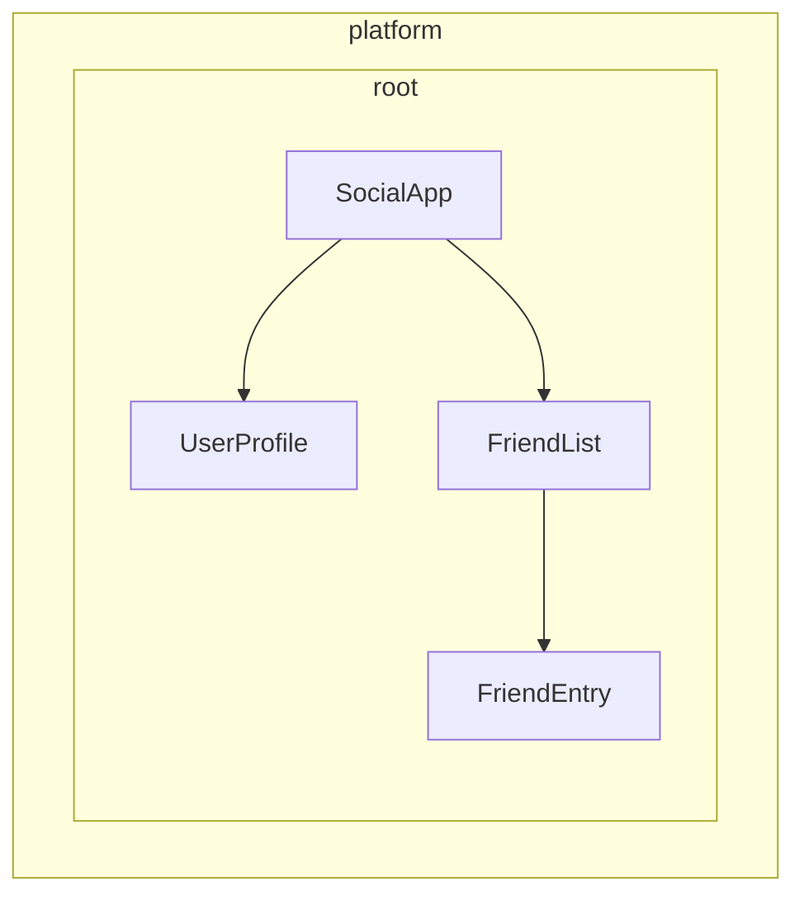

# Defining dependency providers

Angular, servisleri enjeksiyon için kullanılabilir hale getirmenin iki yolunu sunar:

1. **Otomatik sağlama** - `@Injectable` dekoratöründe `providedIn` kullanarak veya `InjectionToken` yapılandırmasında bir fabrika sağlayarak
2. **Manuel sağlama** - Bileşenlerde, direktiflerde, rotalarda veya uygulama yapılandırmasında `providers` dizisini kullanarak

[Önceki kılavuzda](/guide/di/creating-and-using-services), çoğu yaygın kullanım durumunu ele alan `providedIn: 'root'` kullanarak servislerin nasıl oluşturulacağını öğrendiniz. Bu kılavuz, hem otomatik hem de manuel sağlayıcı yapılandırması için ek desenleri inceler.

## Automatic provision for non-class dependencies

`@Injectable` dekoratörü ile `providedIn: 'root'` servisler (sınıflar) için harika çalışırken, başka türde değerleri global olarak sağlamanız gerekebilir - yapılandırma nesneleri, fonksiyonlar veya ilkel değerler gibi. Angular bu amaçla `InjectionToken` sağlar.

### What is an InjectionToken?

`InjectionToken`, Angular'ın bağımlılık enjeksiyonu sisteminin enjeksiyon için değerleri benzersiz şekilde tanımlamak için kullandığı bir nesnedir. Bunu, Angular'ın DI sisteminde herhangi bir türde değer depolamanıza ve almanıza olanak tanıyan özel bir anahtar olarak düşünün:

```ts
import {InjectionToken} from '@angular/core';

// Create a token for a string value
export const API_URL = new InjectionToken<string>('api.url');

// Create a token for a function
export const LOGGER = new InjectionToken<(msg: string) => void>('logger.function');

// Create a token for a complex type
export interface Config {
  apiUrl: string;
  timeout: number;
}
export const CONFIG_TOKEN = new InjectionToken<Config>('app.config');
```

NOTE: String parametresi (örn., `'api.url'`) tamamen hata ayıklama amaçlı bir açıklamadır -- Angular, token'ları bu string ile değil nesne referansları ile tanımlar.

### InjectionToken with `providedIn: 'root'`

`factory`'ye sahip bir `InjectionToken`, varsayılan olarak `providedIn: 'root'` ile sonuçlanır (ancak `providedIn` özelliği ile geçersiz kılınabilir).

```ts
// 📁 /app/config.token.ts
import {InjectionToken} from '@angular/core';

export interface AppConfig {
  apiUrl: string;
  version: string;
  features: Record<string, boolean>;
}

// Globally available configuration using providedIn
export const APP_CONFIG = new InjectionToken<AppConfig>('app.config', {
  providedIn: 'root',
  factory: () => ({
    apiUrl: 'https://api.example.com',
    version: '1.0.0',
    features: {
      darkMode: true,
      analytics: false,
    },
  }),
});

// No need to add to providers array - available everywhere!
@Component({
  selector: 'app-header',
  template: `<h1>Version: {{ config.version }}</h1>`,
})
export class Header {
  config = inject(APP_CONFIG); // Automatically available
}
```

### When to use InjectionToken with factory functions

Bir sınıf kullanamadığınızda ancak bağımlılıkları global olarak sağlamanız gerektiğinde, fabrika fonksiyonları ile InjectionToken idealdir:

```ts
// 📁 /app/logger.token.ts
import {InjectionToken, inject} from '@angular/core';
import {APP_CONFIG} from './config.token';

// Logger function type
export type LoggerFn = (level: string, message: string) => void;

// Global logger function with dependencies
export const LOGGER_FN = new InjectionToken<LoggerFn>('logger.function', {
  providedIn: 'root',
  factory: () => {
    const config = inject(APP_CONFIG);

    return (level: string, message: string) => {
      if (config.features.logging !== false) {
        console[level](`[${new Date().toISOString()}] ${message}`);
      }
    };
  },
});

// 📁 /app/storage.token.ts
// Providing browser APIs as tokens
export const LOCAL_STORAGE = new InjectionToken<Storage>('localStorage', {
  // providedIn: 'root' is configured as the default
  factory: () => window.localStorage,
});

export const SESSION_STORAGE = new InjectionToken<Storage>('sessionStorage', {
  providedIn: 'root',
  factory: () => window.sessionStorage,
});

// 📁 /app/feature-flags.token.ts
// Complex configuration with runtime logic
export const FEATURE_FLAGS = new InjectionToken<Map<string, boolean>>('feature.flags', {
  providedIn: 'root',
  factory: () => {
    const flags = new Map<string, boolean>();

    // Parse from environment or URL params
    const urlParams = new URLSearchParams(window.location.search);
    const enableBeta = urlParams.get('beta') === 'true';

    flags.set('betaFeatures', enableBeta);
    flags.set('darkMode', true);
    flags.set('newDashboard', false);

    return flags;
  },
});
```

Bu yaklaşım birçok avantaj sunar:

- **Manuel sağlayıcı yapılandırması gerekmez** - Servisler için `providedIn: 'root'` gibi çalışır
- **Tree-shakeable** - Yalnızca gerçekten kullanılıyorsa dahil edilir
- **Tür güvenli** - Sınıf dışı değerler için tam TypeScript desteği
- **Diğer bağımlılıkları enjekte edebilir** - Fabrika fonksiyonları diğer servislere erişmek için `inject()` kullanabilir

## Understanding manual provider configuration

`providedIn: 'root'`'un sunduğundan daha fazla kontrol gerektiğinde, sağlayıcıları manuel olarak yapılandırabilirsiniz. `providers` dizisi aracılığıyla manuel yapılandırma şu durumlarda faydalıdır:

1. **Servisin `providedIn`'i yoksa** - Otomatik sağlama olmayan servisler manuel olarak sağlanmalıdır
2. **Yeni bir örnek istiyorsanız** - Paylaşılan örneği kullanmak yerine bileşen/direktif seviyesinde ayrı bir örnek oluşturmak için
3. **Çalışma zamanı yapılandırması gerekiyorsa** - Servis davranışı çalışma zamanı değerlerine bağlı olduğunda
4. **Sınıf dışı değerler sağlıyorsanız** - Yapılandırma nesneleri, fonksiyonlar veya ilkel değerler

### Example: Service without `providedIn`

```ts
import {Injectable, Component, inject} from '@angular/core';

// Service without providedIn
@Injectable()
export class LocalDataStore {
  private data: string[] = [];

  addData(item: string) {
    this.data.push(item);
  }
}

// Component must provide it
@Component({
  selector: 'app-example',
  // A provider is required here because the `LocalDataStore` service has no providedIn.
  providers: [LocalDataStore],
  template: `...`,
})
export class Example {
  dataStore = inject(LocalDataStore);
}
```

### Example: Creating component-specific instances

`providedIn: 'root'` ile sağlanan servisler bileşen seviyesinde geçersiz kılınabilir. Bu, servisin örneğini bir bileşenin yaşam döngüsüne bağlar. Sonuç olarak, bileşen yok edildiğinde, sağlanan servis de yok edilir.

```ts
import {Injectable, Component, inject} from '@angular/core';

@Injectable({providedIn: 'root'})
export class DataStore {
  private data: ListItem[] = [];
}

// This component gets its own instance
@Component({
  selector: 'app-isolated',
  // Creates new instance of `DataStore` rather than using the root-provided instance.
  providers: [DataStore],
  template: `...`,
})
export class Isolated {
  dataStore = inject(DataStore); // Component-specific instance
}
```

## Injector hierarchy in Angular

Angular'ın bağımlılık enjeksiyonu sistemi hiyerarşiktir. Bir bileşen bir bağımlılık istediğinde, Angular o bileşenin enjektöründen başlar ve bu bağımlılık için bir sağlayıcı bulana kadar ağaçta yukarı doğru ilerler. Uygulama ağacınızdaki her bileşenin kendi enjektörü olabilir ve bu enjektörler bileşen ağacınızı yansıtan bir hiyerarşi oluşturur.

Bu hiyerarşi şunları sağlar:

- **Kapsamlı örnekler**: Uygulamanızın farklı bölümleri aynı servisin farklı örneklerine sahip olabilir
- **Geçersiz kılma davranışı**: Alt bileşenler üst bileşenlerden gelen sağlayıcıları geçersiz kılabilir
- **Bellek verimliliği**: Servisler yalnızca gerekli olduğu yerde örneklendirilir

Angular'da, bir bileşen veya direktife sahip herhangi bir eleman tüm alt öğelerine değerler sağlayabilir.



Yukarıdaki örnekte:

1. `SocialApp`, `UserProfile` ve `FriendList` için değerler sağlayabilir
2. `FriendList`, `FriendEntry`'ye enjeksiyon için değerler sağlayabilir, ancak ağacın parçası olmadığı için `UserProfile`'a enjeksiyon için değer sağlayamaz

## Declaring a provider

Angular'ın bağımlılık enjeksiyonu sistemini bir hash map veya sözlük olarak düşünün. Her sağlayıcı yapılandırma nesnesi bir anahtar-değer çifti tanımlar:

- **Anahtar (Sağlayıcı tanımlayıcı)**: Bir bağımlılığı istemek için kullandığınız benzersiz tanımlayıcı
- **Değer**: Bu token istendiğinde Angular'ın döndürmesi gereken şey

Bağımlılıkları manuel olarak sağlarken, genellikle şu kısaltılmış sözdizimini görürsünüz:

```angular-ts
import {Component} from '@angular/core';
import {LocalService} from './local-service';

@Component({
  selector: 'app-example',
  providers: [LocalService], // Service without providedIn
})
export class Example {}
```

Bu aslında daha ayrıntılı bir sağlayıcı yapılandırmasının kısaltmasıdır:

```ts
{
  // This is the shorthand version
  providers: [LocalService],

  // This is the full version
  providers: [
    { provide: LocalService, useClass: LocalService }
  ]
}
```

### Provider configuration object

Her sağlayıcı yapılandırma nesnesinin iki temel parçası vardır:

1. **Sağlayıcı tanımlayıcı**: Angular'ın bağımlılığı almak için kullandığı benzersiz anahtar (`provide` özelliği aracılığıyla ayarlanır)
2. **Değer**: Angular'ın getirmesini istediğiniz gerçek bağımlılık, istenen türe göre farklı anahtarlarla yapılandırılır:
   - `useClass` - Bir JavaScript sınıfı sağlar
   - `useValue` - Statik bir değer sağlar
   - `useFactory` - Değeri döndüren bir fabrika fonksiyonu sağlar
   - `useExisting` - Mevcut bir sağlayıcıya takma ad sağlar

### Provider identifiers

Sağlayıcı tanımlayıcıları, Angular'ın bağımlılık enjeksiyonu (DI) sisteminin benzersiz bir kimlik aracılığıyla bir bağımlılığı almasına olanak tanır. Sağlayıcı tanımlayıcılarını iki şekilde oluşturabilirsiniz:

1. [Sınıf adları](#class-names)
2. [Enjeksiyon token'ları](#injection-tokens)

#### Class names

Sınıf adı, içe aktarılan sınıfı doğrudan tanımlayıcı olarak kullanır:

```angular-ts
import {Component} from '@angular/core';
import {LocalService} from './local-service';

@Component({
  selector: 'app-example',
  providers: [{provide: LocalService, useClass: LocalService}],
})
export class Example {
  /* ... */
}
```

Sınıf hem tanımlayıcı hem de uygulama olarak hizmet eder, bu nedenle Angular `providers: [LocalService]` kısaltmasını sağlar.

#### Injection tokens

Angular, enjekte edilebilir değerler için veya aynı arayüzün birden fazla uygulamasını sağlamak istediğinizde benzersiz bir nesne referansı oluşturan yerleşik [`InjectionToken`](api/core/InjectionToken) sınıfını sağlar.

```ts
// 📁 /app/tokens.ts
import {InjectionToken} from '@angular/core';
import {DataService} from './data-service.interface';

export const DATA_SERVICE_TOKEN = new InjectionToken<DataService>('DataService');
```

NOTE: `'DataService'` string'i tamamen hata ayıklama amacıyla kullanılan bir açıklamadır. Angular, token'ı bu string ile değil nesne referansı ile tanımlar.

Token'ı sağlayıcı yapılandırmanızda kullanın:

```angular-ts
import {Component, inject} from '@angular/core';
import {LocalDataService} from './local-data-service';
import {DATA_SERVICE_TOKEN} from './tokens';

@Component({
  selector: 'app-example',
  providers: [{provide: DATA_SERVICE_TOKEN, useClass: LocalDataService}],
})
export class Example {
  private dataService = inject(DATA_SERVICE_TOKEN);
}
```

#### Can TypeScript interfaces be identifiers for injection?

TypeScript arayüzleri çalışma zamanında var olmadıkları için enjeksiyon amacıyla kullanılamaz:

```ts
// ❌ This won't work!
interface DataService {
  getData(): string[];
}

// Interfaces disappear after TypeScript compilation
@Component({
  providers: [
    {provide: DataService, useClass: LocalDataService}, // Error!
  ],
})
export class Example {
  private dataService = inject(DataService); // Error!
}

// ✅ Use InjectionToken instead
export const DATA_SERVICE_TOKEN = new InjectionToken<DataService>('DataService');

@Component({
  providers: [{provide: DATA_SERVICE_TOKEN, useClass: LocalDataService}],
})
export class Example {
  private dataService = inject(DATA_SERVICE_TOKEN); // Works!
}
```

`InjectionToken`, Angular'ın DI sisteminin kullanabileceği bir çalışma zamanı değeri sağlarken, TypeScript'in generic tür parametresi aracılığıyla tür güvenliğini korur.

### Provider value types

#### useClass

`useClass`, bir bağımlılık olarak bir JavaScript sınıfı sağlar. Kısaltılmış sözdizimi kullanıldığında varsayılandır:

```ts
// Shorthand
providers: [DataService];

// Full syntax
providers: [{provide: DataService, useClass: DataService}];

// Different implementation
providers: [{provide: DataService, useClass: MockDataService}];

// Conditional implementation
providers: [
  {
    provide: StorageService,
    useClass: environment.production ? CloudStorageService : LocalStorageService,
  },
];
```

#### Practical example: Logger substitution

İşlevselliği genişletmek için uygulamaları ikame edebilirsiniz:

```ts
import {Injectable, Component, inject} from '@angular/core';

// Base logger
@Injectable()
export class Logger {
  log(message: string) {
    console.log(message);
  }
}

// Enhanced logger with timestamp
@Injectable()
export class BetterLogger extends Logger {
  override log(message: string) {
    super.log(`[${new Date().toISOString()}] ${message}`);
  }
}

// Logger that includes user context
@Injectable()
export class EvenBetterLogger extends Logger {
  private userService = inject(UserService);

  override log(message: string) {
    const name = this.userService.user.name;
    super.log(`Message to ${name}: ${message}`);
  }
}

// In your component
@Component({
  selector: 'app-example',
  providers: [
    UserService, // EvenBetterLogger needs this
    {provide: Logger, useClass: EvenBetterLogger},
  ],
})
export class Example {
  private logger = inject(Logger); // Gets EvenBetterLogger instance
}
```

#### useValue

`useValue`, statik bir değer olarak herhangi bir JavaScript veri türünü sağlar:

```ts
providers: [
  {provide: API_URL_TOKEN, useValue: 'https://api.example.com'},
  {provide: MAX_RETRIES_TOKEN, useValue: 3},
  {provide: FEATURE_FLAGS_TOKEN, useValue: {darkMode: true, beta: false}},
];
```

IMPORTANT: TypeScript türleri ve arayüzleri bağımlılık değerleri olarak hizmet edemez. Yalnızca derleme zamanında var olurlar.

#### Practical example: Application configuration

`useValue` için yaygın bir kullanım durumu, uygulama yapılandırması sağlamaktır:

```ts
// Define configuration interface
export interface AppConfig {
  apiUrl: string;
  appTitle: string;
  features: {
    darkMode: boolean;
    analytics: boolean;
  };
}

// Create injection token
export const APP_CONFIG = new InjectionToken<AppConfig>('app.config');

// Define configuration
const appConfig: AppConfig = {
  apiUrl: 'https://api.example.com',
  appTitle: 'My Application',
  features: {
    darkMode: true,
    analytics: false,
  },
};

// Provide in bootstrap
bootstrapApplication(AppComponent, {
  providers: [{provide: APP_CONFIG, useValue: appConfig}],
});

// Use in component
@Component({
  selector: 'app-header',
  template: `<h1>{{ title }}</h1>`,
})
export class Header {
  private config = inject(APP_CONFIG);
  title = this.config.appTitle;
}
```

#### useFactory

`useFactory`, enjeksiyon için yeni bir değer üreten bir fonksiyon sağlar:

```ts
export const loggerFactory = (config: AppConfig) => {
  return new LoggerService(config.logLevel, config.endpoint);
};

providers: [
  {
    provide: LoggerService,
    useFactory: loggerFactory,
    deps: [APP_CONFIG], // Dependencies for the factory function
  },
];
```

Fabrika bağımlılıklarını isteğe bağlı olarak işaretleyebilirsiniz:

```ts
import {Optional} from '@angular/core';

providers: [
  {
    provide: MyService,
    useFactory: (required: RequiredService, optional?: OptionalService) => {
      return new MyService(required, optional || new DefaultService());
    },
    deps: [RequiredService, [new Optional(), OptionalService]],
  },
];
```

#### Practical example: Configuration-based API client

İşte çalışma zamanı yapılandırmasıyla bir servis oluşturmak için fabrika kullanımını gösteren eksiksiz bir örnek:

```ts
// Service that needs runtime configuration
class ApiClient {
  constructor(
    private http: HttpClient,
    private baseUrl: string,
    private rateLimitMs: number,
  ) {}

  async fetchData(endpoint: string) {
    // Apply rate limiting based on user tier
    await this.applyRateLimit();
    return this.http.get(`${this.baseUrl}/${endpoint}`);
  }

  private async applyRateLimit() {
    // Simplified example - real implementation would track request timing
    return new Promise((resolve) => setTimeout(resolve, this.rateLimitMs));
  }
}

// Factory function that configures based on user tier
import {inject} from '@angular/core';
import {HttpClient} from '@angular/common/http';
const apiClientFactory = () => {
  const http = inject(HttpClient);
  const userService = inject(UserService);

  // Assuming userService provides these values
  const baseUrl = userService.getApiBaseUrl();
  const rateLimitMs = userService.getRateLimit();

  return new ApiClient(http, baseUrl, rateLimitMs);
};

// Provider configuration
export const apiClientProvider = {
  provide: ApiClient,
  useFactory: apiClientFactory,
};

// Usage in component
@Component({
  selector: 'app-dashboard',
  providers: [apiClientProvider],
})
export class Dashboard {
  private apiClient = inject(ApiClient);
}
```

#### useExisting

`useExisting`, zaten tanımlanmış bir sağlayıcı için bir takma ad oluşturur. Her iki token da aynı örneği döndürür:

```ts
providers: [
  NewLogger, // The actual service
  {provide: OldLogger, useExisting: NewLogger}, // The alias
];
```

IMPORTANT: `useExisting`'i `useClass` ile karıştırmayın. `useClass` ayrı örnekler oluşturur, `useExisting` ise aynı tekil örneği almanızı sağlar.

### Multiple providers

Birden fazla sağlayıcı aynı token'a değer katkıda bulunduğunda `multi: true` bayrağını kullanın:

```ts
export const INTERCEPTOR_TOKEN = new InjectionToken<Interceptor[]>('interceptors');

providers: [
  {provide: INTERCEPTOR_TOKEN, useClass: AuthInterceptor, multi: true},
  {provide: INTERCEPTOR_TOKEN, useClass: LoggingInterceptor, multi: true},
  {provide: INTERCEPTOR_TOKEN, useClass: RetryInterceptor, multi: true},
];
```

`INTERCEPTOR_TOKEN`'ı enjekte ettiğinizde, üç interceptor'ın örneklerini içeren bir dizi alırsınız.

## Where can you specify providers?

Angular, sağlayıcıları kaydedebileceğiniz birkaç seviye sunar ve her birinin kapsam, yaşam döngüsü ve performans için farklı etkileri vardır:

- [**Uygulama başlatma**](#application-bootstrap) - Her yerde kullanılabilir global tekil örnekler
- [**Bir eleman üzerinde (bileşen veya direktif)**](#component-or-directive-providers) - Belirli bileşen ağaçları için izole örnekler
- [**Rota**](#route-providers) - Tembel yüklenen modüller için özelliğe özgü servisler

### Application bootstrap

Şu durumlarda `bootstrapApplication`'da uygulama seviyesi sağlayıcıları kullanın:

- **Servis birden fazla özellik alanında kullanılıyorsa** - Uygulamanızın birçok bölümünün ihtiyaç duyduğu HTTP istemcileri, günlükleme veya kimlik doğrulama gibi servisler
- **Gerçek bir tekil istiyorsanız** - Tüm uygulama tarafından paylaşılan tek bir örnek
- **Servisin bileşene özgü yapılandırması yoksa** - Her yerde aynı şekilde çalışan genel amaçlı yardımcı araçlar
- **Global yapılandırma sağlıyorsanız** - API uç noktaları, özellik bayrakları veya ortam ayarları

```ts
// main.ts
bootstrapApplication(App, {
  providers: [
    {provide: API_BASE_URL, useValue: 'https://api.example.com'},
    {provide: INTERCEPTOR_TOKEN, useClass: AuthInterceptor, multi: true},
    LoggingService, // Used throughout the app
    {provide: ErrorHandler, useClass: GlobalErrorHandler},
  ],
});
```

**Avantajlar:**

- Tek örnek bellek kullanımını azaltır
- Ek kurulum olmadan her yerde kullanılabilir
- Global durumu yönetmek daha kolaydır

**Dezavantajlar:**

- Değer hiç enjekte edilmese bile her zaman JavaScript paketinize dahil edilir
- Özellik başına kolayca özelleştirilemez
- Bireysel bileşenleri izole olarak test etmek daha zordur

#### Why provide during bootstrap instead of using `providedIn: 'root'`?

Şu durumlarda başlatma sırasında bir sağlayıcı isteyebilirsiniz:

- Sağlayıcının yan etkileri varsa (örn., istemci tarafı yönlendiriciyi yükleme)
- Sağlayıcı yapılandırma gerektiriyorsa (örn., rotalar)
- Angular'ın `provideSomething` desenini kullanıyorsanız (örn., `provideRouter`, `provideHttpClient`)

### Component or directive providers

Şu durumlarda bileşen veya direktif sağlayıcıları kullanın:

- **Servisin bileşene özgü durumu varsa** - Form doğrulayıcılar, bileşene özgü önbellekler veya UI durum yöneticileri
- **İzole örneklere ihtiyacınız varsa** - Her bileşenin servisin kendi kopyasına ihtiyaç duyması
- **Servis yalnızca bir bileşen ağacı tarafından kullanılıyorsa** - Global erişim gerektirmeyen özel servisler
- **Yeniden kullanılabilir bileşenler oluşturuyorsanız** - Kendi servisleriyle bağımsız çalışması gereken bileşenler

```angular-ts
// Specialized form component with its own validation service
@Component({
  selector: 'app-advanced-form',
  providers: [
    FormValidationService, // Each form gets its own validator
    {provide: FORM_CONFIG, useValue: {strictMode: true}},
  ],
})
export class AdvancedForm {}

// Modal component with isolated state management
@Component({
  selector: 'app-modal',
  providers: [
    ModalStateService, // Each modal manages its own state
  ],
})
export class Modal {}
```

**Avantajlar:**

- Daha iyi kapsülleme ve izolasyon
- Bileşenleri bireysel olarak test etmek daha kolay
- Birden fazla örnek farklı yapılandırmalarla bir arada bulunabilir

**Dezavantajlar:**

- Her bileşen için yeni örnek oluşturulur (daha yüksek bellek kullanımı)
- Bileşenler arasında paylaşılan durum yok
- İhtiyaç duyulan her yerde sağlanmalıdır
- Değer hiç enjekte edilmese bile her zaman bileşen veya direktif ile aynı JavaScript paketine dahil edilir

NOTE: Aynı eleman üzerinde birden fazla direktif aynı token'ı sağlıyorsa, biri kazanır, ancak hangisi tanımsızdır.

### Route providers

Rota seviyesi sağlayıcılarını şunlar için kullanın:

- **Özelliğe özgü servisler** - Yalnızca belirli rotalar veya özellik modülleri için gereken servisler
- **Tembel yüklenen modül bağımlılıkları** - Yalnızca belirli özelliklerle yüklenmesi gereken servisler
- **Rotaya özgü yapılandırma** - Uygulama alanına göre değişen ayarlar

```ts
// routes.ts
export const routes: Routes = [
  {
    path: 'admin',
    providers: [
      AdminService, // Only loaded with admin routes
      {provide: FEATURE_FLAGS, useValue: {adminMode: true}},
    ],
    loadChildren: () => import('./admin/admin.routes'),
  },
  {
    path: 'shop',
    providers: [
      ShoppingCartService, // Isolated shopping state
      PaymentService,
    ],
    loadChildren: () => import('./shop/shop.routes'),
  },
];
```

Rota seviyesinde sağlanan servisler, o rota içindeki tüm bileşenler ve direktifler ile korumaları ve çözücüleri tarafından kullanılabilir.

Bu servisler rotanın bileşenlerinden bağımsız olarak örneklendirildiğinden, rotaya özgü bilgilere doğrudan erişimleri yoktur.

## Library author patterns

Angular kütüphaneleri oluştururken, temiz API'leri korurken tüketiciler için esnek yapılandırma seçenekleri sağlamanız gerekir. Angular'ın kendi kütüphaneleri, bunu başarmak için güçlü desenler gösterir.

### The `provide` pattern

Kullanıcıların karmaşık sağlayıcıları manuel olarak yapılandırmasını gerektirmek yerine, kütüphane yazarları sağlayıcı yapılandırmalarını döndüren fonksiyonları dışa aktarabilir:

```ts
// 📁 /libs/analytics/src/providers.ts
import {InjectionToken, Provider, inject} from '@angular/core';

// Configuration interface
export interface AnalyticsConfig {
  trackingId: string;
  enableDebugMode?: boolean;
  anonymizeIp?: boolean;
}

// Internal token for configuration
const ANALYTICS_CONFIG = new InjectionToken<AnalyticsConfig>('analytics.config');

// Main service that uses the configuration
export class AnalyticsService {
  private config = inject(ANALYTICS_CONFIG);

  track(event: string, properties?: any) {
    // Implementation using config
  }
}

// Provider function for consumers
export function provideAnalytics(config: AnalyticsConfig): Provider[] {
  return [{provide: ANALYTICS_CONFIG, useValue: config}, AnalyticsService];
}

// Usage in consumer app
// main.ts
bootstrapApplication(App, {
  providers: [
    provideAnalytics({
      trackingId: 'GA-12345',
      enableDebugMode: !environment.production,
    }),
  ],
});
```

### Advanced provider patterns with options

Daha karmaşık senaryolar için, birden fazla yapılandırma yaklaşımını birleştirebilirsiniz:

```ts
// 📁 /libs/http-client/src/provider.ts
import {Provider, InjectionToken, inject} from '@angular/core';

// Feature flags for optional functionality
export enum HttpFeatures {
  Interceptors = 'interceptors',
  Caching = 'caching',
  Retry = 'retry',
}

// Configuration interfaces
export interface HttpConfig {
  baseUrl?: string;
  timeout?: number;
  headers?: Record<string, string>;
}

export interface RetryConfig {
  maxAttempts: number;
  delayMs: number;
}

// Internal tokens
const HTTP_CONFIG = new InjectionToken<HttpConfig>('http.config');
const RETRY_CONFIG = new InjectionToken<RetryConfig>('retry.config');
const HTTP_FEATURES = new InjectionToken<Set<HttpFeatures>>('http.features');

// Core service
class HttpClientService {
  private config = inject(HTTP_CONFIG, {optional: true});
  private features = inject(HTTP_FEATURES);

  get(url: string) {
    // Use config and check features
  }
}

// Feature services
class RetryInterceptor {
  private config = inject(RETRY_CONFIG);
  // Retry logic
}

class CacheInterceptor {
  // Caching logic
}

// Main provider function
export function provideHttpClient(config?: HttpConfig, ...features: HttpFeature[]): Provider[] {
  const providers: Provider[] = [
    {provide: HTTP_CONFIG, useValue: config || {}},
    {provide: HTTP_FEATURES, useValue: new Set(features.map((f) => f.kind))},
    HttpClientService,
  ];

  // Add feature-specific providers
  features.forEach((feature) => {
    providers.push(...feature.providers);
  });

  return providers;
}

// Feature configuration functions
export interface HttpFeature {
  kind: HttpFeatures;
  providers: Provider[];
}

export function withInterceptors(...interceptors: any[]): HttpFeature {
  return {
    kind: HttpFeatures.Interceptors,
    providers: interceptors.map((interceptor) => ({
      provide: INTERCEPTOR_TOKEN,
      useClass: interceptor,
      multi: true,
    })),
  };
}

export function withCaching(): HttpFeature {
  return {
    kind: HttpFeatures.Caching,
    providers: [CacheInterceptor],
  };
}

export function withRetry(config: RetryConfig): HttpFeature {
  return {
    kind: HttpFeatures.Retry,
    providers: [{provide: RETRY_CONFIG, useValue: config}, RetryInterceptor],
  };
}

// Consumer usage with multiple features
bootstrapApplication(App, {
  providers: [
    provideHttpClient(
      {baseUrl: 'https://api.example.com'},
      withInterceptors(AuthInterceptor, LoggingInterceptor),
      withCaching(),
      withRetry({maxAttempts: 3, delayMs: 1000}),
    ),
  ],
});
```

### Why use provider functions instead of direct configuration?

Sağlayıcı fonksiyonları kütüphane yazarları için çeşitli avantajlar sunar:

1. **Kapsülleme** - Dahili token'lar ve uygulama detayları özel kalır
2. **Tür güvenliği** - TypeScript, derleme zamanında doğru yapılandırmayı sağlar
3. **Esneklik** - `with*` deseni ile özellikleri kolayca birleştirme
4. **Geleceğe yönelik koruma** - Dahili uygulama, tüketicileri bozmadan değişebilir
5. **Tutarlılık** - Angular'ın kendi desenleriyle (`provideRouter`, `provideHttpClient`, vb.) uyumludur

Bu desen, Angular'ın kendi kütüphanelerinde yaygın olarak kullanılır ve yapılandırılabilir servisler sağlaması gereken kütüphane yazarları için en iyi uygulama olarak kabul edilir.
