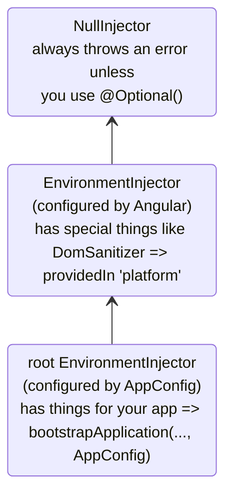
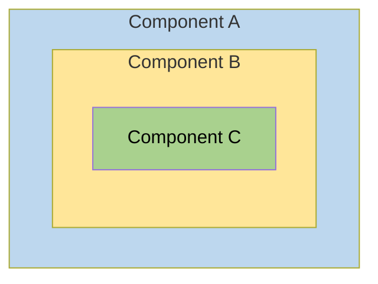
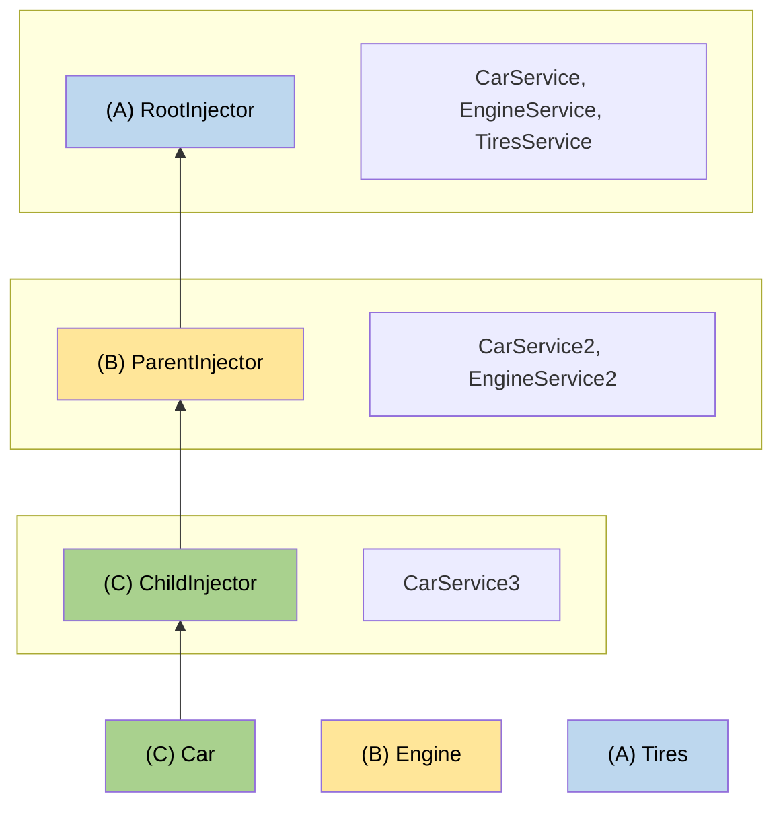

# Hiyerarşik injector'lar

Bu kılavuz, Angular'ın hiyerarşik bağımlılık enjeksiyonu sistemi hakkında çözümleme kuralları, değiştiriciler ve gelişmiş desenler dahil olmak üzere derinlemesine bilgi sağlar.

NOTE: Enjektör hiyerarşisi ve sağlayıcı kapsamı hakkında temel kavramlar için [bağımlılık sağlayıcılarını tanımlama kılavuzuna](guide/di/defining-dependency-providers#angularda-injector-hiyerarşisi) bakın.

## Injector hiyerarşi türleri

Angular'da iki enjektör hiyerarşisi vardır:

| Injector hierarchies            | Details                                                                                                                                                                                        |
| :------------------------------ | :--------------------------------------------------------------------------------------------------------------------------------------------------------------------------------------------- |
| `EnvironmentInjector` hierarchy | Bu hiyerarşide `@Injectable()` veya `ApplicationConfig` içindeki `providers` dizisini kullanarak bir `EnvironmentInjector` yapılandırın.                                                       |
| `ElementInjector` hierarchy     | Her DOM elemanında örtük olarak oluşturulur. Bir `ElementInjector`, `@Directive()` veya `@Component()` üzerindeki `providers` özelliğinde yapılandırmadığınız sürece varsayılan olarak boştur. |

<docs-callout title="NgModule Tabanlı Uygulamalar">
`NgModule` tabanlı uygulamalar için, `@NgModule()` veya `@Injectable()` anotasyonunu kullanarak `ModuleInjector` hiyerarşisi ile bağımlılıklar sağlayabilirsiniz.
</docs-callout>

### `EnvironmentInjector`

`EnvironmentInjector` iki şekilde yapılandırılabilir:

- `@Injectable()` `providedIn` özelliğini `root` veya `platform` olarak belirtmek için kullanma
- `ApplicationConfig` `providers` dizisi

<docs-callout title="Tree-shaking ve @Injectable()">

`@Injectable()` `providedIn` özelliğini kullanmak, `ApplicationConfig` `providers` dizisini kullanmaktan tercih edilir. `@Injectable()` `providedIn` ile optimizasyon araçları, uygulamanızın kullanmadığı servisleri kaldıran tree-shaking işlemi yapabilir. Bu, daha küçük paket boyutlarıyla sonuçlanır.

Tree-shaking özellikle bir kütüphane için kullanışlıdır çünkü kütüphaneyi kullanan uygulama onu enjekte etme ihtiyacı duymayabilir.

</docs-callout>

`EnvironmentInjector`, `ApplicationConfig.providers` tarafından yapılandırılır.

Servisleri `@Injectable()` dekoratörünün `providedIn` özelliğini kullanarak aşağıdaki gibi sağlayın:

```ts {highlight:[4]}
import {Injectable} from '@angular/core';

@Injectable({
  providedIn: 'root', // <--bu service'i root EnvironmentInjector'da sağlar
})
export class ItemService {
  name = 'telephone';
}
```

`@Injectable()` dekoratörü bir servis sınıfını tanımlar.
`providedIn` özelliği belirli bir `EnvironmentInjector`'ı, burada `root`'u yapılandırır ve servisi `root` `EnvironmentInjector`'da kullanılabilir hale getirir.

### ModuleInjector

`NgModule` tabanlı uygulamalarda, ModuleInjector iki şekilde yapılandırılabilir:

- `@Injectable()` `providedIn` özelliğini `root` veya `platform` olarak belirtmek için kullanma
- `@NgModule()` `providers` dizisi

`ModuleInjector`, `@NgModule.providers` ve `NgModule.imports` özelliği tarafından yapılandırılır. `ModuleInjector`, `NgModule.imports` özyinelemeli olarak takip edilerek ulaşılabilen tüm providers dizilerinin düzleştirilmiş halidir.

Tembel yüklenen diğer `@NgModule`'lar yüklendiğinde alt `ModuleInjector` hiyerarşileri oluşturulur.

### Platform injector'ı

`root`'un üzerinde iki enjektör daha vardır, ek bir `EnvironmentInjector` ve `NullInjector()`.

Angular'ın uygulamayı `main.ts` içinde nasıl başlattığını düşünün:

```ts
bootstrapApplication(App, appConfig);
```

`bootstrapApplication()` yöntemi, `ApplicationConfig` örneği tarafından yapılandırılan platform enjektörünün bir alt enjektörünü oluşturur.
Bu, `root` `EnvironmentInjector`'dır.

`platformBrowserDynamic()` yöntemi, platforma özgü bağımlılıklar içeren bir `PlatformModule` tarafından yapılandırılmış bir enjektör oluşturur.
Bu, birden fazla uygulamanın bir platform yapılandırmasını paylaşmasına olanak tanır.
Örneğin, bir tarayıcının kaç uygulama çalıştırırsanız çalıştırın yalnızca bir URL çubuğu vardır.
`platformBrowser()` fonksiyonunu kullanarak `extraProviders` sağlayarak platform seviyesinde ek platforma özgü sağlayıcılar yapılandırabilirsiniz.

Hiyerarşideki bir sonraki üst enjektör, ağacın tepesi olan `NullInjector()`'dır.
Ağaçta `NullInjector()` içinde bir servis arayacak kadar yukarı çıktıysanız, `@Optional()` kullanmadığınız sürece bir hata alırsınız çünkü sonuçta her şey `NullInjector()`'da biter ve `@Optional()` durumunda `null` döndürür ya da bir hata fırlatır.
`@Optional()` hakkında daha fazla bilgi için bu kılavuzun [`@Optional()` bölümüne](#optional) bakın.

Aşağıdaki diyagram, önceki paragrafların açıkladığı gibi `root` `ModuleInjector` ile üst enjektörleri arasındaki ilişkiyi temsil eder.



`root` adı özel bir takma ad olsa da, diğer `EnvironmentInjector` hiyerarşilerinin takma adları yoktur.
Router gibi dinamik olarak yüklenen bir bileşen oluşturulduğunda, alt `EnvironmentInjector` hiyerarşileri oluşturacak olan `EnvironmentInjector` hiyerarşileri oluşturma seçeneğiniz vardır.

Tüm istekler, `bootstrapApplication()` yöntemine iletilen `ApplicationConfig` örneği ile yapılandırdıysanız veya tüm sağlayıcıları kendi servislerinde `root` ile kaydettiyseniz, root enjektöre yönlendirilir.

<docs-callout title="@Injectable() vs. ApplicationConfig">

`bootstrapApplication`'ın `ApplicationConfig`'inde uygulama çapında bir sağlayıcı yapılandırırsanız, `@Injectable()` meta verilerinde `root` için yapılandırılmış olanı geçersiz kılar.
Bunu, birden fazla uygulamayla paylaşılan bir servisin varsayılan olmayan bir sağlayıcısını yapılandırmak için yapabilirsiniz.

İşte bileşen yönlendirici yapılandırmasının, `ApplicationConfig`'in `providers` listesinde sağlayıcısını listeleyerek varsayılan olmayan bir [konum stratejisi](guide/routing/common-router-tasks#locationstrategy-ve-tarayıcı-url-stilleri) içerdiği bir örnek.

```ts
providers: [{provide: LocationStrategy, useClass: HashLocationStrategy}];
```

`NgModule` tabanlı uygulamalar için, uygulama çapında sağlayıcıları `AppModule` `providers`'da yapılandırın.

</docs-callout>

### `ElementInjector`

Angular, her DOM elemanı için örtük olarak `ElementInjector` hiyerarşileri oluşturur.

`@Component()` dekoratöründe `providers` veya `viewProviders` özelliğini kullanarak bir servis sağlamak, bir `ElementInjector` yapılandırır.
Örneğin, aşağıdaki `TestComponent`, servisi şu şekilde sağlayarak `ElementInjector`'ı yapılandırır:

```ts {highlight:[3]}
@Component({
  /* … */
  providers: [{ provide: ItemService, useValue: { name: 'lamp' } }]
})
export class TestComponent
```

HELPFUL: `EnvironmentInjector` ağacı, `ModuleInjector` ve `ElementInjector` ağacı arasındaki ilişkiyi anlamak için [çözümleme kuralları](#çözümleme-kuralları) bölümüne bakın.

Bir bileşende servisler sağladığınızda, bu servis o bileşen örneğindeki `ElementInjector` aracılığıyla kullanılabilir.
[Çözümleme kuralları](#çözümleme-kuralları) bölümünde açıklanan görünürlük kurallarına göre alt bileşen/direktiflerde de görünür olabilir.

Bileşen örneği yok edildiğinde, o servis örneği de yok edilir.

#### `@Directive()` and `@Component()`

Bir bileşen özel bir direktif türüdür, yani `@Directive()`'in bir `providers` özelliği olduğu gibi, `@Component()`'in de vardır.
Bu, direktiflerin yanı sıra bileşenlerin de `providers` özelliğini kullanarak sağlayıcılar yapılandırabileceği anlamına gelir.
`providers` özelliğini kullanarak bir bileşen veya direktif için bir sağlayıcı yapılandırdığınızda, bu sağlayıcı o bileşen veya direktifin `ElementInjector`'ına aittir.
Aynı eleman üzerindeki bileşenler ve direktifler bir enjektörü paylaşır.

## Çözümleme kuralları

Bir bileşen/direktif için bir token çözümlenirken, Angular bunu iki aşamada çözümler:

1. `ElementInjector` hiyerarşisindeki üst elemanlara karşı.
2. `EnvironmentInjector` hiyerarşisindeki üst elemanlara karşı.

Bir bileşen bir bağımlılık bildirdiğinde, Angular önce bu bağımlılığı kendi `ElementInjector`'ı ile karşılamaya çalışır.
Bileşenin enjektöründe sağlayıcı yoksa, isteği üst bileşenin `ElementInjector`'ına iletir.

İstekler, Angular isteği işleyebilecek bir enjektör bulana veya üst `ElementInjector` hiyerarşileri tükenene kadar yönlendirilmeye devam eder.

Angular herhangi bir `ElementInjector` hiyerarşisinde sağlayıcıyı bulamazsa, isteğin kaynaklandığı elemana geri döner ve `EnvironmentInjector` hiyerarşisine bakar.
Angular hala sağlayıcıyı bulamazsa, bir hata fırlatır.

Aynı DI token'ı için farklı seviyelerde bir sağlayıcı kaydettiyseniz, Angular'ın karşılaştığı ilki bağımlılığı çözmek için kullanılır.
Örneğin, bir sağlayıcı servise ihtiyaç duyan bileşende yerel olarak kayıtlıysa, Angular aynı servisin başka bir sağlayıcısını aramaz.

HELPFUL: `NgModule` tabanlı uygulamalarda, Angular `ElementInjector` hiyerarşilerinde sağlayıcı bulamazsa `ModuleInjector` hiyerarşisinde arama yapacaktır.

## Çözümleme değiştiricileri

Angular'ın çözümleme davranışı `optional`, `self`, `skipSelf` ve `host` ile değiştirilebilir.
Her birini `@angular/core`'dan içe aktarın ve servisinizi enjekte ederken [`inject`](/api/core/inject) yapılandırmasında kullanın.

### Değiştirici türleri

Çözümleme değiştiricileri üç kategoriye ayrılır:

- Angular aradığınızı bulamazsa ne yapılacağı, yani `optional`
- Aramaya nereden başlanacağı, yani `skipSelf`
- Aramanın nerede duracağı, `host` ve `self`

Varsayılan olarak, Angular her zaman mevcut `Injector`'da başlar ve sonuna kadar aramaya devam eder.
Değiştiriciler, başlangıç veya _self_ konumunu ve bitiş konumunu değiştirmenize olanak tanır.

Ayrıca, şunlar hariç tüm değiştiricileri birleştirebilirsiniz:

- `host` ve `self`
- `skipSelf` ve `self`.

### `optional`

`optional`, Angular'ın enjekte ettiğiniz bir servisi isteğe bağlı olarak değerlendirmesine olanak tanır.
Bu şekilde, çalışma zamanında çözümlenemezse, Angular bir hata fırlatmak yerine servisi `null` olarak çözümler.
Aşağıdaki örnekte, `OptionalService` servisi serviste, `ApplicationConfig`'de, `@NgModule()`'da veya bileşen sınıfında sağlanmamıştır, bu nedenle uygulamada hiçbir yerde kullanılamaz.

```ts {header:"src/app/optional/optional.ts"}
export class Optional {
  public optional? = inject(OptionalService, {optional: true});
}
```

### `self`

Angular'ın yalnızca mevcut bileşen veya direktifin `ElementInjector`'ına bakması için `self` kullanın.

`self` için iyi bir kullanım durumu, bir servisi yalnızca mevcut ana elemanda mevcutsa enjekte etmektir.
Bu durumda hataları önlemek için `self`'i `optional` ile birleştirin.

Örneğin, aşağıdaki `SelfNoData`'da, enjekte edilen `LeafService`'e bir özellik olarak dikkat edin.

```ts {header: 'self-no-data.ts', highlight: [7]}
@Component({
  selector: 'app-self-no-data',
  templateUrl: './self-no-data.html',
  styleUrls: ['./self-no-data.css'],
})
export class SelfNoData {
  public leaf = inject(LeafService, {optional: true, self: true});
}
```

Bu örnekte, bir üst sağlayıcı vardır ve servisi enjekte etmek değeri döndürür, ancak servisi `self` ve `optional` ile enjekte etmek `null` döndürür çünkü `self` enjektöre mevcut ana elemanda aramayı durdurmasını söyler.

Başka bir örnek, `FlowerService` için bir sağlayıcıya sahip bileşen sınıfını gösterir.
Bu durumda, enjektör `FlowerService`'i bulduğu için mevcut `ElementInjector`'dan daha ileriye bakmaz ve lale 🌷 döndürür.

```ts {header:"src/app/self/self.ts"}
@Component({
  selector: 'app-self',
  templateUrl: './self.html',
  styleUrls: ['./self.css'],
  providers: [{provide: FlowerService, useValue: {emoji: '🌷'}}],
})
export class Self {
  constructor(@Self() public flower: FlowerService) {}
}
```

### `skipSelf`

`skipSelf`, `self`'in tersidir.
`skipSelf` ile Angular, mevcut elemandan değil üst `ElementInjector`'dan başlayarak bir servis arar.
Yani üst `ElementInjector`, `emoji` için eğreltiotu <code>🌿</code> değerini kullanıyorsa, ancak bileşenin `providers` dizisinde akçaağaç yaprağı <code>🍁</code> varsa, Angular akçaağaç yaprağını <code>🍁</code> yok sayar ve eğreltiotu <code>🌿</code> kullanır.

Bunu kodda görmek için, aşağıdaki `emoji` değerinin üst bileşenin kullandığı değer olduğunu varsayın, bu serviste olduğu gibi:

```ts {header: 'leaf.service.ts'}
export class LeafService {
  emoji = '🌿';
}
```

Alt bileşende farklı bir değeriniz olduğunu, akçaağaç yaprağı 🍁, ancak bunun yerine üst değeri kullanmak istediğinizi hayal edin.
`skipSelf` kullanacağınız yer burasıdır:

```ts {header:"skipself.ts" highlight:[[6],[10]]}
@Component({
  selector: 'app-skipself',
  templateUrl: './skipself.html',
  styleUrls: ['./skipself.css'],
  // Angular bu LeafService örneğini yok sayar
  providers: [{provide: LeafService, useValue: {emoji: '🍁'}}],
})
export class Skipself {
  // skipSelf'i inject seçeneği olarak kullan
  public leaf = inject(LeafService, {skipSelf: true});
}
```

Bu durumda, `emoji` için alacağınız değer akçaağaç yaprağı <code>🍁</code> değil eğreltiotu <code>🌿</code> olacaktır.

#### `skipSelf` option with `optional`

Değer `null` ise bir hatayı önlemek için `skipSelf` seçeneğini `optional` ile kullanın.

Aşağıdaki örnekte, `Person` servisi özellik başlatma sırasında enjekte edilir.
`skipSelf`, Angular'a mevcut enjektörü atlamasını söyler ve `optional`, `Person` servisi `null` olması durumunda bir hatayı önler.

```ts
class Person {
  parent = inject(Person, {optional: true, skipSelf: true});
}
```

### `host`

<!-- TODO: Remove ambiguity between host and self. -->

`host`, sağlayıcıları ararken enjektör ağacında bir bileşeni son durak olarak belirlemenize olanak tanır.

Ağaçta daha yukarıda bir servis örneği olsa bile, Angular aramaya devam etmez.
`host`'u şu şekilde kullanın:

```ts {header:"host.ts" highlight:[[6],[9]]}
@Component({
  selector: 'app-host',
  templateUrl: './host.html',
  styleUrls: ['./host.css'],
  // service'i sağla
  providers: [{provide: FlowerService, useValue: {emoji: '🌷'}}],
})
export class Host {
  // service'i enjekte ederken host kullan
  flower = inject(FlowerService, {host: true, optional: true});
}
```

`Host`, `host` seçeneğine sahip olduğundan, `Host`'un üstünün `flower.emoji` değeri ne olursa olsun, `Host` lale <code>🌷</code> kullanacaktır.

### Constructor injection ile değiştiriciler

Daha önce sunulduğu gibi, constructor enjeksiyonunun davranışı `@Optional()`, `@Self()`, `@SkipSelf()` ve `@Host()` ile değiştirilebilir.

Her birini `@angular/core`'dan içe aktarın ve servisinizi enjekte ederken bileşen sınıfı constructor'ında kullanın.

```ts {header:"self-no-data.ts" highlight:[2]}
export class SelfNoData {
  constructor(@Self() @Optional() public leaf?: LeafService) {}
}
```

## Şablonun mantıksal yapısı

Bileşen sınıfında servisler sağladığınızda, servisler bu servisleri nerede ve nasıl sağladığınıza göre `ElementInjector` ağacı içinde görünür olur.

Angular şablonunun temel mantıksal yapısını anlamak, servisleri yapılandırmanız ve bunun karşılığında görünürlüklerini kontrol etmeniz için bir temel sağlar.

Bileşenler, aşağıdaki örnekte olduğu gibi şablonlarınızda kullanılır:

```html
<app-root> <app-child />; </app-root>
```

HELPFUL: Genellikle bileşenleri ve şablonlarını ayrı dosyalarda bildirirsiniz.
Enjeksiyon sisteminin nasıl çalıştığını anlamak amacıyla, bunlara birleşik bir mantıksal ağaç açısından bakmak faydalıdır.
_Mantıksal_ terimi bunu render ağacından, yani uygulamanızın DOM ağacından ayırır.
Bileşen şablonlarının nerede bulunduğunu işaretlemek için bu kılavuz, render ağacında gerçekte var olmayan ve yalnızca zihinsel model amaçlı olan `<#VIEW>` sözde elemanını kullanır.

Aşağıda, `<app-root>` ve `<app-child>` görünüm ağaçlarının tek bir mantıksal ağaçta nasıl birleştirildiğine dair bir örnek verilmiştir:

```html
<app-root>
  <#VIEW>
    <app-child>
     <#VIEW>
       …content goes here…
     </#VIEW>
    </app-child>
  </#VIEW>
</app-root>
```

`<#VIEW>` sınırlamasını anlamak, bileşen sınıfında servisleri yapılandırdığınızda özellikle önemlidir.

## Örnek: `@Component()` içinde service'ler sağlama

`@Component()` (veya `@Directive()`) dekoratörünü kullanarak servisleri nasıl sağladığınız, görünürlüklerini belirler.
Aşağıdaki bölümler, servis görünürlüğünü `skipSelf` ve `host` ile değiştirme yollarıyla birlikte `providers` ve `viewProviders`'ı gösterir.

Bir bileşen sınıfı servisleri iki şekilde sağlayabilir:

| Arrays                       | Details                                        |
| :--------------------------- | :--------------------------------------------- |
| With a `providers` array     | `@Component({ providers: [SomeService] })`     |
| With a `viewProviders` array | `@Component({ viewProviders: [SomeService] })` |

Aşağıdaki örneklerde, bir Angular uygulamasının mantıksal ağacını göreceksiniz.
Enjektörün şablonlar bağlamında nasıl çalıştığını göstermek için mantıksal ağaç, uygulamanın HTML yapısını temsil edecektir.
Örneğin, mantıksal ağaç `<child-component>`'in `<parent-component>`'in doğrudan çocuğu olduğunu gösterecektir.

Mantıksal ağaçta özel nitelikler göreceksiniz: `@Provide`, `@Inject` ve `@ApplicationConfig`.
Bunlar gerçek nitelikler değildir, arka planda neler olduğunu göstermek için buradalar.

| Angular service attribute | Details                                                                           |
| :------------------------ | :-------------------------------------------------------------------------------- |
| `@Inject(Token)=>Value`   | Mantıksal ağaçtaki bu konumda `Token` enjekte edilirse, değeri `Value` olacaktır. |
| `@Provide(Token=Value)`   | Mantıksal ağaçtaki bu konumda `Token`'ın `Value` ile sağlandığını gösterir.       |
| `@ApplicationConfig`      | Bu konumda yedek bir `EnvironmentInjector` kullanılması gerektiğini gösterir.     |

### Örnek uygulama yapısı

Örnek uygulamada, `root`'ta kırmızı hibiskus <code>🌺</code> `emoji` değeri ile sağlanan bir `FlowerService` vardır.

```ts {header:"lower.service.ts"}
@Injectable({
  providedIn: 'root',
})
export class FlowerService {
  emoji = '🌺';
}
```

Yalnızca bir `App` ve bir `Child` olan bir uygulama düşünün.
En temel render edilmiş görünüm, aşağıdaki gibi iç içe HTML elemanları olarak görünecektir:

```html
<app-root>
  <!-- App selector -->
  <app-child> <!-- Child selector --> </app-child>
</app-root>
```

Ancak arka planda, Angular enjeksiyon isteklerini çözerken aşağıdaki gibi mantıksal bir görünüm temsili kullanır:

```html
<app-root> <!-- App selector -->
  <#VIEW>
    <app-child> <!-- Child selector -->
      <#VIEW>
      </#VIEW>
    </app-child>
  </#VIEW>
</app-root>
```

Buradaki `<#VIEW>` bir şablon örneğini temsil eder.
Her bileşenin kendi `<#VIEW>`'ı olduğuna dikkat edin.

Bu yapıyı bilmek, servislerinizi nasıl sağladığınız ve enjekte ettiğiniz konusunda bilgi verebilir ve servis görünürlüğü üzerinde tam kontrol sağlar.

Şimdi, `<app-root>`'un `FlowerService`'i enjekte ettiğini düşünün:

```typescript
export class App {
  flower = inject(FlowerService);
}
```

Sonucu görselleştirmek için `<app-root>` şablonuna bir bağlama ekleyin:

```html
<p>Emoji from FlowerService: {{flower.emoji}}</p>
```

Görünümdeki çıktı şöyle olacaktır:

```text {hideCopy}
Emoji from FlowerService: 🌺
```

Mantıksal ağaçta bu, aşağıdaki gibi temsil edilir:

```html
<app-root @ApplicationConfig
        @Inject(FlowerService) flower=>"🌺">
  <#VIEW>
    <p>Emoji from FlowerService: {{flower.emoji}} (🌺)</p>
    <app-child>
      <#VIEW>
      </#VIEW>
    </app-child>
  </#VIEW>
</app-root>
```

`<app-root>` `FlowerService`'i istediğinde, `FlowerService` token'ını çözmek enjektörün görevidir.
Token'ın çözümlenmesi iki aşamada gerçekleşir:

1. Enjektör, mantıksal ağaçtaki başlangıç konumunu ve aramanın bitiş konumunu belirler.
   Enjektör, başlangıç konumundan başlar ve mantıksal ağaçtaki her görünüm seviyesinde token'ı arar.
   Token bulunursa döndürülür.

1. Token bulunamazsa, enjektör isteği devretmek için en yakın üst `EnvironmentInjector`'ı arar.

Örnek durumda, kısıtlamalar şunlardır:

1. `<app-root>`'a ait `<#VIEW>` ile başlayın ve `<app-root>` ile bitirin.
   - Normalde arama başlangıç noktası enjeksiyon noktasıdır.
     Ancak bu durumda `<app-root>` bir bileşendir. `@Component`'ler özeldir çünkü kendi `viewProviders`'larını da içerirler, bu nedenle arama `<app-root>`'a ait `<#VIEW>`'den başlar.
     Bu, aynı konumda eşleşen bir direktif için geçerli olmaz.
   - Bitiş konumu, bu uygulamadaki en üst bileşen olduğu için bileşenin kendisiyle aynıdır.

1. `ApplicationConfig` tarafından sağlanan `EnvironmentInjector`, enjeksiyon token'ı `ElementInjector` hiyerarşilerinde bulunamadığında yedek enjektör olarak hareket eder.

### `providers` dizisini kullanma

Şimdi, `Child` sınıfında, yaklaşan bölümlerde daha karmaşık çözümleme kurallarını göstermek için `FlowerService` için bir sağlayıcı ekleyin:

```ts
@Component({
  selector: 'app-child',
  templateUrl: './child.html',
  styleUrls: ['./child.css'],
  // bir service sağlamak için providers dizisini kullan
  providers: [{provide: FlowerService, useValue: {emoji: '🌻'}}],
})
export class Child {
  // service'i enjekte et
  flower = inject(FlowerService);
}
```

Artık `FlowerService`, `@Component()` dekoratöründe sağlandığından, `<app-child>` servisi istediğinde, enjektör yalnızca `<app-child>` içindeki `ElementInjector`'a kadar bakmak zorundadır.
Enjektör ağacında aramaya devam etmesi gerekmez.

Sonraki adım, `Child` şablonuna bir bağlama eklemektir.

```html
<p>Emoji from FlowerService: {{flower.emoji}}</p>
```

Yeni değerleri render etmek için, `App` şablonunun alt kısmına `<app-child>` ekleyin, böylece görünüm ayçiçeğini de göstersin:

```text {hideCopy}
Child Component
Emoji from FlowerService: 🌻
```

Mantıksal ağaçta bu, aşağıdaki gibi temsil edilir:

```html
<app-root @ApplicationConfig
          @Inject(FlowerService) flower=>"🌺">
  <#VIEW>

  <p>Emoji from FlowerService: {{flower.emoji}} (🌺)</p>
  <app-child @Provide(FlowerService="🌻" )
             @Inject(FlowerService)=>"🌻"> <!-- search ends here -->
    <#VIEW> <!-- search starts here -->
    <h2>Child Component</h2>
    <p>Emoji from FlowerService: {{flower.emoji}} (🌻)</p>
  </
  #VIEW>
  </app-child>
</#VIEW>
</app-root>
```

`<app-child>` `FlowerService`'i istediğinde, enjektör aramaya `<app-child>`'a ait `<#VIEW>`'den başlar \(`<#VIEW>` dahildir çünkü `@Component()`'den enjekte edilmiştir\) ve `<app-child>` ile biter.
Bu durumda, `FlowerService`, `<app-child>`'ın ayçiçeği <code>🌻</code> ile `providers` dizisinde çözümlenir.
Enjektörün enjektör ağacında daha ileriye bakması gerekmez.
`FlowerService`'i bulur bulmaz durur ve kırmızı hibiskusu <code>🌺</code> asla görmez.

### `viewProviders` dizisini kullanma

`@Component()` dekoratöründe servis sağlamanın başka bir yolu olarak `viewProviders` dizisini kullanın.
`viewProviders` kullanmak, servisleri `<#VIEW>` içinde görünür kılar.

HELPFUL: Adımlar, `viewProviders` dizisini kullanma dışında `providers` dizisini kullanmakla aynıdır.

Adım adım talimatlar için bu bölümle devam edin.
Kendiniz ayarlayabiliyorsanız, [Servis kullanılabilirliğini değiştirme](#sağlanan-tokenların-görünürlüğü) bölümüne atlayın.

Gösterim için, `viewProviders`'ı göstermek amacıyla bir `AnimalService` oluşturuyoruz.
İlk olarak, balina <code>🐳</code> `emoji` özelliğine sahip bir `AnimalService` oluşturun:

```typescript
import {Injectable} from '@angular/core';

@Injectable({
  providedIn: 'root',
})
export class AnimalService {
  emoji = '🐳';
}
```

`FlowerService` ile aynı deseni izleyerek, `AnimalService`'i `App` sınıfına enjekte edin:

```ts
export class App {
  public flower = inject(FlowerService);
  public animal = inject(AnimalService);
}
```

HELPFUL: Tüm `FlowerService` ile ilgili kodu yerinde bırakabilirsiniz çünkü `AnimalService` ile bir karşılaştırma yapmanıza olanak tanıyacaktır.

Bir `viewProviders` dizisi ekleyin ve `AnimalService`'i `<app-child>` sınıfına da enjekte edin, ancak `emoji`'ye farklı bir değer verin.
Burada, köpek 🐶 değerine sahiptir.

```typescript
@Component({
  selector: 'app-child',
  templateUrl: './child.html',
  styleUrls: ['./child.css'],
  // service'leri sağla
  providers: [{provide: FlowerService, useValue: {emoji: '🌻'}}],
  viewProviders: [{provide: AnimalService, useValue: {emoji: '🐶'}}],
})
export class Child {
  // service'leri enjekte et
  flower = inject(FlowerService);
  animal = inject(AnimalService);
}
```

`Child` ve `App` şablonlarına bağlamalar ekleyin.
`Child` şablonuna aşağıdaki bağlamayı ekleyin:

```html
<p>Emoji from AnimalService: {{animal.emoji}}</p>
```

Ayrıca aynısını `App` şablonuna ekleyin:

```html
<p>Emoji from AnimalService: {{animal.emoji}}</p>
```

Şimdi her iki değeri de tarayıcıda görmelisiniz:

```text {hideCopy}
App
Emoji from AnimalService: 🐳

Child Component
Emoji from AnimalService: 🐶
```

`viewProviders`'ın bu örneği için mantıksal ağaç aşağıdaki gibidir:

```html
<app-root @ApplicationConfig
          @Inject(AnimalService) animal=>"🐳">
  <#VIEW>
  <app-child>
    <#VIEW @Provide(AnimalService="🐶")
    @Inject(AnimalService=>"🐶")>

    <!-- ^^using viewProviders means AnimalService is available in <#VIEW>-->
    <p>Emoji from AnimalService: {{animal.emoji}} (🐶)</p>
  </
  #VIEW>
  </app-child>
</#VIEW>
</app-root>
```

`FlowerService` örneğinde olduğu gibi, `AnimalService` `<app-child>` `@Component()` dekoratöründe sağlanır.
Bu, enjektör önce bileşenin `ElementInjector`'ına baktığından, köpek <code>🐶</code> `AnimalService` değerini bulur.
`ElementInjector` ağacında aramaya devam etmesi gerekmez, `ModuleInjector`'da da araması gerekmez.

### `providers` ve `viewProviders` karşılaştırması

`viewProviders` alanı kavramsal olarak `providers`'a benzerdir, ancak önemli bir fark vardır.
`viewProviders`'da yapılandırılan sağlayıcılar, bileşenin mantıksal çocukları olarak sona eren yansıtılmış içerik için görünür değildir.

`providers` ve `viewProviders` kullanma arasındaki farkı görmek için, örneğe başka bir bileşen ekleyin ve `Inspector` olarak adlandırın.
`Inspector`, `Child`'ın bir çocuğu olacaktır.
`inspector.ts`'de, özellik başlatma sırasında `FlowerService` ve `AnimalService`'i enjekte edin:

```typescript
export class Inspector {
  flower = inject(FlowerService);
  animal = inject(AnimalService);
}
```

`providers` veya `viewProviders` dizisine ihtiyacınız yok.
Sonra, `inspector.html`'de önceki bileşenlerle aynı işaretlemeyi ekleyin:

```html
<p>Emoji from FlowerService: {{flower.emoji}}</p>
<p>Emoji from AnimalService: {{animal.emoji}}</p>
```

`Inspector`'ı `Child` `imports` dizisine eklemeyi unutmayın.

```ts
@Component({
  ...
  imports: [Inspector]
})
```

Sonra, `child.html`'e aşağıdakini ekleyin:

```html
...

<div class="container">
  <h3>Content projection</h3>
  <ng-content />
</div>
<h3>Inside the view</h3>

<app-inspector />
```

`<ng-content>` içerik yansıtmanıza olanak tanır ve `Child` şablonu içindeki `<app-inspector>`, `Inspector`'ı `Child`'ın alt bileşeni yapar.

Sonra, içerik yansıtmadan yararlanmak için `app.html`'e aşağıdakini ekleyin.

```html
<app-child>
  <app-inspector />
</app-child>
```

Tarayıcı şimdi aşağıdakini render eder, kısalık için önceki örnekler atlanmıştır:

```text {hideCopy}
...
Content projection

Emoji from FlowerService: 🌻
Emoji from AnimalService: 🐳

Emoji from FlowerService: 🌻
Emoji from AnimalService: 🐶
```

Bu dört bağlama, `providers` ve `viewProviders` arasındaki farkı gösterir.
Köpek emojisinin <code>🐶</code> `Child`'ın `<#VIEW>` içinde bildirildiğini ve yansıtılmış içerik için görünür olmadığını unutmayın.
Bunun yerine, yansıtılmış içerik balinayı <code>🐳</code> görür.

Ancak sonraki çıktı bölümünde, `Inspector` `Child`'ın gerçek bir alt bileşenidir, `Inspector` `<#VIEW>` içindedir, bu nedenle `AnimalService`'i istediğinde köpeği <code>🐶</code> görür.

Mantıksal ağaçta `AnimalService` şöyle görünecektir:

```html
<app-root @ApplicationConfig
          @Inject(AnimalService) animal=>"🐳">
  <#VIEW>
  <app-child>
    <#VIEW @Provide(AnimalService="🐶")
    @Inject(AnimalService=>"🐶")>

    <!-- ^^using viewProviders means AnimalService is available in <#VIEW>-->
    <p>Emoji from AnimalService: {{animal.emoji}} (🐶)</p>

    <div class="container">
      <h3>Content projection</h3>
      <app-inspector @Inject(AnimalService) animal=>"🐳">
        <p>Emoji from AnimalService: {{animal.emoji}} (🐳)</p>
      </app-inspector>
    </div>

    <app-inspector>
      <#VIEW @Inject(AnimalService) animal=>"🐶">
      <p>Emoji from AnimalService: {{animal.emoji}} (🐶)</p>
    </
    #VIEW>
    </app-inspector>
  </
  #VIEW>
  </app-child>

</#VIEW>
</app-root>
```

`<app-inspector>`'ın yansıtılmış içeriği köpeği <code>🐶</code> değil balinayı <code>🐳</code> görür, çünkü köpek <code>🐶</code> `<app-child>` `<#VIEW>` içindedir.
`<app-inspector>` köpeği <code>🐶</code> yalnızca `<#VIEW>` içinde de olması durumunda görebilir.

### Sağlanan token'ların görünürlüğü

Görünürlük dekoratörleri, mantıksal ağaçta enjeksiyon token'ı aramasının nerede başlayıp nerede biteceğini etkiler.
Bunu yapmak için, görünürlük yapılandırmasını bir bildirim noktasına değil, enjeksiyon noktasına, yani `inject()` çağrılırken yerleştirin.

`FlowerService` için enjektörün aramaya nereden başladığını değiştirmek için, `FlowerService`'in enjekte edildiği `<app-child>` `inject()` çağrısına `skipSelf` ekleyin.
Bu çağrı, `child.ts`'de gösterildiği gibi `<app-child>`'ın bir özellik başlatıcısıdır:

```typescript
flower = inject(FlowerService, {skipSelf: true});
```

`skipSelf` ile, `<app-child>` enjektörü `FlowerService` için kendisine bakmaz.
Bunun yerine, enjektör `FlowerService`'i `<app-root>`'un `ElementInjector`'ında aramaya başlar ve burada hiçbir şey bulamaz.
Sonra, `<app-child>` `ModuleInjector`'ına geri döner ve kırmızı hibiskus <code>🌺</code> değerini bulur, bu kullanılabilir çünkü `<app-child>` ve `<app-root>` aynı `ModuleInjector`'ı paylaşır.
Kullanıcı arayüzü aşağıdakini render eder:

```text {hideCopy}
Emoji from FlowerService: 🌺
```

Mantıksal ağaçta, aynı fikir şöyle görünebilir:

```html
<app-root @ApplicationConfig
          @Inject(FlowerService) flower=>"🌺">
  <#VIEW>
  <app-child @Provide(FlowerService="🌻" )>
    <#VIEW @Inject(FlowerService, SkipSelf)=>"🌺">

    <!-- With SkipSelf, the injector looks to the next injector up the tree (app-root) -->

  </
  #VIEW>
  </app-child>
</#VIEW>
</app-root>
```

`<app-child>` ayçiçeğini <code>🌻</code> sağlasa da, `skipSelf` mevcut enjektörün (app-child) kendisini atlayıp üst elemana bakmasına neden olduğundan uygulama kırmızı hibiskusu <code>🌺</code> render eder.

Şimdi `host`'u (`skipSelf`'e ek olarak) eklerseniz, sonuç `null` olacaktır.
Bunun nedeni, `host`'un aramanın üst sınırını `app-child` `<#VIEW>` ile sınırlamasıdır.
İşte mantıksal ağaçtaki fikir:

```html
<app-root @ApplicationConfig
          @Inject(FlowerService) flower=>"🌺">
  <#VIEW> <!-- end search here with null-->
  <app-child @Provide(FlowerService="🌻" )> <!-- start search here -->
    <#VIEW inject(FlowerService, {skipSelf: true, host: true, optional:true})=>null>
  </
  #VIEW>
  </app-parent>
</#VIEW>
</app-root>
```

Burada, servisler ve değerleri aynıdır, ancak `host` enjektörün `FlowerService` için `<#VIEW>`'den daha ileriye bakmasını engeller, bu nedenle bulamaz ve `null` döndürür.

### `skipSelf` and `viewProviders`

`<app-child>`'ın `AnimalService`'i `viewProviders` dizisinde köpek <code>🐶</code> değeri ile sağladığını hatırlayın.
Enjektörün `AnimalService` için yalnızca `<app-child>`'ın `ElementInjector`'ına bakması gerektiğinden, balinayı <code>🐳</code> asla görmez.

`FlowerService` örneğinde olduğu gibi, `AnimalService`'in `inject()`'ine `skipSelf` eklerseniz, enjektör `AnimalService` için mevcut `<app-child>` `ElementInjector`'ına bakmaz.
Bunun yerine, enjektör `<app-root>` `ElementInjector`'ından başlayacaktır.

```typescript
@Component({
  selector: 'app-child',
  …
  viewProviders: [
    { provide: AnimalService, useValue: { emoji: '🐶' } },
  ],
})
```

`<app-child>`'da `skipSelf` ile mantıksal ağaç şöyle görünür:

```html
<app-root @ApplicationConfig
          @Inject(AnimalService=>"🐳")>
  <#VIEW><!-- search begins here -->
  <app-child>
    <#VIEW @Provide(AnimalService="🐶")
    @Inject(AnimalService, SkipSelf=>"🐳")>

    <!--Add skipSelf -->

  </
  #VIEW>
  </app-child>
</#VIEW>
</app-root>
```

`<app-child>`'da `skipSelf` ile, enjektör `AnimalService` aramasına `<app-root>` `ElementInjector`'ında başlar ve balina 🐳 bulur.

### `host` and `viewProviders`

`AnimalService`'in enjeksiyonu için sadece `host` kullanırsanız, sonuç köpek <code>🐶</code> olacaktır çünkü enjektör `AnimalService`'i `<app-child>` `<#VIEW>` içinde bulur.
`Child`, köpek emojisinin `AnimalService` değeri olarak sağlanması için `viewProviders`'ı yapılandırır.
`inject()` içinde `host`'u da görebilirsiniz:

```typescript
@Component({
  selector: 'app-child',
  …
  viewProviders: [
    { provide: AnimalService, useValue: { emoji: '🐶' } },
  ]
})
export class Child {
  animal = inject(AnimalService, { host: true })
}
```

`host: true`, enjektörün `<#VIEW>`'ün kenarına ulaşana kadar bakmasına neden olur.

```html
<app-root @ApplicationConfig
          @Inject(AnimalService=>"🐳")>
  <#VIEW>
  <app-child>
    <#VIEW @Provide(AnimalService="🐶")
    inject(AnimalService, {host: true}=>"🐶")> <!-- host stops search here -->
  </
  #VIEW>
  </app-child>
</#VIEW>
</app-root>
```

`app.ts` `@Component()` meta verisine üçüncü bir hayvan olan kirpi <code>🦔</code> ile bir `viewProviders` dizisi ekleyin:

```typescript
@Component({
  selector: 'app-root',
  templateUrl: './app.html',
  styleUrls: [ './app.css' ],
  viewProviders: [
    { provide: AnimalService, useValue: { emoji: '🦔' } },
  ],
})
```

Sonra, `child.ts`'deki `AnimalService` enjeksiyonunun `inject()`'ine `host` ile birlikte `skipSelf` ekleyin.
İşte `animal` özellik başlatmadaki `host` ve `skipSelf`:

```typescript
export class Child {
  animal = inject(AnimalService, {host: true, skipSelf: true});
}
```

<!-- TODO: This requires a rework. It seems not well explained what `viewProviders`/`injectors` is here
  and how `host` works.
 -->

`host` ve `skipSelf`, `providers` dizisindeki `FlowerService`'e uygulandığında, sonuç `null` idi çünkü `skipSelf` aramasına `<app-child>` enjektöründe başlar, ancak `host` aramayı `<#VIEW>`'de durdurur - burada `FlowerService` yoktur.
Mantıksal ağaçta, `FlowerService`'in `<app-child>` içinde görünür olduğunu, `<#VIEW>` içinde değil görebilirsiniz.

Ancak, `App` `viewProviders` dizisinde sağlanan `AnimalService` görünür durumdadır.

Mantıksal ağaç temsili bunun nedenini gösterir:

```html
<app-root @ApplicationConfig
          @Inject(AnimalService=>"🐳")>
  <#VIEW @Provide(AnimalService="🦔")
  @Inject(AnimalService, @Optional)=>"🦔">

  <!-- ^^skipSelf starts here,  host stops here^^ -->
  <app-child>
    <#VIEW @Provide(AnimalService="🐶")
    inject(AnimalService, {skipSelf:true, host: true, optional: true})=>"🦔">
    <!-- Add skipSelf ^^-->
  </
  #VIEW>
  </app-child>
</#VIEW>
</app-root>
```

`skipSelf`, enjektörün `AnimalService` aramasına isteğin kaynaklandığı `<app-child>` değil `<app-root>`'tan başlamasına neden olur ve `host`, aramayı `<app-root>` `<#VIEW>`'de durdurur.
`AnimalService`, `viewProviders` dizisi aracılığıyla sağlandığından, enjektör `<#VIEW>` içinde kirpiyi <code>🦔</code> bulur.

## Örnek: `ElementInjector` kullanım senaryoları

Farklı seviyelerde bir veya daha fazla sağlayıcı yapılandırma yeteneği yararlı olasılıklar açar.

### Senaryo: service izolasyonu

Mimari nedenler, bir servise erişimi ait olduğu uygulama alanıyla sınırlamanıza yol açabilir.
Örneğin, kötü karakterlerin bir listesini görüntüleyen bir `VillainsList` oluşturduğumuzu düşünün.
Bu kötü karakterleri bir `VillainsService`'den alır.

`VillainsService`'i root `AppModule`'da sağlarsanız, `VillainsService` uygulamada her yerde görünür olacaktır.
`VillainsService`'i daha sonra değiştirirseniz, bu servise kazayla bağımlı olmaya başlayan diğer bileşenlerde bir şeyleri bozabilirsiniz.

Bunun yerine, `VillainsService`'i `VillainsList`'in `providers` meta verisinde şu şekilde sağlamalısınız:

```typescript
@Component({
  selector: 'app-villains-list',
  templateUrl: './villains-list.html',
  providers: [VillainsService],
})
export class VillainsList {}
```

`VillainsService`'i `VillainsList` meta verisinde ve başka hiçbir yerde sağlamayarak, servis yalnızca `VillainsList` ve alt bileşen ağacında kullanılabilir olur.

`VillainsService`, bildirildiği yer olduğu için `VillainsList`'e göre bir tekil örnektir.
`VillainsList` yok edilmediği sürece aynı `VillainsService` örneği olacaktır, ancak birden fazla `VillainsList` örneği varsa, her `VillainsList` örneğinin kendi `VillainsService` örneği olacaktır.

### Senaryo: birden fazla düzenleme oturumu

Birçok uygulama, kullanıcıların aynı anda birkaç açık görev üzerinde çalışmasına olanak tanır.
Örneğin, bir vergi hazırlama uygulamasında, hazırlayıcı gün boyunca birinden diğerine geçerek birkaç vergi beyannamesi üzerinde çalışıyor olabilir.

Bu senaryoyu göstermek için, süper kahramanların bir listesini görüntüleyen bir `HeroList` hayal edin.

Bir kahramanın vergi beyannamesini açmak için, hazırlayıcı bir kahraman adına tıklar ve bu beyanı düzenlemek için bir bileşen açılır.
Seçilen her kahraman vergi beyannamesi kendi bileşeninde açılır ve aynı anda birden fazla beyan açık olabilir.

Her vergi beyannamesi bileşeni şu özelliklere sahiptir:

- Kendi vergi beyannamesi düzenleme oturumudur
- Başka bir bileşendeki bir beyanı etkilemeden bir vergi beyannamesini değiştirebilir
- Vergi beyannamesindeki değişiklikleri kaydetme veya iptal etme yeteneğine sahiptir

`HeroTaxReturn`'ın değişiklikleri yönetme ve geri yükleme mantığına sahip olduğunu varsayalım.
Bu, bir kahraman vergi beyannamesi için basit bir görev olurdu.
Gerçek dünyada, zengin bir vergi beyannamesi veri modeli ile değişiklik yönetimi karmaşık olurdu.
Bu yönetimi, bu örneğin yaptığı gibi bir yardımcı servise devredebilirsiniz.

`HeroTaxReturnService`, tek bir `HeroTaxReturn`'ı önbelleğe alır, bu beyandaki değişiklikleri izler ve kaydetme veya geri yükleme yapabilir.
Ayrıca enjeksiyon yoluyla aldığı uygulama çapında tekil `HeroService`'e de delege eder.

```typescript
import {inject, Injectable} from '@angular/core';
import {HeroTaxReturn} from './hero';
import {HeroesService} from './heroes.service';

@Injectable()
export class HeroTaxReturnService {
  private currentTaxReturn!: HeroTaxReturn;
  private originalTaxReturn!: HeroTaxReturn;

  private heroService = inject(HeroesService);

  set taxReturn(htr: HeroTaxReturn) {
    this.originalTaxReturn = htr;
    this.currentTaxReturn = htr.clone();
  }

  get taxReturn(): HeroTaxReturn {
    return this.currentTaxReturn;
  }

  restoreTaxReturn() {
    this.taxReturn = this.originalTaxReturn;
  }

  saveTaxReturn() {
    this.taxReturn = this.currentTaxReturn;
    this.heroService.saveTaxReturn(this.currentTaxReturn).subscribe();
  }
}
```

İşte `HeroTaxReturnService`'i kullanan `HeroTaxReturn`.

```typescript
import {Component, input, output} from '@angular/core';
import {HeroTaxReturn} from './hero';
import {HeroTaxReturnService} from './hero-tax-return.service';

@Component({
  selector: 'app-hero-tax-return',
  templateUrl: './hero-tax-return.html',
  styleUrls: ['./hero-tax-return.css'],
  providers: [HeroTaxReturnService],
})
export class HeroTaxReturn {
  message = '';

  close = output<void>();

  get taxReturn(): HeroTaxReturn {
    return this.heroTaxReturnService.taxReturn;
  }

  taxReturn = input.required<HeroTaxReturn>();

  constructor() {
    effect(() => {
      this.heroTaxReturnService.taxReturn = this.taxReturn();
    });
  }

  private heroTaxReturnService = inject(HeroTaxReturnService);

  onCanceled() {
    this.flashMessage('Canceled');
    this.heroTaxReturnService.restoreTaxReturn();
  }

  onClose() {
    this.close.emit();
  }

  onSaved() {
    this.flashMessage('Saved');
    this.heroTaxReturnService.saveTaxReturn();
  }

  flashMessage(msg: string) {
    this.message = msg;
    setTimeout(() => (this.message = ''), 500);
  }
}
```

_Düzenlenecek vergi beyannamesi_, getter ve setter'larla uygulanan `input` özelliği aracılığıyla gelir.
Setter, bileşenin kendi `HeroTaxReturnService` örneğini gelen beyan ile başlatır.
Getter her zaman servisin kahramanın mevcut durumu olarak söylediğini döndürür.
Bileşen ayrıca servisten bu vergi beyannamesini kaydetmesini ve geri yüklemesini ister.

Servis uygulama çapında bir tekil olsaydı bu çalışmazdı.
Her bileşen aynı servis örneğini paylaşırdı ve her bileşen başka bir kahramana ait vergi beyannamesinin üzerine yazardı.

Bunu önlemek için, `HeroTaxReturn`'ın bileşen seviyesi enjektörünü, bileşen meta verisindeki `providers` özelliğini kullanarak servisi sağlayacak şekilde yapılandırın.

```typescript
providers: [HeroTaxReturnService];
```

`HeroTaxReturn`'ın `HeroTaxReturnService`'in kendi sağlayıcısı vardır.
Her bileşen _örneğinin_ kendi enjektörü olduğunu hatırlayın.
Servisi bileşen seviyesinde sağlamak, bileşenin _her_ örneğinin servisin özel bir örneğini almasını sağlar. Bu, hiçbir vergi beyannamesinin üzerine yazılmamasını garanti eder.

HELPFUL: Senaryonun geri kalan kodu, belgelerin başka yerlerinde öğrenebileceğiniz diğer Angular özelliklerine ve tekniklerine dayanır.

### Senaryo: özelleştirilmiş provider'lar

Bir servisi başka bir seviyede tekrar sağlamanın bir diğer nedeni, bileşen ağacında daha derinde o servisin _daha özelleştirilmiş_ bir uygulamasını ikame etmektir.

Örneğin, lastik servisi bilgileri içeren ve araç hakkında daha fazla ayrıntı sağlamak için diğer servislere bağımlı olan bir `Car` bileşeni düşünün.

(A) olarak işaretlenen root enjektör, `CarService` ve `EngineService` hakkında ayrıntılar için _genel_ sağlayıcılar kullanır.

1. `Car` bileşeni (A). Bileşen (A) araç hakkında lastik servisi verilerini görüntüler ve araç hakkında daha fazla bilgi sağlamak için genel servisler belirtir.

2. Alt bileşen (B). Bileşen (B), bileşen (B)'de olan şeyler için uygun özel yeteneklere sahip `CarService` ve `EngineService` için kendi _özelleştirilmiş_ sağlayıcılarını tanımlar.

3. Bileşen (B)'nin çocuğu olarak alt bileşen (C). Bileşen (C), `CarService` için kendi, daha da _özelleştirilmiş_ sağlayıcısını tanımlar.



Arka planda, her bileşen o bileşen için tanımlanan sıfır, bir veya daha fazla sağlayıcı ile kendi enjektörünü kurar.

En derin bileşende (C) bir `Car` örneğini çözümlediğinizde, enjektör şunları üretir:

- Enjektör (C) tarafından çözümlenen bir `Car` örneği
- Enjektör (B) tarafından çözümlenen bir `Engine`
- Root enjektör (A) tarafından çözümlenen `Tires`.



## More on dependency injection

<docs-pill-row>
  <docs-pill href="/guide/di/defining-dependency-providers" title="DI Providers"/>
</docs-pill-row>
