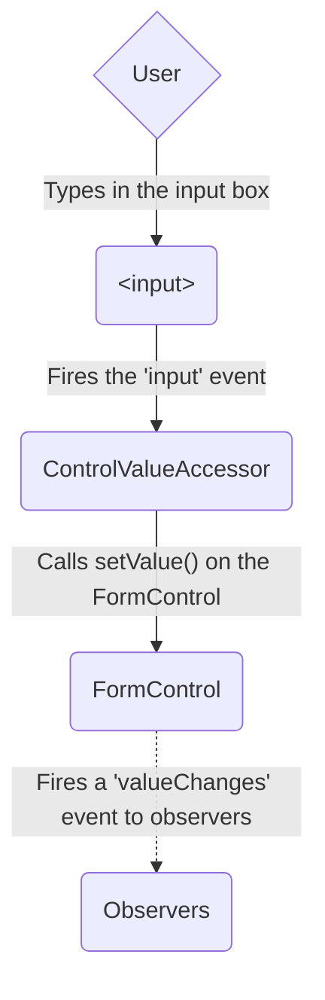
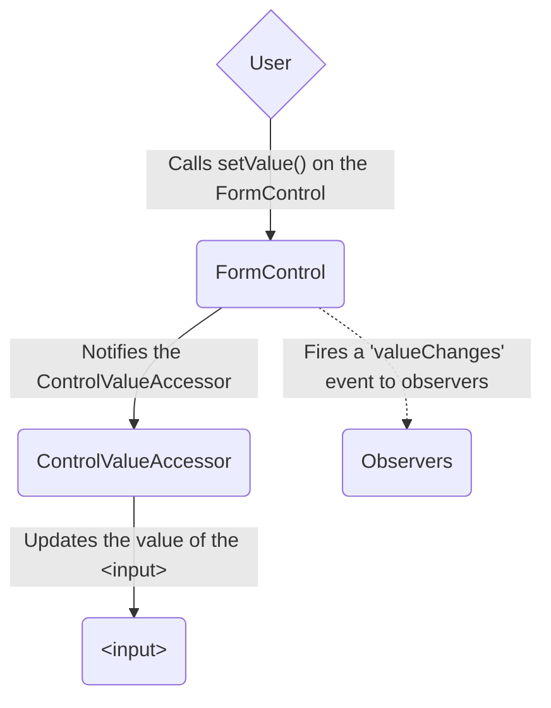
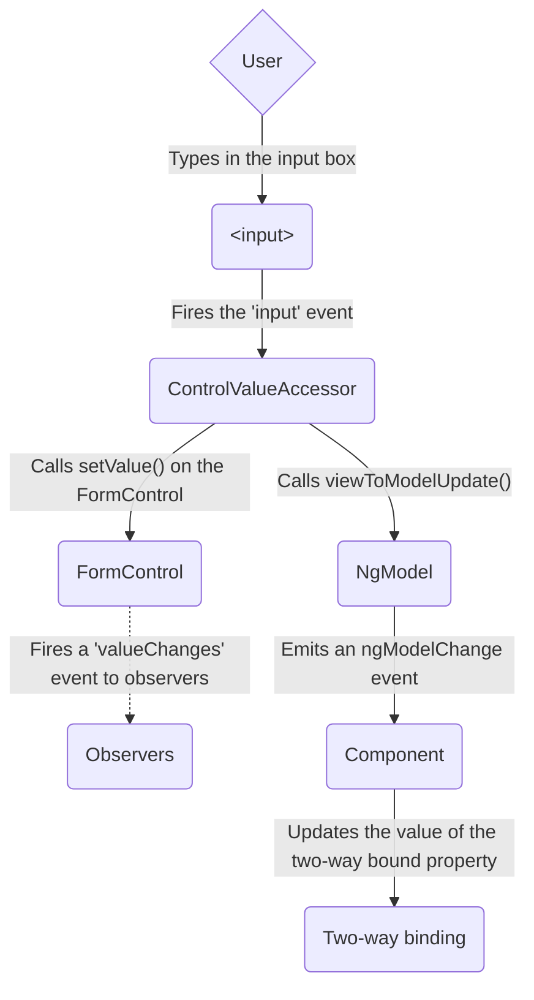
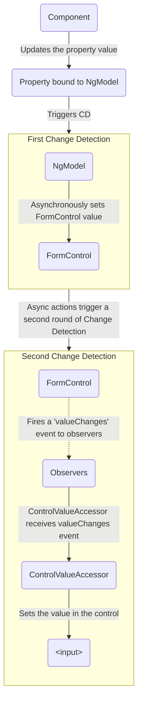

<docs-decorative-header title="Forms in Angular" imgSrc="adev/src/assets/images/overview.svg"> <!-- markdownlint-disable-line -->
Kullanıcı girdisini formlarla yönetmek, birçok yaygın uygulamanın temel taşıdır.
</docs-decorative-header>

Uygulamalar, kullanıcıların oturum açmasını, profil güncellemesini, hassas bilgi girmesini ve diğer birçok veri giriş görevini gerçekleştirmesini sağlamak için formları kullanır.

Angular, formlar aracılığıyla kullanıcı girdisini yönetmek için iki farklı yaklaşım sunar: reaktif ve şablon odaklı.

Her iki yaklaşım da kullanıcı girdi olaylarını görünümden yakalar, kullanıcı girdisini doğrular, güncellenecek bir form modeli ve veri modeli oluşturur ve değişiklikleri takip etmek için bir yol sağlar.

TIP: Yeni deneysel Signal Forms'u arıyorsanız, [temel Signal Forms kılavuzumuza](/essentials/signal-forms) göz atın!

Bu kılavuz, durumunuz için en uygun form türünü belirlemenize yardımcı olacak bilgiler sağlar.
Her iki yaklaşımın da kullandığı ortak yapı taşlarını tanıtır.
Ayrıca iki yaklaşım arasındaki temel farkları özetler ve bu farkları kurulum, veri akışı ve test bağlamında gösterir.

## Choosing an approach

Reaktif formlar ve şablon odaklı formlar, form verilerini farklı şekilde işler ve yönetir.
Her yaklaşım farklı avantajlar sunar.

| Formlar               | Ayrıntılar                                                                                                                                                                                                                                                                                                                                                                                                       |
| :-------------------- | :--------------------------------------------------------------------------------------------------------------------------------------------------------------------------------------------------------------------------------------------------------------------------------------------------------------------------------------------------------------------------------------------------------------- |
| Reaktif formlar       | Altta yatan form nesne modeline doğrudan, açık erişim sağlar. Şablon odaklı formlarla karşılaştırıldığında daha güçlüdürler: daha ölçeklenebilir, yeniden kullanılabilir ve test edilebilirdirler. Formlar uygulamanızın önemli bir parçasıysa veya uygulamanızı oluşturmak için zaten reaktif kalıplar kullanıyorsanız, reaktif formları kullanın.                                                              |
| Şablon odaklı formlar | Altta yatan nesne modelini oluşturmak ve yönetmek için şablondaki direktiflere dayanır. Bir uygulamaya basit bir form eklemek için kullanışlıdırlar; örneğin bir e-posta listesi kayıt formu. Uygulamaya eklemek kolaydır, ancak reaktif formlar kadar iyi ölçeklenmezler. Çok temel form gereksinimleriniz varsa ve mantık yalnızca şablonda yönetilebiliyorsa, şablon odaklı formlar uygun bir seçim olabilir. |

### Key differences

Aşağıdaki tablo, reaktif ve şablon odaklı formlar arasındaki temel farkları özetlemektedir.

|                                                       | Reaktif                             | Şablon odaklı                         |
| :---------------------------------------------------- | :---------------------------------- | :------------------------------------ |
| [Form modelinin kurulumu](#setting-up-the-form-model) | Açık, bileşen sınıfında oluşturulur | Örtük, direktiflerle oluşturulur      |
| [Veri modeli](#mutability-of-the-data-model)          | Yapılandırılmış ve değişmez         | Yapılandırılmamış ve değiştirilebilir |
| [Veri akışı](#data-flow-in-forms)                     | Senkron                             | Asenkron                              |
| [Form doğrulama](#form-validation)                    | Fonksiyonlar                        | Direktifler                           |

### Scalability

Formlar uygulamanızın merkezi bir parçasıysa, ölçeklenebilirlik çok önemlidir.
Form modellerini bileşenler arasında yeniden kullanabilmek kritiktir.

Reaktif formlar, şablon odaklı formlardan daha ölçeklenebilirdir.
Altta yatan form API'sine doğrudan erişim sağlarlar ve görünüm ile veri modeli arasında [senkron veri akışı](#data-flow-in-reactive-forms) kullanırlar, bu da büyük ölçekli formlar oluşturmayı kolaylaştırır.
Reaktif formlar test için daha az kurulum gerektirir ve form güncellemelerini ve doğrulamayı düzgün bir şekilde test etmek için değişiklik algılamanın derinlemesine anlaşılmasını gerektirmez.

Şablon odaklı formlar basit senaryolara odaklanır ve yeniden kullanılabilirlik açısından sınırlıdır.
Altta yatan form API'sini soyutlarlar ve görünüm ile veri modeli arasında [asenkron veri akışı](#data-flow-in-template-driven-forms) kullanırlar.
Şablon odaklı formların soyutlaması test etmeyi de etkiler.
Testler düzgün çalışması için manuel değişiklik algılama yürütmesine derinden bağımlıdır ve daha fazla kurulum gerektirir.

## Setting up the form model

Hem reaktif hem de şablon odaklı formlar, kullanıcıların etkileşimde bulunduğu form girdi öğeleri ile bileşen modelinizdeki form verileri arasındaki değer değişikliklerini takip eder.
İki yaklaşım aynı temel yapı taşlarını paylaşır, ancak ortak form kontrolü örneklerini nasıl oluşturduğunuz ve yönettiğiniz konusunda farklılık gösterir.

### Common form foundation classes

Hem reaktif hem de şablon odaklı formlar aşağıdaki temel sınıflar üzerine inşa edilmiştir.

| Temel sınıflar         | Ayrıntılar                                                                             |
| :--------------------- | :------------------------------------------------------------------------------------- |
| `FormControl`          | Tek bir form kontrolünün değerini ve doğrulama durumunu takip eder.                    |
| `FormGroup`            | Bir form kontrolleri koleksiyonu için aynı değerleri ve durumu takip eder.             |
| `FormArray`            | Bir form kontrolleri dizisi için aynı değerleri ve durumu takip eder.                  |
| `ControlValueAccessor` | Angular `FormControl` örnekleri ile yerleşik DOM öğeleri arasında bir köprü oluşturur. |

### Setup in reactive forms

Reaktif formlarda, form modelini doğrudan bileşen sınıfında tanımlarsınız.
`[formControl]` direktifi, açıkça oluşturulan `FormControl` örneğini, dahili bir değer erişimcisi kullanarak görünümdeki belirli bir form öğesine bağlar.

Aşağıdaki bileşen, reaktif formlar kullanarak tek bir kontrol için bir girdi alanı uygular.
Bu örnekte, form modeli `FormControl` örneğidir.

<docs-code language="angular-ts" path="adev/src/content/examples/forms-overview/src/app/reactive/favorite-color/favorite-color.component.ts"/>

IMPORTANT: Reaktif formlarda, form modeli doğruluk kaynağıdır; `<input>` öğesindeki `[formControl]` direktifi aracılığıyla, herhangi bir zamanda form öğesinin değerini ve durumunu sağlar.

### Setup in template-driven forms

Şablon odaklı formlarda, form modeli açık değil, örtüktür.
`NgModel` direktifi, belirli bir form öğesi için bir `FormControl` örneği oluşturur ve yönetir.

Aşağıdaki bileşen, şablon odaklı formlar kullanarak tek bir kontrol için aynı girdi alanını uygular.

<docs-code language="angular-ts" path="adev/src/content/examples/forms-overview/src/app/template/favorite-color/favorite-color.component.ts"/>

IMPORTANT: Şablon odaklı bir formda doğruluk kaynağı şablondur. `NgModel` direktifi `FormControl` örneğini sizin için otomatik olarak yönetir.

## Data flow in forms

Bir uygulama form içerdiğinde, Angular'ın görünümü bileşen modeliyle ve bileşen modelini görünümle senkronize tutması gerekir.
Kullanıcılar görünüm aracılığıyla değerleri değiştirdikçe ve seçimler yaptıkça, yeni değerler veri modelinde yansıtılmalıdır.
Benzer şekilde, program mantığı veri modelindeki değerleri değiştirdiğinde, bu değerler görünümde yansıtılmalıdır.

Reaktif ve şablon odaklı formlar, kullanıcıdan veya programatik değişikliklerden gelen verilerin akışını farklı şekilde yönetir.
Aşağıdaki diyagramlar, yukarıda tanımlanan favori renk girdi alanını kullanarak her form türü için her iki veri akışını da göstermektedir.

### Data flow in reactive forms

Reaktif formlarda, görünümdeki her form öğesi doğrudan form modeline (bir `FormControl` örneği) bağlıdır.
Görünümden modele ve modelden görünüme güncellemeler senkrondur ve kullanıcı arayüzünün nasıl oluşturulduğuna bağlı değildir.

Görünümden modele diyagramı, bir girdi alanının değeri görünümden değiştirildiğinde verilerin nasıl aktığını aşağıdaki adımlarla gösterir.

1. Kullanıcı girdi öğesine bir değer yazar, bu durumda favori renk _Blue_.
1. Form girdi öğesi en son değerle bir "input" olayı yayar.
1. Form girdi öğesindeki olayları dinleyen `ControlValueAccessor`, yeni değeri hemen `FormControl` örneğine aktarır.
1. `FormControl` örneği, `valueChanges` observable'ı aracılığıyla yeni değeri yayar.
1. `valueChanges` observable'ının tüm aboneleri yeni değeri alır.

Modelden görünüme diyagramı, modeldeki programatik bir değişikliğin görünüme nasıl yayıldığını aşağıdaki adımlarla gösterir.

1. Kullanıcı `favoriteColorControl.setValue()` yöntemini çağırır, bu da `FormControl` değerini günceller.
1. `FormControl` örneği, `valueChanges` observable'ı aracılığıyla yeni değeri yayar.
1. `valueChanges` observable'ının tüm aboneleri yeni değeri alır.
1. Form girdi öğesindeki kontrol değeri erişimcisi, öğeyi yeni değerle günceller.

### Data flow in template-driven forms

Şablon odaklı formlarda, her form öğesi form modelini dahili olarak yöneten bir direktife bağlıdır.

Görünümden modele diyagramı, bir girdi alanının değeri görünümden değiştirildiğinde verilerin nasıl aktığını aşağıdaki adımlarla gösterir.

1. Kullanıcı girdi öğesine _Blue_ yazar.
1. Girdi öğesi, _Blue_ değeriyle bir "input" olayı yayar.
1. Girdiye bağlı kontrol değeri erişimcisi, `FormControl` örneğindeki `setValue()` yöntemini tetikler.
1. `FormControl` örneği, `valueChanges` observable'ı aracılığıyla yeni değeri yayar.
1. `valueChanges` observable'ının tüm aboneleri yeni değeri alır.
1. Kontrol değeri erişimcisi ayrıca `NgModel.viewToModelUpdate()` yöntemini çağırır ve bu bir `ngModelChange` olayı yayar.
1. Bileşen şablonu `favoriteColor` özelliği için çift yönlü veri bağlama kullandığından, bileşendeki `favoriteColor` özelliği `ngModelChange` olayı tarafından yayılan değere \(_Blue_\) güncellenir.

Modelden görünüme diyagramı, `favoriteColor` _Blue_'dan _Red_'e değiştiğinde verilerin modelden görünüme nasıl aktığını aşağıdaki adımlarla gösterir

1. `favoriteColor` değeri bileşende güncellenir.
1. Değişiklik algılama başlar.
1. Değişiklik algılama sırasında, girdilerinden birinin değeri değiştiği için `NgModel` direktif örneğinde `ngOnChanges` yaşam döngüsü kancası çağrılır.
1. `ngOnChanges()` yöntemi, dahili `FormControl` örneği için değeri ayarlamak üzere asenkron bir görev kuyruğa alır.
1. Değişiklik algılama tamamlanır.
1. Bir sonraki döngüde, `FormControl` örneği değerini ayarlama görevi yürütülür.
1. `FormControl` örneği, `valueChanges` observable'ı aracılığıyla en son değeri yayar.
1. `valueChanges` observable'ının tüm aboneleri yeni değeri alır.
1. Kontrol değeri erişimcisi, görünümdeki form girdi öğesini en son `favoriteColor` değeriyle günceller.

NOTE: `NgModel`, değer değişikliği bir girdi bağlamadan kaynaklandığı için `ExpressionChangedAfterItHasBeenChecked` hatalarını önlemek amacıyla ikinci bir değişiklik algılama tetikler.

### Mutability of the data model

Değişiklik takip yöntemi, uygulamanızın verimliliğinde bir rol oynar.

| Formlar               | Ayrıntılar                                                                                                                                                                                                                                                                                                                                                                                                                                                                                                                                                                   |
| :-------------------- | :--------------------------------------------------------------------------------------------------------------------------------------------------------------------------------------------------------------------------------------------------------------------------------------------------------------------------------------------------------------------------------------------------------------------------------------------------------------------------------------------------------------------------------------------------------------------------- |
| Reaktif formlar       | Veri modelini değişmez bir veri yapısı olarak sağlayarak saf tutar. Veri modelinde her değişiklik tetiklendiğinde, `FormControl` örneği mevcut veri modelini güncellemek yerine yeni bir veri modeli döndürür. Bu size kontrolün observable'ı aracılığıyla veri modelindeki benzersiz değişiklikleri takip etme yeteneği verir. Değişiklik algılama daha verimlidir çünkü yalnızca benzersiz değişikliklerde güncelleme yapması gerekir. Veri güncellemeleri reaktif kalıpları takip ettiğinden, verileri dönüştürmek için observable operatörleriyle entegre edebilirsiniz. |
| Şablon odaklı formlar | Şablonda yapılan değişiklikler sırasında bileşendeki veri modelini güncellemek için çift yönlü veri bağlama ile değiştirilebilirliğe dayanır. Çift yönlü veri bağlama kullanılırken veri modelinde takip edilecek benzersiz değişiklikler olmadığından, değişiklik algılama güncellemelerin ne zaman gerekli olduğunu belirlemede daha az verimlidir.                                                                                                                                                                                                                        |

Fark, favori renk girdi öğesini kullanan önceki örneklerde gösterilmektedir.

- Reaktif formlarda, **`FormControl` örneği** kontrolün değeri güncellendiğinde her zaman yeni bir değer döndürür
- Şablon odaklı formlarda, **favori renk özelliği** her zaman yeni değerine göre değiştirilir

## Form validation

Doğrulama, herhangi bir form kümesini yönetmenin ayrılmaz bir parçasıdır.
İster zorunlu alanları kontrol ediyor olun, ister mevcut bir kullanıcı adı için harici bir API'yi sorgulayın, Angular bir dizi yerleşik doğrulayıcının yanı sıra özel doğrulayıcılar oluşturma yeteneği sağlar.

| Formlar               | Ayrıntılar                                                                                                       |
| :-------------------- | :--------------------------------------------------------------------------------------------------------------- |
| Reaktif formlar       | Özel doğrulayıcıları, doğrulanacak bir kontrol alan **fonksiyonlar** olarak tanımlayın                           |
| Şablon odaklı formlar | Şablon **direktiflerine** bağlıdır ve doğrulama fonksiyonlarını saran özel doğrulayıcı direktifleri sağlamalıdır |

Daha fazla bilgi için [Form Doğrulama](guide/forms/form-validation#validating-input-in-reactive-forms) bölümüne bakın.

## Testing

Test, karmaşık uygulamalarda büyük bir rol oynar.
Formlarınızın doğru çalıştığını doğrularken daha basit bir test stratejisi yararlıdır.
Reaktif formlar ve şablon odaklı formlar, form kontrolü ve form alanı değişikliklerine dayalı doğrulamalar yapmak için kullanıcı arayüzünün oluşturulmasına farklı düzeylerde bağımlıdır.
Aşağıdaki örnekler, reaktif ve şablon odaklı formlarla formları test etme sürecini göstermektedir.

### Testing reactive forms

Reaktif formlar, senkron erişim sağladıkları ve kullanıcı arayüzünü oluşturmadan test edilebildikleri için nispeten basit bir test stratejisi sunar.
Bu testlerde, durum ve veriler değişiklik algılama döngüsüyle etkileşime girmeden kontrol üzerinden sorgulanır ve işlenir.

Aşağıdaki testler, reaktif bir form için görünümden modele ve modelden görünüme veri akışlarını doğrulamak amacıyla önceki örneklerdeki favori renk bileşenlerini kullanır.

<!--todo: make consistent with other topics -->

#### Verifying view-to-model data flow

İlk örnek, görünümden modele veri akışını doğrulamak için aşağıdaki adımları gerçekleştirir.

1. Form girdi öğesi için görünümü sorgulayın ve test için özel bir "input" olayı oluşturun.
1. Girdi için yeni değeri _Red_ olarak ayarlayın ve form girdi öğesinde "input" olayını gönderin.
1. Bileşenin `favoriteColorControl` değerinin girdiden gelen değerle eşleştiğini doğrulayın.

<docs-code header="Favorite color test - view to model" path="adev/src/content/examples/forms-overview/src/app/reactive/favorite-color/favorite-color.component.spec.ts" region="view-to-model"/>

Sonraki örnek, modelden görünüme veri akışını doğrulamak için aşağıdaki adımları gerçekleştirir.

1. Yeni değeri ayarlamak için `FormControl` örneği olan `favoriteColorControl`'ü kullanın.
1. Form girdi öğesi için görünümü sorgulayın.
1. Kontrolde ayarlanan yeni değerin girdideki değerle eşleştiğini doğrulayın.

<docs-code header="Favorite color test - model to view" path="adev/src/content/examples/forms-overview/src/app/reactive/favorite-color/favorite-color.component.spec.ts" region="model-to-view"/>

### Testing template-driven forms

Şablon odaklı formlarla test yazmak, değişiklik algılama sürecinin ayrıntılı bilgisini ve direktiflerin her döngüde nasıl çalıştığının anlaşılmasını gerektirir; böylece öğeler doğru zamanda sorgulanabilir, test edilebilir veya değiştirilebilir.

Aşağıdaki testler, şablon odaklı bir form için görünümden modele ve modelden görünüme veri akışlarını doğrulamak amacıyla daha önce bahsedilen favori renk bileşenlerini kullanır.

Aşağıdaki test, görünümden modele veri akışını doğrular.

<docs-code header="Favorite color test - view to model" path="adev/src/content/examples/forms-overview/src/app/template/favorite-color/favorite-color.component.spec.ts" region="view-to-model"/>

Görünümden modele testinde gerçekleştirilen adımlar şunlardır.

1. Form girdi öğesi için görünümü sorgulayın ve test için özel bir "input" olayı oluşturun.
1. Girdi için yeni değeri _Red_ olarak ayarlayın ve form girdi öğesinde "input" olayını gönderin.
1. Test fikstürü aracılığıyla değişiklik algılamayı çalıştırın.
1. Bileşenin `favoriteColor` özellik değerinin girdiden gelen değerle eşleştiğini doğrulayın.

Aşağıdaki test, modelden görünüme veri akışını doğrular.

<docs-code header="Favorite color test - model to view" path="adev/src/content/examples/forms-overview/src/app/template/favorite-color/favorite-color.component.spec.ts" region="model-to-view"/>

Modelden görünüme testinde gerçekleştirilen adımlar şunlardır.

1. `favoriteColor` özelliğinin değerini ayarlamak için bileşen örneğini kullanın.
1. Test fikstürü aracılığıyla değişiklik algılamayı çalıştırın.
1. Sonraki oluşturmayı beklemek için `await fixture.whenStable()` kullanın.
1. Form girdi öğesi için görünümü sorgulayın.
1. Girdi değerinin bileşen örneğindeki `favoriteColor` özelliğinin değeriyle eşleştiğini doğrulayın.

## Next steps

Reaktif formlar hakkında daha fazla bilgi edinmek için aşağıdaki kılavuzlara bakın:

<docs-pill-row>
  <docs-pill href="guide/forms/reactive-forms" title="Reactive forms"/>
  <docs-pill href="guide/forms/form-validation#validating-input-in-reactive-forms" title="Form validation"/>
  <docs-pill href="guide/forms/dynamic-forms" title="Dynamic forms"/>
</docs-pill-row>

Şablon odaklı formlar hakkında daha fazla bilgi edinmek için aşağıdaki kılavuzlara bakın:

<docs-pill-row>
  <docs-pill href="guide/forms/template-driven-forms" title="Template Driven Forms tutorial" />
  <docs-pill href="guide/forms/form-validation#validating-input-in-template-driven-forms" title="Form validation" />
  <docs-pill href="api/forms/NgForm" title="NgForm directive API reference" />
</docs-pill-row>
