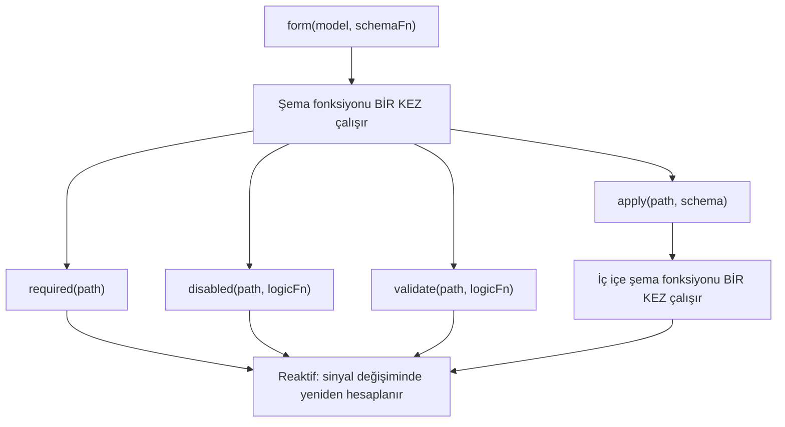

# Şemalar ve şema birleştirilebilirliği

Signal Forms, _formunuzun nasıl yapılandırıldığını_ _çalışma zamanında nasıl davrandığından_ ayırmak için iki katmanlı bir mimari kullanır.

Bir şema fonksiyonunu `form()`'a geçirdiğinizde, o fonksiyon form oluşturma sırasında _bir kez çalışır_. Görevi, hangi alanların doğrulamaya sahip olduğunu, hangi alanların devre dışı bırakıldığını ve hangi alanların diğer alanlara bağlı olduğunu bildirerek formun mantık ağacını kurmaktır. Bu, formunuzun **yapısal katmanıdır**.

Bir şema fonksiyonunun içinde, `disabled()` ve `validate()` gibi kural fonksiyonlarını çağırırsınız. Bu kural fonksiyonları, referans verdikleri sinyaller değiştiğinde yeniden hesaplanan reaktif mantık kabul eder. `disabled()` ve `required()` gibi koşullu kurallar, kuralı etkinleştiren bir `when` fonksiyonu da dahil olmak üzere isteğe bağlı yapılandırma kabul eder. Birlikte, bunlar formunuzun çalışma zamanındaki **davranışsal katmanını** oluşturur.

```ts
contactForm = form(this.contactModel, (schemaPath) => {
  // Şema fonksiyonu: form oluşturma sırasında BİR KEZ çalışır
  required(schemaPath.name);
  disabled(schemaPath.couponCode, {when: ({valueOf}) => valueOf(schemaPath.total) < 50});
  //  ^^^ Reaktif mantık: total değiştiğinde yeniden hesaplanır
});
```



Bu ayrım, şemaları birleştirirken önemlidir çünkü `apply()`, `applyWhen()` ve `schema()` gibi fonksiyonların tümü yapısal katmanda çalışır. Şemalar _hangi_ kuralların var olduğunu ve _etkin olup olmadıklarını_ kontrol ederken, kural fonksiyonları o kuralların _neyi_ değerlendirdiğini tanımlar.

## `schema()` ile yeniden kullanılabilir şemalar oluşturma

Birden fazla form, ortak bir veri şekli için aynı kuralları paylaştığında, bu kuralları yeniden kullanılabilir bir şemaya çıkarmak için `schema()` fonksiyonunu kullanabilirsiniz.

```ts
import {schema, required, minLength} from '@angular/forms/signals';

const nameSchema = schema<{first: string; last: string}>((name) => {
  required(name.first);
  required(name.last);
  minLength(name.first, 2);
  minLength(name.last, 2);
});
```

`schema()` fonksiyonu bir fonksiyonu sarmalar ve onu yeniden kullanılabilir bir `Schema<T>` nesnesine dönüştürür. Herhangi bir şema fonksiyonu gibi, form başına _bir kez çalışır_, ancak nesnenin kendisi ihtiyaç duyduğunuz kadar çok form arasında paylaşılabilir.

TIP: Kurallar yalnızca tek bir yerde görünüyorsa, satır içi bir şema fonksiyonu da aynı şekilde işe yarar. Aynı şemayı birden fazla formda yeniden kullanmak veya aynı şemayı birden fazla yola uygulamak istediğinizde `schema()` kullanın. Yeniden kullanılabilir `Schema` nesneleri form derlemesi başına önbelleğe alınır.

### Şemayı `apply()` ile kullanma

Yeniden kullanılabilir bir şemayı, `apply()` fonksiyonunu kullanarak bir formdaki belirli bir yola uygulayabilirsiniz. `apply()`'ı çağırdığınızda, şema yalnızca o alt yoldaki alanları gören kapsamlı bir yol alır:

```ts
import {apply} from '@angular/forms/signals';

profileForm = form(this.profileModel, (schemaPath) => {
  apply(schemaPath.name, nameSchema);
});

registrationForm = form(this.registrationModel, (schemaPath) => {
  apply(schemaPath.name, nameSchema);
});
```

## `applyWhen()` ile koşullu şemalar

NOTE: [Form mantığı ekleme kılavuzu](guide/forms/signals/form-logic), satır içi mantıkla koşullu kurallar için `applyWhen()`'i tanıttı. Bu bölüm, `applyWhen()`'in yeniden kullanılabilir şemalarla nasıl birleştirileceğini ele alır.

Bazı kurallar yalnızca belirli koşullar altında uygulanmalıdır. Örneğin, bir posta kodu alanı yalnızca seçilen ülke Amerika Birleşik Devletleri olduğunda doğrulama gerektirebilir.

`applyWhen()` fonksiyonu, reaktif duruma göre bir şemayı koşullu olarak uygular. Üç argüman kabul eder:

1. Şemanın uygulanacağı bir yol
1. Şema etkin olması gerektiğinde `true` döndüren bir reaktif mantık fonksiyonu
1. Koşullu kuralları içeren bir şema veya şema fonksiyonu

```ts
import {form, applyWhen, required, pattern} from '@angular/forms/signals';

addressForm = form(this.addressModel, (schemaPath) => {
  applyWhen(
    schemaPath,
    ({valueOf}) => valueOf(schemaPath.country) === 'US',
    (schemaPath) => {
      required(schemaPath.zipCode);
      pattern(schemaPath.zipCode, /^\d{5}(-\d{4})?$/);
    },
  );
});
```

Mantık fonksiyonu, `value`, `valueOf`, `stateOf` ve diğer reaktif yardımcılara erişim sağlayan bir `FieldContext` alır. Reaktif olduğu için, koşul okuduğu sinyaller değiştiğinde yeniden değerlendirilir. Koşul `false` olduğunda, şemanın içindeki kurallar devre dışı kalır. Tekrar `true` olduğunda, yeniden etkinleşir.

Şemanın kendisi hâlâ yapısaldır -- şema fonksiyonu form oluşturma sırasında bir kez çalışır. Koşul, bu kuralların _var olup olmadığını_ değil, _etkin_ olup olmadıklarını kontrol eder.

Koşullu şemanın içinde, o şema fonksiyonuna geçirilen kapsamlı yol parametresini kullanın. Dış bir şemadan gelen yollar, iç içe bir şemanın içinde geçerli değildir.

### `applyWhen()`'i yeniden kullanılabilir şemalarla birleştirme

`applyWhen()` bir `Schema` nesnesi kabul ettiği için, yeniden kullanılabilir şemaları koşullu olarak uygulamak amacıyla onu `schema()` ile eşleştirebilirsiniz:

```ts
const usZipCodeSchema = schema<{zipCode: string}>((address) => {
  required(address.zipCode);
  pattern(address.zipCode, /^\d{5}(-\d{4})?$/);
});

const caPostalCodeSchema = schema<{postalCode: string}>((address) => {
  required(address.postalCode);
  pattern(address.postalCode, /^[A-Z]\d[A-Z] \d[A-Z]\d$/);
});

shippingForm = form(this.shippingModel, (schemaPath) => {
  applyWhen(
    schemaPath.address,
    ({valueOf}) => valueOf(schemaPath.country) === 'US',
    usZipCodeSchema,
  );
  applyWhen(
    schemaPath.address,
    ({valueOf}) => valueOf(schemaPath.country) === 'CA',
    caPostalCodeSchema,
  );
});
```

NOTE: Yol argümanı `schemaPath.address` olmasına rağmen, mantık fonksiyonu `valueOf(schemaPath.country)`'ye erişir. Bunun nedeni, `valueOf` yardımcısının yalnızca kapsamlı yol içindeki alanlara değil, formdaki herhangi bir alana erişebilmesidir.

Bu kalıp, doğrulama mantığını modüler tutar -- her ülkenin adres kuralları kendi şemasında yaşar ve form, kullanıcının seçimine göre hangisini etkinleştireceğini belirler.

## `applyWhenValue()` ile tür daraltma

`applyWhenValue()` fonksiyonu, yalnızca alanın değerini kontrol etmesi gereken koşulları basitleştirir. Koşul fonksiyonu, bir `FieldContext` almak yerine, alanın ham değerini doğrudan alır.

```ts {header: "applyWhen — mantık fonksiyonu FieldContext alır"}
applyWhen(schemaPath.payment, ({value}) => value().type === 'credit-card', creditCardSchema);
```

```ts {header: "applyWhenValue — koşul değeri doğrudan alır"}
applyWhenValue(schemaPath.payment, (payment) => payment.type === 'credit-card', creditCardSchema);
```

`applyWhenValue()`'nin temel avantajı TypeScript tür koruyucu (type guard) desteğidir. Koşul fonksiyonu bir tür koruyucu olduğunda, şemanın tür parametresi korunan türe daralır. Bu, özellikle her bir varyantın farklı kurallara ihtiyaç duyan farklı alanlara sahip olduğu ayırt edici birleşimler (discriminated unions) için kullanışlıdır.

```ts
import {form, applyWhenValue, required} from '@angular/forms/signals';

interface CreditCard {
  type: 'credit-card';
  cardNumber: string;
  expiry: string;
  cvv: string;
}

interface BankTransfer {
  type: 'bank-transfer';
  accountNumber: string;
  routingNumber: string;
}

type PaymentMethod = CreditCard | BankTransfer;

function isCreditCard(value: PaymentMethod): value is CreditCard {
  return value.type === 'credit-card';
}

function isBankTransfer(value: PaymentMethod): value is BankTransfer {
  return value.type === 'bank-transfer';
}

paymentForm = form(this.paymentModel, (schemaPath) => {
  applyWhenValue(schemaPath, isCreditCard, (payment) => {
    // TypeScript, payment'ın CreditCard kapsamında olduğunu bilir
    required(payment.cardNumber);
    required(payment.expiry);
    required(payment.cvv);
  });

  applyWhenValue(schemaPath, isBankTransfer, (payment) => {
    // TypeScript, payment'ın BankTransfer kapsamında olduğunu bilir
    required(payment.accountNumber);
    required(payment.routingNumber);
  });
});
```

Tür koruyucu olmadan, TypeScript her şema fonksiyonunun içinde hangi alanların mevcut olduğunu bilemezdi. Tür daraltma, kredi kartı dalında `payment.cardNumber`'a ve banka havalesi dalında `payment.accountNumber`'a erişmenin tür açısından güvenli olmasını sağlar.

## `applyEach()` ile dizi öğeleri

Bir form bir nesneler dizisi içerdiğinde, genellikle her öğeye aynı kuralların uygulanması gerekir. `applyEach()` fonksiyonu, kaç öğe olursa olsun, bir dizi alanındaki her öğeye bir şema uygular.

```ts
import {form, applyEach, required, min} from '@angular/forms/signals';

type LineItem = {name: string; quantity: number};

orderForm = form(this.orderModel, (schemaPath) => {
  required(schemaPath.title);

  applyEach(schemaPath.items, (item) => {
    required(item.name);
    min(item.quantity, 1);
  });
});
```

`applyEach()`'e geçirilen şema fonksiyonu, tek bir dizi öğesine kapsamlanmış bir `SchemaPathTree` alır. İçinde bildirilen kurallar, form oluşturulduktan sonra eklenen öğeler de dahil olmak üzere dizideki her öğeye uygulanır.

### `applyEach()`'i yeniden kullanılabilir şemalarla birleştirme

`applyEach()` bir `Schema` nesnesi kabul ettiği için, öğe düzeyindeki kuralları yeniden kullanılabilir bir şemaya çıkarabilir ve bunları formlar arasında paylaşabilirsiniz:

```ts
const lineItemSchema = schema<LineItem>((item) => {
  required(item.name);
  min(item.quantity, 1);
});

orderForm = form(this.orderModel, (schemaPath) => {
  required(schemaPath.title);
  applyEach(schemaPath.items, lineItemSchema);
});

invoiceForm = form(this.invoiceModel, (schemaPath) => {
  required(schemaPath.invoiceNumber);
  applyEach(schemaPath.lineItems, lineItemSchema);
});
```

TIP: Her alan için özel hata mesajları da dahil olmak üzere dizi öğelerini doğrulama hakkında daha fazla bilgi için [Doğrulama kılavuzuna](guide/forms/signals/validation) bakın.

## Sonraki adımlar

Signal Forms hakkında daha fazla bilgi edinmek için bu ilgili kılavuzlara göz atın:

- [Form mantığı ekleme](guide/forms/signals/form-logic) - Formlarınıza koşullu mantık, dinamik davranış ve meta veri eklemeyi öğrenin
- [Doğrulama](guide/forms/signals/validation) - Doğrulama kuralları ve hata yönetimi hakkında bilgi edinin
- [Asenkron işlemler](guide/forms/signals/async-operations) - Form gönderimi ve asenkron doğrulamayı nasıl ele alacağınızı öğrenin
