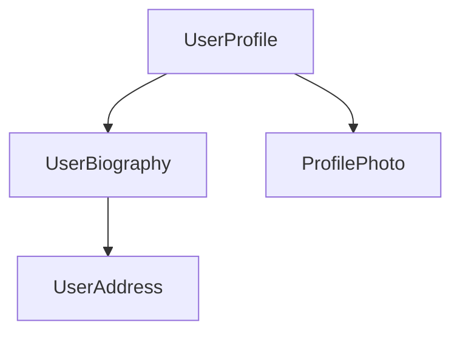

<docs-decorative-header title="Bileşenler" imgSrc="adev/src/assets/images/components.svg"> <!-- markdownlint-disable-line -->
Angular'da uygulama oluşturmanın temel yapı taşı.
</docs-decorative-header>

Bileşenler, Angular uygulamalarının ana yapı taşlarıdır. Her bileşen, daha büyük bir web sayfasının bir parçasını temsil eder. Bir uygulamayı bileşenlere göre düzenlemek, projenize yapı kazandırmaya yardımcı olarak kodu bakımı kolay ve zamanla büyüyebilen belirli parçalara net bir şekilde ayırır.

## Bir Bileşen Tanımlama

Her bileşenin birkaç ana parçası vardır:

1. Angular tarafından kullanılan bazı yapılandırmaları içeren bir `@Component` [dekoratörü](https://www.typescriptlang.org/docs/handbook/decorators.html).
2. DOM'a ne render edileceğini kontrol eden bir HTML şablonu.
3. Bileşenin HTML'de nasıl kullanılacağını tanımlayan bir [CSS seçici](https://developer.mozilla.org/docs/Learn/CSS/Building_blocks/Selectors).
4. Kullanıcı girdisini işleme veya sunucuya istek gönderme gibi davranışlara sahip bir TypeScript sınıfı.

İşte basitleştirilmiş bir `UserProfile` bileşeni örneği.

```angular-ts
// user-profile.ts
@Component({
  selector: 'user-profile',
  template: `
    <h1>User profile</h1>
    <p>This is the user profile page</p>
  `,
})
export class UserProfile {
  /* Bileşen kodunuz buraya gelecek */
}
```

`@Component` dekoratörü ayrıca isteğe bağlı olarak şablonunuza uygulamak istediğiniz CSS için bir `styles` özelliğini de kabul eder:

```angular-ts
// user-profile.ts
@Component({
  selector: 'user-profile',
  template: `
    <h1>User profile</h1>
    <p>This is the user profile page</p>
  `,
  styles: `
    h1 {
      font-size: 3em;
    }
  `,
})
export class UserProfile {
  /* Bileşen kodunuz buraya gelecek */
}
```

### HTML ve CSS'i Ayrı Dosyalara Ayırma

Bir bileşenin HTML ve CSS'ini `templateUrl` ve `styleUrl` kullanarak ayrı dosyalarda tanımlayabilirsiniz:

```angular-ts
// user-profile.ts
@Component({
  selector: 'user-profile',
  templateUrl: 'user-profile.html',
  styleUrl: 'user-profile.css',
})
export class UserProfile {
  // Bileşen davranışı burada tanımlanır
}
```

```angular-html
<!-- user-profile.html -->
<h1>User profile</h1>
<p>This is the user profile page</p>
```

```css
/* user-profile.css */
h1 {
  font-size: 3em;
}
```

## Bileşenleri Kullanma

Birden fazla bileşeni bir araya getirerek bir uygulama oluşturursunuz. Örneğin, bir kullanıcı profili sayfası oluşturuyorsanız, sayfayı şu şekilde birkaç bileşene ayırabilirsiniz:



Burada `UserProfile` bileşeni, son sayfayı oluşturmak için birkaç başka bileşeni kullanır.

Bir bileşeni içe aktarmak ve kullanmak için şunları yapmanız gerekir:

1. Bileşeninizin TypeScript dosyasında, kullanmak istediğiniz bileşen için bir `import` ifadesi ekleyin.
2. `@Component` dekoratörünüzde, kullanmak istediğiniz bileşen için `imports` dizisine bir giriş ekleyin.
3. Bileşeninizin şablonunda, kullanmak istediğiniz bileşenin seçicisiyle eşleşen bir eleman ekleyin.

İşte bir `ProfilePhoto` bileşenini içe aktaran bir `UserProfile` bileşeni örneği:

```angular-ts
// user-profile.ts
import {ProfilePhoto} from 'profile-photo.ts';

@Component({
  selector: 'user-profile',
  imports: [ProfilePhoto],
  template: `
    <h1>User profile</h1>
    <profile-photo />
    <p>This is the user profile page</p>
  `,
})
export class UserProfile {
  // Bileşen davranışı burada tanımlanır
}
```

TIP: Angular bileşenleri hakkında daha fazla bilgi edinmek ister misiniz? Tüm ayrıntılar için [Detaylı Bileşenler kılavuzuna](guide/components) bakın.

## Sonraki Adım

Angular'da bileşenlerin nasıl çalıştığını öğrendiğinize göre, uygulamamızda dinamik verileri nasıl ekleyip yöneteceğimizi öğrenmenin zamanı geldi.

<docs-pill-row>
  <docs-pill title="Sinyallerle reaktivite" href="essentials/signals" />
  <docs-pill title="Detaylı bileşenler kılavuzu" href="guide/components" />
</docs-pill-row>
