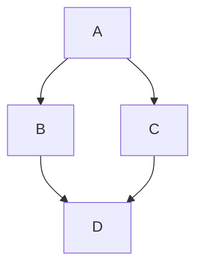
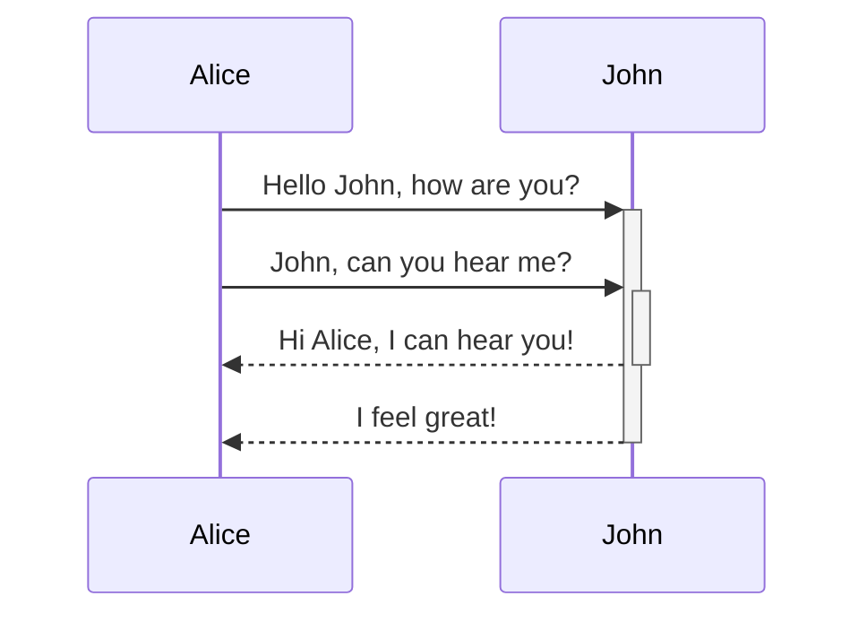
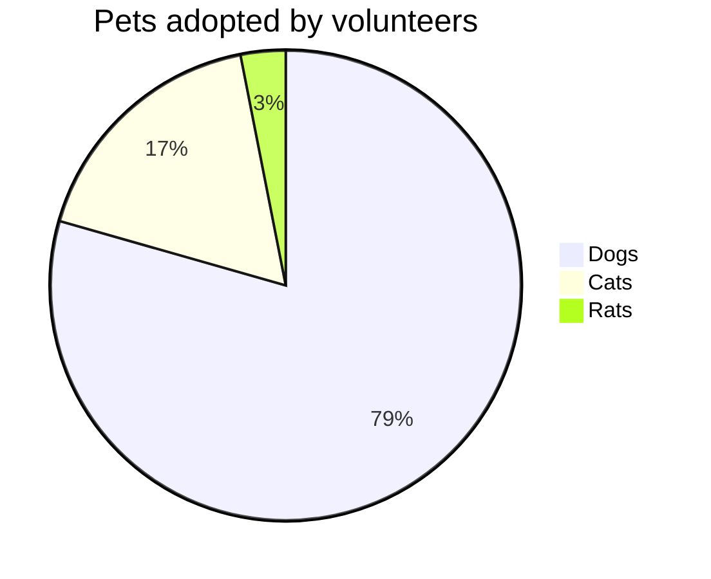

<docs-decorative-header title="Kitchen sink" imgSrc="adev/src/assets/images/components.svg"> <!-- markdownlint-disable-line -->
Bu, Angular.dev için tüm özel bileşenlerin ve stillerin görsel bir listesidir.
</docs-decorative-header>

Bir tasarım sistemi olarak bu sayfa, aşağıdakiler için görsel ve Markdown yazım rehberliği içerir:

- Özel Angular dokümantasyon öğeleri: [`docs-card`](#cards), [`docs-callout`](#callouts), [`docs-pill`](#pills) ve [`docs-steps`](#workflow)
- Özel metin öğeleri: [uyarılar](#alerts)
- Kod örnekleri: [`docs-code`](#code)
- Yerleşik Markdown stillendirilmiş öğeler: bağlantılar, listeler, [başlıklar](#headers-h2), [yatay çizgiler](#horizontal-line-divider)
- ve daha fazlası!

Hazır olun:

1. Harika...
2. dokümantasyon...
3. yazmaya!

## Headers (h2)

### Smaller headers (h3)

#### Even smaller (h4)

##### Even more smaller (h5)

###### The smallest! (h6)

## Cards

<docs-card-container>
  <docs-card title="What is Angular?" link="Platform Overview" href="tutorials/first-app">
    Lorem ipsum dolor sit amet, consectetur adipiscing elit. Nullam ornare ligula nisi
  </docs-card>
  <docs-card title="Second Card" link="Try It Now" href="essentials/what-is-angular">
    Lorem ipsum dolor sit amet, consectetur adipiscing elit. Nullam ornare ligula nisi
  </docs-card>
    <docs-card title="No Link Card">
    Lorem ipsum dolor sit amet, consectetur adipiscing elit. Nullam ornare ligula nisi
  </docs-card>
</docs-card-container>

### `<docs-card>` Attributes

| Attributes              | Details                                            |
| :---------------------- | :------------------------------------------------- |
| `<docs-card-container>` | Tüm kartlar bir kapsayıcı içinde yer almalıdır     |
| `title`                 | Kart başlığı                                       |
| card body contents      | `<docs-card>` ve `</docs-card>` arasındaki her şey |
| `link`                  | (İsteğe bağlı) Eylem çağrısı bağlantı metni        |
| `href`                  | (İsteğe bağlı) Eylem çağrısı bağlantı href'i       |

## Callouts

<docs-callout title="Title of a callout that is helpful">
  Lorem ipsum dolor sit amet, consectetur adipiscing elit. Nulla luctus metus blandit semper faucibus. Sed blandit diam quis tellus maximus, ac scelerisque ex egestas. Ut euismod lobortis mauris pretium iaculis. Quisque ullamcorper, elit ut lacinia blandit, magna sem finibus urna, vel suscipit tortor dolor id risus.
</docs-callout>

<docs-callout critical title="Title of a callout that is critical">
  Lorem ipsum dolor sit amet, consectetur adipiscing elit. Nulla luctus metus blandit semper faucibus. Sed blandit diam quis tellus maximus, ac scelerisque ex egestas. Ut euismod lobortis mauris pretium iaculis. Quisque ullamcorper, elit ut lacinia blandit, magna sem finibus urna, vel suscipit tortor dolor id risus.
</docs-callout>

<docs-callout important title="Title of a callout that is important">
  Lorem ipsum dolor sit amet, consectetur adipiscing elit. Nulla luctus metus blandit semper faucibus. Sed blandit diam quis tellus maximus, ac scelerisque ex egestas. Ut euismod lobortis mauris pretium iaculis. Quisque ullamcorper, elit ut lacinia blandit, magna sem finibus urna, vel suscipit tortor dolor id risus.
</docs-callout>

### `<docs-callout>` Attributes

| Attributes                                       | Details                                                     |
| :----------------------------------------------- | :---------------------------------------------------------- |
| `title`                                          | Callout başlığı                                             |
| card body contents                               | `<docs-callout>` ve `</docs-callout>` arasındaki her şey    |
| `helpful` (default) \| `critical` \| `important` | (İsteğe bağlı) Ciddiyet seviyesine göre stil ve simge ekler |

## Pills

Pill satırları, faydalı kaynaklara bağlantılar içeren bir tür navigasyon olarak kullanışlıdır.

<docs-pill-row id=pill-row>
  <docs-pill href="#pill-row" title="Link"/>
  <docs-pill href="#pill-row" title="Link"/>
  <docs-pill href="#pill-row" title="Link"/>
  <docs-pill href="#pill-row" title="Link"/>
  <docs-pill href="#pill-row" title="Link"/>
  <docs-pill href="#pill-row" title="Link"/>
</docs-pill-row>

### `<docs-pill>` Attributes

| Attributes       | Details                                           |
| :--------------- | :------------------------------------------------ |
| `<docs-pill-row` | Tüm pill'ler bir pill satırı içinde yer almalıdır |
| `title`          | Pill metni                                        |
| `href`           | Pill href'i                                       |

Pill'ler tek başlarına satır içi olarak da kullanılabilir, ancak henüz bunu geliştirmedik.

## Alerts

Uyarılar sadece özel paragraflardır. Biraz daha acil olan bir şeyi vurgulamak (callout ile karıştırılmamalıdır) için kullanışlıdırlar. Yazı tipi boyutunu bağlamdan alırlar ve birçok seviyede mevcutturlar. Uyarıları çok fazla içerik oluşturmak için değil, çevredeki içeriği geliştirmek ve dikkat çekmek için kullanmaya çalışın.

Uyarıları Markdown'da yeni bir satırda `CİDDİYET_SEVİYESİ` + `:` + `UYARI_METNİ` formatını kullanarak stilleyin.

NOTE: Not'u, ana metin için _gerekli_ olmayan ek/tamamlayıcı bilgiler için kullanın.

TIP: İpucu'yu, kullanıcıların gerçekleştirebileceği belirli bir görev/eylemi veya doğrudan bir görev/eyleme etki eden bir gerçeği vurgulamak için kullanın.

TODO: TODO'yu, yakında genişletmeyi planladığınız eksik dokümantasyon için kullanın. TODO'yu atayabilirsiniz de, ör. TODO(emmatwersky): Metin.

QUESTION: Soru'yu okuyucuya bir soru sormak için kullanın, yanıtlayabilmeleri gereken bir mini sınav gibi.

SUMMARY: Özet'i, sayfanın veya bölümün içeriğinin iki veya üç cümlelik bir özetini sağlamak için kullanın, böylece okuyucular burası kendileri için doğru yer mi anlayabilirler.

TLDR: Bir sayfa veya bölüm hakkındaki temel bilgileri bir veya iki cümlede sağlayabiliyorsanız ÖZ (veya TLDR) kullanın. Örneğin, TLDR: Rhubarb bir kedidir.

CRITICAL: Kritik'i, olası kötü durumları vurgulamak veya okuyucuyu bir şey yapmadan önce dikkatli olması gerektiği konusunda uyarmak için kullanın. Örneğin, Uyarı: `rm`'yi `-f` seçeneğiyle çalıştırmak, sizi uyarmadan yazma korumalı dosya veya dizinleri siler.

IMPORTANT: Önemli'yi, metni anlamak veya bir görevi tamamlamak için kritik olan bilgiler için kullanın.

HELPFUL: En iyi uygulamayı, başarılı olduğu bilinen veya alternatiflerden daha iyi olan uygulamaları vurgulamak için kullanın.

NOTE: Dikkat `geliştiriciler`! Uyarılar bir [bağlantı](#alerts) ve diğer iç içe stillere _sahip olabilir_ (ancak bunu **az kullanmaya** çalışın)!

## Code

Yerleşik üçlü ters tırnak kullanarak `code` görüntüleyebilirsiniz:

```ts
example code
```

Veya `<docs-code>` öğesini kullanarak.

<docs-code header="Your first example" language="ts" linenums>
import { Component } from '@angular/core';

@Component({
selector: 'example-code',
template: '<h1>Hello World!</h1>',
})
export class ComponentOverviewComponent {}
</docs-code>

### Styling the example

İşte tam olarak stillendirilmiş bir kod örneği:

<docs-code
  path="adev/src/content/examples/hello-world/src/app/app.component-old.ts"
  header="A styled code example"
  language='ts'
  linenums
  highlight="[[3,7], 9]"
  preview
  visibleLines="[3,10]">
</docs-code>

Terminal için de stilimiz var, dili `shell` olarak ayarlamanız yeterli:

```shell
npm install @angular/material --save
```

Geliştirilmiş sunum için standart Markdown üçlü ters tırnakları niteliklerle stillendirebilirsiniz:

```ts {header:"Awesome Title", linenums, highlight="[2]", hideCopy}
console.log('Hello, World!');
console.log('Awesome Angular Docs!');
```

#### `<docs-code>` Attributes

| Attributes     | Type                 | Details                                                                  |
| :------------- | :------------------- | :----------------------------------------------------------------------- |
| code           | `string`             | Etiketler arasındaki her şey kod olarak değerlendirilir                  |
| `path`         | `string`             | Kod örneğinin yolu (kök: `content/examples/`)                            |
| `header`       | `string`             | Örneğin başlığı (varsayılan: `file-name`)                                |
| `language`     | `string`             | Kod dili                                                                 |
| `linenums`     | `boolean`            | (False) satır numaralarını görüntüler                                    |
| `highlight`    | `string of number[]` | Vurgulanan satırlar                                                      |
| `diff`         | `string`             | Değiştirilmiş kodun yolu                                                 |
| `visibleLines` | `string of number[]` | Daraltma modu için satır aralığı                                         |
| `region`       | `string`             | Yalnızca belirtilen bölgeyi gösterir.                                    |
| `preview`      | `boolean`            | (False) önizlemeyi görüntüler                                            |
| `hideCode`     | `boolean`            | (False) Kod örneğinin varsayılan olarak daraltılıp daraltılmayacağı.     |
| `hideDollar`   | `boolean`            | (False) Shell kod örneklerinde dolar işaretinin gizlenip gizlenmeyeceği. |

### Multifile examples

Örnekleri bir `<docs-code-multifile>` içine sararak çoklu dosya örnekleri oluşturabilirsiniz.

<docs-code-multifile
  path="adev/src/content/examples/hello-world/src/app/app.component.ts"
  preview>
<docs-code
    path="adev/src/content/examples/hello-world/src/app/app.component.html"
    highlight="[1]"
    linenums/>
<docs-code
    path="adev/src/content/examples/hello-world/src/app/app.component.css" />
</docs-code-multifile>

#### `<docs-code-multifile>` Attributes

| Attributes    | Type      | Details                                                                  |
| :------------ | :-------- | :----------------------------------------------------------------------- |
| body contents | `string`  | İç içe geçmiş `docs-code` örnek sekmeleri                                |
| `path`        | `string`  | Önizleme ve harici bağlantı için kod örneğinin yolu                      |
| `preview`     | `boolean` | (False) önizlemeyi görüntüler                                            |
| `hideCode`    | `boolean` | (False) Kod örneğinin varsayılan olarak daraltılıp daraltılmayacağı.     |
| `hideDollar`  | `boolean` | (False) Shell kod örneklerinde dolar işaretinin gizlenip gizlenmeyeceği. |

### Adding `preview` to your code example

`preview` bayrağını eklemek, kod parçacığının altında kodun çalışan bir örneğini oluşturur. Bu ayrıca otomatik olarak çalışan örneği Stackblitz'de açmak için bir düğme ekler.

NOTE: `preview` yalnızca standalone ile çalışır.

### Styling example previews with Tailwind CSS

Tailwind yardımcı sınıfları kod örnekleri içinde kullanılabilir.

<docs-code-multifile
  path="adev/src/content/examples/hello-world/src/app/tailwind-app.component.ts"
  preview>
<docs-code path="adev/src/content/examples/hello-world/src/app/tailwind-app.component.html" />
<docs-code path="adev/src/content/examples/hello-world/src/app/tailwind-app.component.ts" />
</docs-code-multifile>

## Tabs

<docs-tab-group>
  <docs-tab label="Code Example">
    <docs-code-multifile
      path="adev/src/content/examples/hello-world/src/app/tailwind-app.component.ts"
      hideCode="true"
      preview>
    <docs-code path="adev/src/content/examples/hello-world/src/app/tailwind-app.component.html" />
    <docs-code path="adev/src/content/examples/hello-world/src/app/tailwind-app.component.ts" />
    </docs-code-multifile>
  </docs-tab>
  <docs-tab label="Some Text">
    Lorem ipsum dolor sit amet, consectetur adipiscing elit. Nulla luctus metus blandit semper faucibus. Sed blandit diam quis tellus maximus, ac scelerisque ex egestas. Ut euismod lobortis mauris pretium iaculis. Quisque ullamcorper, elit ut lacinia blandit, magna sem finibus urna, vel suscipit tortor dolor id risus.
  </docs-tab>
</docs-tab-group>

## Workflow

Numaralı adımları `<docs-step>` kullanarak stillendirin. Numaralandırma CSS kullanılarak oluşturulur (kullanışlı!).

### `<docs-workflow>` and `<docs-step>` Attributes

| Attributes         | Details                                            |
| :----------------- | :------------------------------------------------- |
| `<docs-workflow>`  | Tüm adımlar bir iş akışı içinde yer almalıdır      |
| `title`            | Adım başlığı                                       |
| step body contents | `<docs-step>` ve `</docs-step>` arasındaki her şey |

Adımlar yeni bir satırda başlamalıdır ve `docs-code` öğeleri ile diğer iç içe öğeleri ve stilleri içerebilir.

<docs-workflow>

<docs-step title="Install the Angular CLI">
  Projeler oluşturmak, uygulama ve kütüphane kodu üretmek ve test etme, paketleme ve dağıtım gibi çeşitli devam eden geliştirme görevlerini gerçekleştirmek için Angular CLI'ı kullanırsınız.

Angular CLI'ı yüklemek için bir terminal penceresi açın ve aşağıdaki komutu çalıştırın:

```shell
npm install -g @angular/cli
```

</docs-step>

<docs-step title="Create a workspace and initial application">
  Uygulamaları bir Angular çalışma alanı bağlamında geliştirirsiniz.

Yeni bir çalışma alanı ve başlangıç uygulaması oluşturmak için:

- CLI komutu `ng new`'i çalıştırın ve burada gösterildiği gibi `my-app` adını verin:

  ```shell
  ng new my-app
  ```

- ng new komutu, başlangıç uygulamasına dahil edilecek özellikler hakkında bilgi ister. Enter veya Return tuşuna basarak varsayılanları kabul edin.

  Angular CLI, gerekli Angular npm paketlerini ve diğer bağımlılıkları yükler. Bu birkaç dakika sürebilir.

  CLI, yeni bir çalışma alanı ve çalışmaya hazır basit bir Karşılama uygulaması oluşturur.
  </docs-step>

<docs-step title="Run the application">
  Angular CLI, uygulamanızı yerel olarak derlemek ve sunmak için bir sunucu içerir.

1. `my-app` gibi çalışma alanı klasörüne gidin.
2. Aşağıdaki komutu çalıştırın:

   ```shell
   cd my-app
   ng serve --open
   ```

`ng serve` komutu sunucuyu başlatır, dosyalarınızı izler ve bu dosyalarda değişiklik yaptığınızda uygulamayı yeniden derler.

`--open` (veya sadece `-o`) seçeneği tarayıcınızı otomatik olarak <http://localhost:4200/> adresinde açar.
Kurulumunuz ve yapılandırmanız başarılıysa, aşağıdakine benzer bir sayfa görmeniz gerekir.
</docs-step>

<docs-step title="Final step">
  Tüm dokümantasyon bileşenleri bu kadar! Şimdi:

  <docs-pill-row>
    <docs-pill href="#pill-row" title="Go"/>
    <docs-pill href="#pill-row" title="write"/>
    <docs-pill href="#pill-row" title="great"/>
    <docs-pill href="#pill-row" title="docs!"/>
  </docs-pill-row>
</docs-step>

</docs-workflow>

## Images and video

Semantik Markdown resmi kullanarak resim ekleyebilirsiniz:


### Add `#small` and `#medium` to change the image size


## Add attributes using curly braces syntax


Gömülü videolar `docs-video` ile oluşturulur ve yalnızca bir `src` ve `alt` gerektirir:

<docs-video src="https://www.youtube.com/embed/O47uUnJjbJc" alt=""/>

## Charts & Graphs

Kod dilini `mermaid` olarak ayarlayarak [Mermaid](http://mermaid.js.org/) kullanarak diyagramlar ve grafikler yazın, tüm tema desteği yerleşiktir.







## Horizontal Line Divider

Bu, sayfa bölümlerini ayırmak için kullanılabilir, aşağıda yapacağımız gibi. Bu stiller varsayılan olarak eklenecektir, özel bir şey gerekmez.

<hr/>

Son!

## Prefer / Avoid

```ts {prefer}
const foo = 'bar';
```

```ts {avoid}
const bar = 'foo';
```

```ts {avoid, header: 'with a header'}
const baz = 42;
```

<docs-code
  path="adev/src/content/examples/hello-world/src/app/app.component-old.ts"
  header="A styled code example"
  language='ts'
  linenums
  highlight="[[3,7], 9]"
  prefer>
</docs-code>
